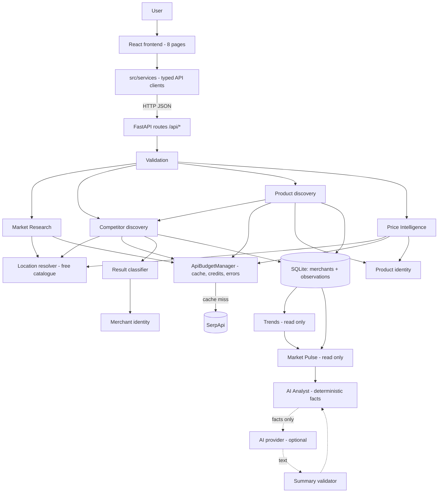
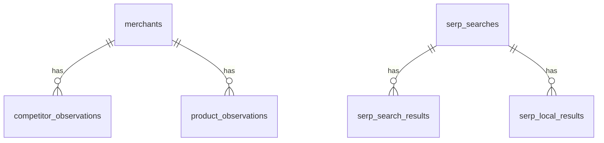

# MarketRadar — Project Document

**Turn live market signals into smarter business decisions.**

| | |
|---|---|
| Project | MarketRadar — commerce market-intelligence platform |
| Version | Submission build, October 2026 |
| Stack | React 19 · TypeScript · Vite · Material UI │ Python 3.12 · FastAPI · SQLAlchemy · SQLite │ SerpApi |
| Status | All seven modules implemented; 525 automated tests passing |
| Companion docs | `README.md` (setup) · `docs/MarketRadar-Demo-Video-Guide.md` (demo) · `docs/audit/` (audit, fix log, execution flows) |

---

## Contents

1. [Executive summary](#1-executive-summary)
2. [The problem](#2-the-problem)
3. [The solution and its design principle](#3-the-solution-and-its-design-principle)
4. [Target users and use cases](#4-target-users-and-use-cases)
5. [System architecture](#5-system-architecture)
6. [Core concepts](#6-core-concepts)
7. [Modules](#7-modules)
8. [Shared engines](#8-shared-engines)
9. [Data model](#9-data-model)
10. [API reference](#10-api-reference)
11. [Frontend](#11-frontend)
12. [External provider, cost and caching](#12-external-provider-cost-and-caching)
13. [The AI layer](#13-the-ai-layer)
14. [Validation and error handling](#14-validation-and-error-handling)
15. [Testing and quality](#15-testing-and-quality)
16. [Security](#16-security)
17. [Setup and operation](#17-setup-and-operation)
18. [Known limitations](#18-known-limitations)
19. [Future work](#19-future-work)
20. [Glossary](#20-glossary)

---

## 1. Executive summary

MarketRadar helps a new or growing business understand the market it operates
in. The user names a **market** (for example "Coffee Shops"), a **location**
(for example "Austin, Texas") and optionally a **product**. MarketRadar then:

1. **discovers the competing businesses** in that place from Google local and
   organic results, and separates real businesses from directories, articles,
   marketplaces and social pages;
2. **checks what those businesses offer** by searching each one's own website
   for the exact product, and records whether a price could be verified;
3. **compares verified local prices** across nearby stores within a radius;
4. **tracks change over time**: search position, rating, availability and
   price, from the observations it has stored;
5. **assembles a factual snapshot** of one market and location (Market Pulse);
6. **produces an analyst report** of evidence-referenced statements computed
   by code. A language model may narrate those facts, but only after its text
   passes validation.

The defining property of the system is **evidence discipline**. Every figure
traces back to a recorded observation, and every gap is reported as a gap:

- "price unavailable" is never shown as "product unavailable";
- "not in the latest search" is never shown as "closed";
- one reading seen twice is never shown as a trend.

## 2. The problem

Price-comparison tools answer one question: *where is this product cheapest?*
A business owner needs to know more:

- **Who am I actually competing with here?** Search results mix real
  businesses with directories ("Top 10 coffee shops"), marketplaces, blogs and
  social pages. Treating every result as a competitor gives a wrong picture.
- **What do they sell, and at what price?** A price on a category page belongs
  to "something in this list", not to the product asked about. A catalogue
  listing does not prove a store has stock.
- **What changed?** Comparing two snapshots is only meaningful if both are real
  measurements of the same market and place. A cached response read twice
  looks like "no change", but nothing was measured twice.
- **Can I trust the summary?** AI-written market summaries readily invent
  leaders, growth and recommendations that the data never showed.

## 3. The solution and its design principle

MarketRadar answers *"What is happening in my market, what changed, and what
should I investigate?"* It does not answer *"What will happen?"* or *"Who is
winning?"*, because public search data cannot support those claims.

The design principle, applied in every layer:

> **Record what was observed and how strongly it is evidenced. Infer nothing
> the evidence does not support. Report uncertainty as uncertainty.**

In practice, this means:

| Situation | MarketRadar says | It never says |
|---|---|---|
| Product found on merchant site, no clear price | product `found`, price `unavailable` | "not sold" |
| No usable evidence either way | product `unknown` | "not found" |
| A result specifically shows a different size or variant | product `not_found` (with reason) | — |
| Catalogue page lists the product | `evidence_scope=catalog`, `inventory_confirmed=false` | "in stock at this store" |
| Business missing from the latest search | "not present in the latest observation" | "closed", "left the market" |
| One measurement, or the same cached reading twice | `insufficient_history` | "flat", "stable" |
| Fewer than two distinct verified prices | individual prices listed | average / lowest / highest |
| Location input contradicts the best match | the request is refused with an explanation | a silently substituted place |

## 4. Target users and use cases

- **Users:** owners and operators of new or growing businesses in any
  industry (retail, food and drink, services, e-commerce), plus analysts who
  support them. Nothing in the code is specific to an industry, country or
  company.
- **Use cases:**
  - *"I'm opening a coffee shop in Austin — who already operates there?"* →
    Competitors.
  - *"Which local wine shops list this exact bottle, and at what price?"* →
    Products / Price Intelligence.
  - *"Did any competitor's price or visibility change since last month?"* →
    Trends.
  - *"Give me a one-page factual picture of this market."* → Market Pulse.
  - *"Summarise it for me without making things up."* → AI Analyst.

## 5. System architecture

### 5.1 Overview



### 5.2 Layers

| Layer | Responsibility | Location |
|---|---|---|
| Presentation | Pages, loading/error/empty states, evidence display | `frontend/src/pages`, `components`, `layouts` |
| API client | One typed module per backend area; shared axios instance with timeout | `frontend/src/services`, `types` |
| Routes | Parse parameters, call one service, map exceptions to status codes | `backend/app/routes` |
| Services | All business logic: discovery, classification, identity, trends, snapshot, analysis | `backend/app/services` |
| Provider access | Cache-or-call, credit accounting, provider-error semantics | `services/api_budget.py`, `providers/` |
| Persistence | Merchants (identity) and append-only observations (evidence) | `backend/app/models` |

### 5.3 Two kinds of module

- **Discovery modules** (Market Research, Competitors, Products, Price
  Intelligence) call SerpApi and, apart from Price Intelligence, record what
  they find.
- **Read-only modules** (Trends, Market Pulse, AI Analyst) only read stored
  observations. They make no provider request, spend no credit and write
  nothing. The test suite enforces all three properties.

## 6. Core concepts

### 6.1 Identity versus evidence

A **merchant** is a business identity, stored once in `merchants`. An
**observation** is one piece of evidence about it, stored as a row in
`competitor_observations` or `product_observations`. Re-running a search
**appends** observations and never overwrites them. This is what makes history
and trends possible.

### 6.2 Context

Every observation records the market, the query, the location as typed, and
the **resolved** location. A context is a (market, location) pair. Trends,
Market Pulse and the Analyst never combine data across contexts. One city's
prices can never appear in another city's snapshot.

### 6.3 Statuses

| Entity | Values | Meaning |
|---|---|---|
| Merchant | `verified` | Strong identity: structured local listing with place id or own domain, or organic result corroborated by a local one |
| | `discovered` | Weaker: a single organic result |
| | `uncertain` | Identity ambiguous (e.g. chain) or fuzzy name only — may not carry product evidence |
| Product | `found` / `not_found` / `unknown` | `not_found` only on a specific contradiction (different size/variant/model) |
| Price | `verified` / `unavailable` / `unknown` | Independent of product status |
| Trend series | `trend` / `insufficient_history` / `no_data` | `trend` requires ≥2 *distinct* measurements |
| Analysis mode | `deterministic` / `assisted` | `assisted` only when a validated AI summary was produced |

### 6.4 Evidence scope

`catalog` (merchant's own website), `marketplace_listing` (Google Shopping),
`store_inventory` (reserved, never claimed today). `inventory_confirmed` is
always `false`, because no source available today establishes physical stock.

## 7. Modules

Each module below lists what the user does, what happens, and what comes back.
Sequence diagrams for every module are in
`docs/audit/MarketRadar-Module-Working-and-Execution-Flow.md`.

### 7.1 Market Research — `/research`

- **User:** enters a search query and an optional location.
- **Flow:**
  1. `GET /api/serpapi/search`.
  2. The location is resolved to a canonical name.
  3. One Google search returns organic and local results, served from cache
     when available.
  4. The raw results are stored (`serp_searches` and its result tables).
- **Shows:**
  - organic results with domain and position;
  - local (map) results with rating, reviews, address and website;
  - a domain-visibility summary;
  - the cache status;
  - recent searches.
- **Purpose:** a direct view of search visibility for any query.

### 7.2 Competitors — `/competitors`

- **User:** enters a market and/or query plus a location (both required).
- **Flow:**
  1. Validate the input: the query must have at least 2 characters including a
     letter, and a location is required.
  2. Resolve the location.
  3. Run one Google search.
  4. **Local results** are structured businesses. **Organic results** are
     classified as business, directory, social, article, marketplace or unknown.
  5. Deduplicate within the search using the tiered merchant matcher.
  6. Assign a status.
  7. Upsert the merchant and append one observation per piece of evidence.
- **Shows:**
  - funnel counts: local and organic results, candidates, rejected, verified,
    discovered, uncertain, new;
  - a competitor table with status, sources, rating and best position;
  - a "Location not verified" flag where it applies;
  - an evidence dialog;
  - the rejected results with reasons;
  - the saved competitors from earlier searches.

### 7.3 Products — `/products`

- **User:** enters a product (required), a location (required) and an
  optional market.
- **Flow:**
  1. Run competitor discovery for the market.
  2. Keep merchants that are not uncertain and that have a website domain,
     limited to 5 to bound credit spend.
  3. Per merchant, search `site:<domain> <product>`.
  4. Keep only results actually served by that domain.
  5. Classify the page type: product, listing or unknown.
  6. Extract a price.
  7. Apply strict **product identity**.
  8. Apply the **price rules**.
  9. Append one observation per merchant.
- **Price rules:** a matched product's price is `unavailable` if the page is a
  listing, shows a price range, shows several unrelated prices, or the
  requested size was not confirmed — or if no price is shown at all.
- **Shows:** a product-status column and a separate price-status column, the
  verification reason, the evidence scope, the rejected rows and their
  reasons, and the saved observations.

### 7.4 Price Intelligence — `/prices`

- **User:** enters a product, an area, a radius (5–25 miles) and an optional
  reference store.
- **Flow:**
  1. Geocode the area to a search centre.
  2. Search Google Maps for stores near that centre.
  3. Keep stores within the radius (haversine distance).
  4. Gather evidence from each store's website (as in Products).
  5. Gather Google Shopping listings, matched to nearby stores by domain or
     name.
  6. Classify each store: product found / not found / unknown, and price
     verified / unavailable / unknown.
- **Statistics:**
  - lowest, average and highest are computed from verified prices only;
  - the reference store is excluded;
  - a warning appears when sizes are mixed;
  - the page shows statistics only when there are at least two distinct
    prices.
- **Note:** results are returned but not stored. See Limitations.

### 7.5 Trends — `/trends`

- **Reads:** stored competitor and product observations.
- **Rule:** consecutive identical readings collapse into one point. A
  direction (up, down or flat) is stated only when two or more *distinct*
  points exist. Re-reading a cached response therefore never creates a trend.
- **Series:**

| Series | What it tracks | Keyed by |
|---|---|---|
| price | verified prices | product, merchant, market, location |
| availability | product status | product, merchant, market, location |
| visibility | position, rating, reviews | merchant, market, location |
| merchant presence | first and last seen; "present in latest" | merchant, market, location |

- **Summary:** which contexts have history, and whether anything has actually
  been measured twice.

### 7.6 Market Pulse — `/pulse`

- **User:** picks a (market, location) pair that has actually been observed;
  the list comes from `/api/market-pulse/options`.
- **Returns one snapshot**, with every section filtered to the same context:
  - context: merchants, observation counts, time span, distinct searches;
  - competitors, with presence notes;
  - product observations;
  - verified prices;
  - price statistics, only when there are at least 2 distinct measurements;
  - visibility;
  - trend series;
  - data-quality counts and notes.
- **Why one endpoint:** returning every section together, under one shared
  context, makes it impossible to show one market's competitors beside
  another's products.

### 7.7 AI Analyst — `/analyst`

- **User:** picks an observed context and clicks Analyze.
- **Flow:**
  1. Build the Market Pulse snapshot.
  2. Python code generates factual statements in seven sections (overview,
     competitors, products, prices, visibility, trends, data quality).
  3. Each statement carries an `EvidenceRef`: its section, the record ids, the
     merchant ids and a count.
  4. *Optionally*, the statements are sent to an AI provider for a short
     narrative. The narrative is validated before display: no banned
     conclusions, and every number must appear in the facts.
- **Without a provider:** the full factual analysis is still returned, with
  `analysis_mode=deterministic`. This is the default, because no vendor adapter
  is bundled.

## 8. Shared engines

### 8.1 Location resolver (`services/location_service.py`)

SerpApi accepts only canonical catalogue locations. The resolver works as
follows:

1. Try the whole input, then comma-separated parts (longer first), then any
   postal code. Up to 6 lookups.
2. Query the **free** `locations.json` catalogue. It costs no credit and needs
   no key.
3. Prefer a result whose own name is exactly what was typed, so "Texas" gives
   the state rather than Dallas. Otherwise rank by place type.
4. **Refuse contradictions.** If a part of the input that was dropped (other
   than an abbreviation, a street line or a postal code) does not appear in the
   match, the request is rejected. "Holmdel, Germany" is not Holmdel, New
   Jersey.
5. Report ambiguity: the alternatives are returned alongside the result.
6. Cache answers in memory. A catalogue outage is reported as an outage and is
   never cached as "no such place".

### 8.2 Result classifier (`services/result_classifier.py`)

This decides what kind of web property a result is. The rules are about the
*shape* of the property, never its industry:

| Signal | Classification |
|---|---|
| Domain also seen in a local result | business, high confidence |
| Government or military namespace (`.gov`, `.mil`, `gov.uk`, `mil.au`, …) | rejected as non-commercial |
| Known social, directory, marketplace or publisher platform | rejected as that type |
| Listicle or roundup title ("Top 10…", "near me"), question title, dated or editorial path | article |
| Listing-style path (e.g. `/biz/…`) | directory |
| Shallow path on the business's own domain | business, medium confidence |

### 8.3 Merchant identity (`services/merchant_identity.py`)

A tiered matcher, tried strongest first: exact domain → domain alias → exact
normalised name → name + address → fuzzy name (only for names of 8+
characters).

- If a tier matches several merchants, the result is *ambiguous*, which
  becomes `uncertain`.
- Across searches, a name-only match is allowed only within the same resolved
  location.
- A platform domain (Facebook, Yelp, …) is never used as a business's
  identity.

### 8.4 Product identity (`services/product_identity.py`)

Discovery may be broad; verification is strict.

| Step | Rule |
|---|---|
| Normalisation | case, punctuation and number words ("Twelve"→12); units ("750 ML"→750ml); ages ("15 Year Old"→15 yr) |
| Identity source | title and URL path only — a snippet may corroborate but never establish identity |
| Required tokens | every meaningful token of the query must appear |
| Accessories | an extra "case", "charger", "opener"… means an accessory → no match |
| Variants | an extra qualifier ("Pro", "Max", "Zero", "Reserve"…) → `different_variant` |
| Model numbers | an extra number when the query uses numbers → `different_model` |
| Sizes | compared by quantity (75cl = 750ml); a different size in the title → `different_size`; a size seen only in the snippet can confirm but never contradict |
| Size confirmation | a requested size that was never observed keeps identity but blocks price verification |

## 9. Data model



| Table | Kind | Key columns |
|---|---|---|
| `merchants` | identity (updated: fill gaps, upgrade status, `last_seen_at`) | name, normalized_name, normalized_domain, place_id, address, lat/lon, status, entity_type |
| `competitor_observations` | evidence, append-only | merchant_id, market, query, location_requested, location_resolved, source_type/url/domain, discovery_method, entity_type, match_method/confidence, status, reason, position, rating, reviews, title, snippet, observed_at |
| `product_observations` | evidence, append-only | merchant_id, product_query, normalized_query, market, location_resolved, product_name, observed_size, size_confirmed, product_status, price_status, verification_reason, price, currency, source_url/domain, page_type, evidence_scope, inventory_confirmed, match_reason, observed_at |
| `serp_searches`, `serp_search_results`, `serp_local_results` | raw search log | query, location, cache_hit, credits_used; organic and local rows |
| `search_cache` | 7-day provider response cache | cache_key (PK), response_data, expires_at |
| `api_usage` | credit ledger | endpoint, query, success, credits_used, response_time |
| `market_observations` | legacy (Google Shopping endpoint) | — |
| `businesses`, `products`, `market_events`, `trend_observations` | reserved for future use, empty | — |

Schema management:

- On startup, missing tables are created and new nullable columns are added.
- Nothing is ever dropped.
- There is no migration tool. PostgreSQL with Alembic is the planned path.

## 10. API reference

Base URL `http://localhost:8001/api`. Interactive docs are at
`http://localhost:8001/docs`.

| Method | Path | Purpose | Cost |
|---|---|---|---|
| GET | `/health` | liveness | free |
| GET | `/serpapi/search?q&location&num&hl&gl` | Market Research search | 1 credit if uncached |
| GET | `/serpapi/recent` | recent searches | free |
| GET | `/serpapi/usage` | local usage + SerpApi account quota | free |
| POST | `/serpapi/search/batch` | up to 20 queries | per query |
| GET | `/competitors/search?market&q&location&hl&gl&num` | competitor discovery | 1 credit if uncached |
| GET | `/competitors?market&location&status&limit` | saved competitors | free |
| GET | `/competitors/{id}` | one competitor with evidence | free |
| GET | `/products/search?q&market&location&max_merchants` | product discovery | 1 + up to 5 |
| GET | `/products?q&market&merchant_id&product_status&limit` | saved observations | free |
| GET | `/products/{id}` | one observation | free |
| GET | `/prices/local?product&area&radius&reference_store` | Price Intelligence | ≈3 + 1 per merchant website |
| GET | `/trends/summary` | history overview | free |
| GET | `/trends/prices?q&market&location` | price series | free |
| GET | `/trends/availability?q&market&location` | availability series | free |
| GET | `/trends/visibility?market&location&metric=position\|rating\|reviews` | visibility series | free |
| GET | `/trends/merchants?market&location` | merchant presence | free |
| GET | `/market-pulse/options` | observed contexts | free |
| GET | `/market-pulse?market&location` | snapshot | free |
| GET | `/analyst/analysis?market&location&include_summary` | analysis | free (AI provider cost if configured) |

**Status codes:**

| Code | Meaning |
|---|---|
| 200 | success, including "no results", which is a successful search |
| 400 | unusable request |
| 404 | record not found |
| 422 | location with no supported equivalent |
| 429 | rate limited |
| 502 | provider failed |
| 503 | SerpApi key not configured |

A provider failure is never reported as an empty result.

## 11. Frontend

| Route | Page | Highlights |
|---|---|---|
| `/` | Dashboard | entry card for every module |
| `/research` | Market Research | organic/local tabs, visibility insights, recent searches |
| `/competitors` | Competitors | funnel, status chips, evidence dialog, rejected list, saved list |
| `/products` | Products | separate product/price status columns, reasons, saved list |
| `/prices` | Price Intelligence | statistics (≥2 distinct prices), reference comparison, nearby store table, stage warnings |
| `/trends` | Trends | price / availability / visibility / presence / context tabs |
| `/pulse` | Market Pulse | context selector, data-quality chips, six tabs |
| `/analyst` | AI Analyst | mode and provider chips, sectioned statements with evidence chips |
| `*` | Not found | fallback page |

UI conventions:

- Every page shows the backend's own error message.
- A failed load is never shown as "nothing found".
- Stale results are cleared when a new request fails or the selection changes.
- Paid searches run only on an explicit click, never automatically on page
  load.

## 12. External provider, cost and caching

SerpApi engines used: `google` (organic + local), `google_maps` (geocoding and
nearby stores) and `google_shopping`. The location catalogue
(`locations.json`) and the account endpoint (`account.json`) are free.

`ApiBudgetManager` handles every call:

1. Return the in-request memo, if there is one.
2. Otherwise read the `search_cache` row. If it is unexpired, that is a cache
   hit and costs nothing.
3. Otherwise insert an `api_usage` reservation, call the provider, and settle
   the reservation at 1 credit on success or 0 on failure.
4. Write the cache row, refreshing it in place if an expired copy exists.

**Consequence for Trends:** the same search repeated within 7 days returns an
identical response. That is why a second *distinct* measurement requires a
search more than 7 days later.

## 13. The AI layer

The guarantee is architectural, not a prompt instruction:

1. **Code produces the facts.** Every statement comes from a Python function
   over the snapshot and carries an evidence reference.
2. **The model receives only those statements.** It never sees raw data to
   interpret.
3. **The model's text is validated:**
   - It is rejected if it contains a banned conclusion: leader, winning,
     dominant, growth, prediction, demand, recommendation, closure, scores, and
     paraphrases such as "leads the market".
   - It is rejected if it contains any number that does not appear exactly in
     the computed facts. "19.9" for 19.99 is rejected.
4. **Failure isolation.** A missing provider, an error, an empty reply or a
   rejected summary never affects the factual analysis. The reason is reported
   instead.

`include_summary=false` skips the provider entirely. The provider interface
(`AIProvider`: `name`, `is_configured()`, `generate()`) lets a vendor adapter
be added through `register_provider` and `AI_PROVIDER` / `AI_API_KEY`, with no
change to the analyst.

## 14. Validation and error handling

| Check | Where | Result |
|---|---|---|
| Market or query: ≥2 characters, contains a letter | Competitors, Products | 400 |
| Location required | Competitors, Products | 400 |
| Location resolvable and not contradicted | all search modules | 422 |
| Radius 1–100 miles | Price Intelligence | 400 |
| SerpApi key present | all search modules | 503 |
| Provider failure | all search modules | 502 with the provider's message |
| Malformed provider payload | organic service | read as empty, never a crash |
| Unexpected server error | Market Research | generic 500; details logged, not returned |

## 15. Testing and quality

- **Backend:** 525 pytest tests across 24 files, covering:
  - location resolution;
  - classification, including gov/mil false positives such as `govinda.com`;
  - merchant and product identity, including sizes, variants, models and
    accessories;
  - price rules and evidence integrity;
  - competitor and product discovery and their APIs;
  - trends: the collapse rule and context separation;
  - Market Pulse: read-only behaviour, zero provider calls, no context mixing;
  - the AI Analyst: provider states, validation and evidence references;
  - request validation, usage reporting and database safety;
  - the demo seeder;
  - a regression file reproducing every audited defect.
- **Isolation:**
  - Tests run against a throwaway database and abort if pointed at the real
    one.
  - Every provider call is stubbed, so no network, key or credits are needed.
- **Frontend:** `npm run build` (strict TypeScript compile + production build)
  and `npm run lint` (oxlint).
- **Audit:** a full pre-submission audit, its fix log, and per-module sequence
  diagrams are in `docs/audit/`.

## 16. Security

- **Secrets:** the SerpApi key lives only in `backend/.env`, which is
  git-ignored and must be excluded from submission archives. The account
  endpoint's response is filtered, so the key is never returned to the client.
- **SQL:** queries go through the ORM or use bound parameters.
- **Outbound requests:** only to fixed SerpApi hosts. User input is used only
  as query parameters, so there is no SSRF surface.
- **XSS:** React escapes all provider text, and no raw HTML is rendered.
- **CORS:** an explicit origin list.
- **Errors:** internal details are logged, not returned.
- **Not included:** authentication and rate limiting. The application is
  intended for local use, and search endpoints spend credits.

## 17. Setup and operation

Full, exact steps (Windows and macOS/Linux), tests, demo data,
configuration, troubleshooting and packaging are in the root **README.md**.
In short:

```text
backend:  python -m venv venv → activate → pip install -r requirements.txt -r requirements-dev.txt
          copy .env.example to .env and set SERPAPI_API_KEY → uvicorn app.main:app --reload --port 8001
frontend: npm install → npm run dev → http://localhost:5173
tests:    cd backend → pytest   (525 passed)
demo:     python scripts/seed_demo_data.py, then start the backend with
          DATABASE_URL=sqlite:///./data/demo_market_radar.db
```

## 18. Known limitations

| Limitation | Effect | Mitigation today |
|---|---|---|
| No AI vendor adapter bundled | Analyst is deterministic only | Full factual analysis still returned; adapter slot ready |
| Prices parsed as `$NN.NN`, labelled USD | Other currencies and "$1,299.99" are not verified | They show as price `unavailable`, never as a wrong price |
| Token-based product matching | A different brand containing every query word can match | Variant/model/size/accessory guards; merchant-site scope |
| Organic results carry no geography | An out-of-area business can be recorded | Status `discovered` with "location not verified"; excluded from `verified` |
| Chains share one domain | All branches collapse into one merchant | Ambiguous same-search matches become `uncertain` |
| Price Intelligence not stored | Its prices do not feed Trends, Pulse or the Analyst | Products module stores price evidence |
| 7-day cache | No new measurement within a week | Trends reports `insufficient_history` honestly; demo data shows real trends |
| SQLite, no migrations | Single-user, local | Additive schema sync; PostgreSQL planned |
| No authentication | Local use only | Binds to 127.0.0.1 by default |

## 19. Future work

- A vendor AI adapter for validated narrative summaries.
- PostgreSQL with Alembic migrations.
- Multi-currency prices and unit conversion across all dimensions.
- Storing Price Intelligence results as observations.
- Per-branch identity for chains (place id over domain).
- Geographic checks for organic results.
- Scheduled re-measurement after cache expiry, to build trend history
  automatically.
- Authentication, rate limiting and per-user credit budgets.
- A frontend test suite, and code-splitting the bundle.

## 20. Glossary

| Term | Meaning |
|---|---|
| Context | A (market, resolved location) pair; the unit every read-only module works within |
| Observation | One append-only evidence row about a merchant |
| Distinct measurement | A reading that differs from the previous one; repeats of a cached reading collapse |
| Evidence scope | What a piece of evidence covers: `catalog`, `marketplace_listing`, `store_inventory` |
| Verified price | A single price on a product-specific page for the exact product and confirmed size |
| Canonical location | SerpApi's catalogue name for a place, e.g. `Holmdel,New Jersey,United States` |
| Credit | One paid SerpApi search |
| Deterministic mode | Analyst output computed entirely by code |
| Assisted mode | Deterministic output plus a validated AI-written summary |
