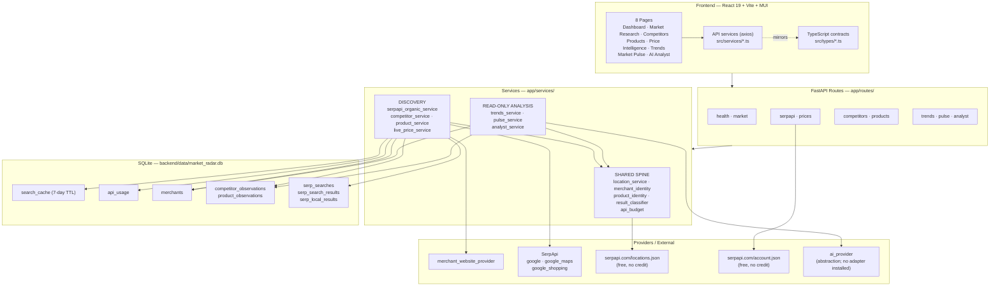
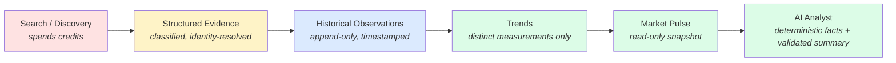
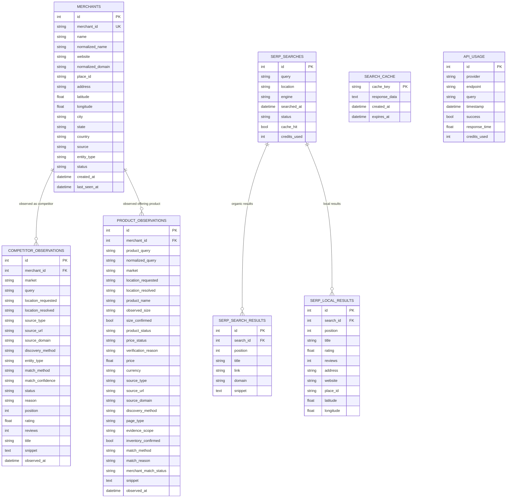
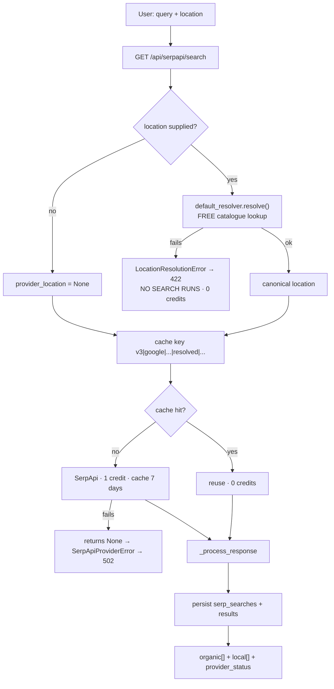
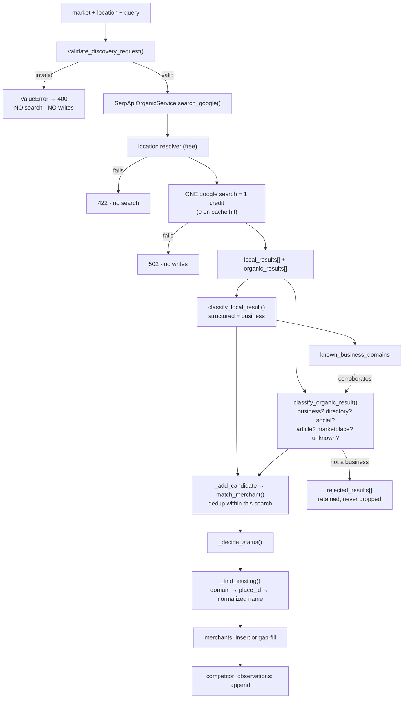
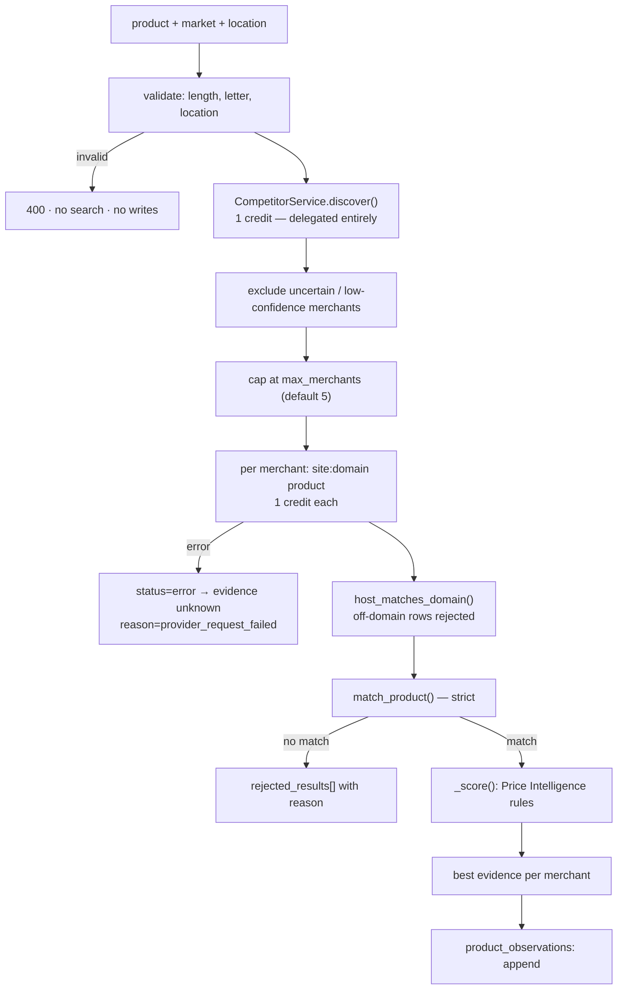
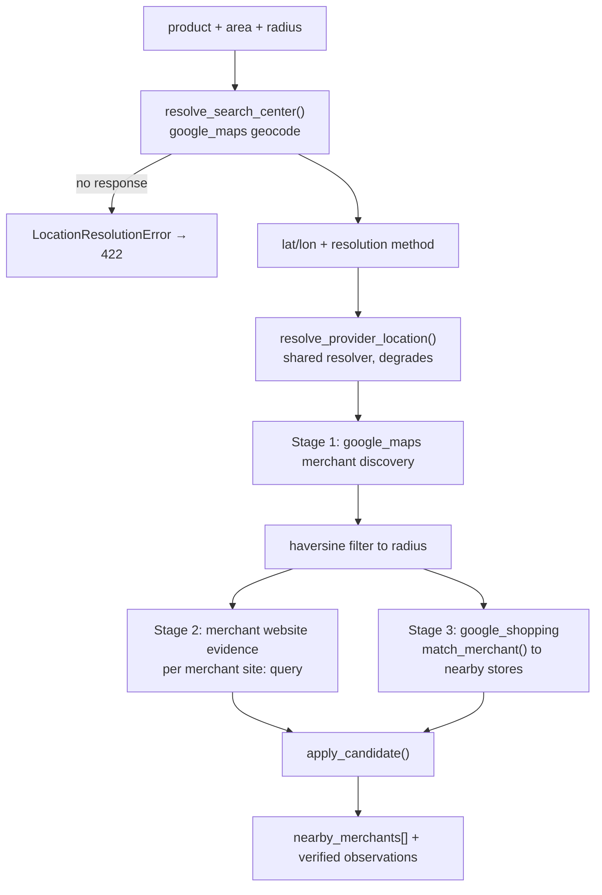
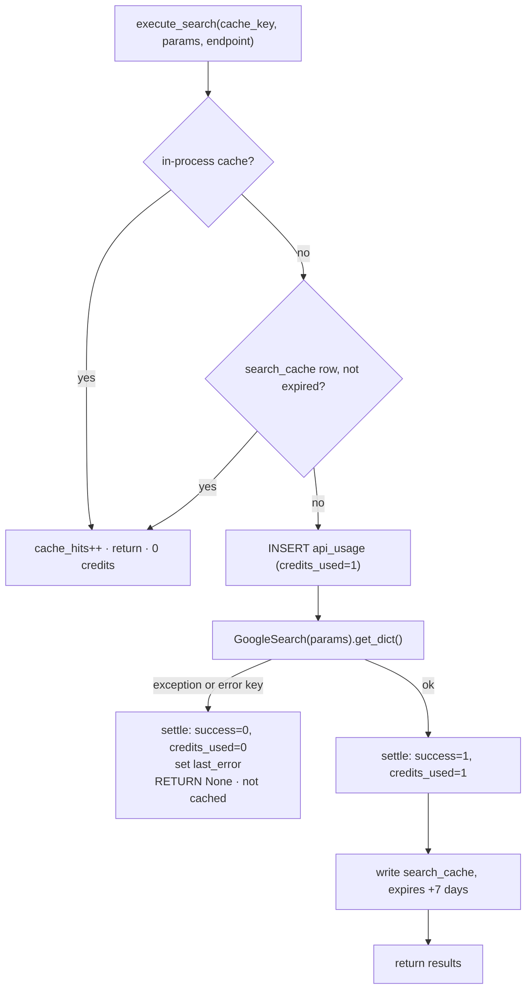
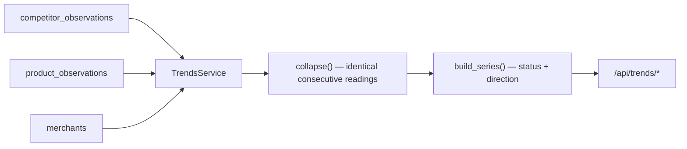
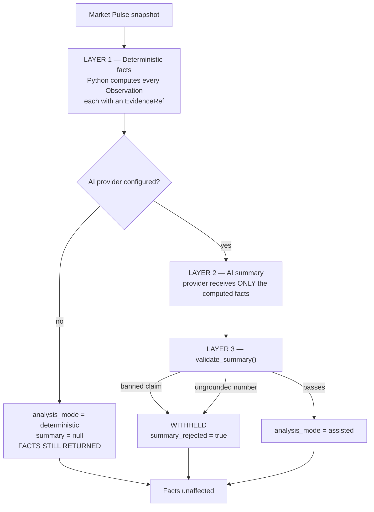

> **Note (October 2026):** for the current, submission-ready overview see [MarketRadar-Project-Document.md](MarketRadar-Project-Document.md). Changes made after this document was written (location conflict handling, Price Intelligence status codes, trend scoping by location, stricter AI summary validation, product-identity rules) are listed in the fix log at the end of [audit/MarketRadar-Pre-Submission-Audit.md](audit/MarketRadar-Pre-Submission-Audit.md).

# MarketRadar — Complete Technical Documentation

**Document version:** 1.0
**Generated:** 2026-09-26
**Repository:** `C:\MarketRadar`
**Status of this document:** Describes the **actual current codebase**. Features that do not exist are marked *"Not currently implemented."*

---

## Table of Contents

1. [Executive Overview](#1-executive-overview)
2. [The Problem MarketRadar Solves](#2-the-problem-marketradar-solves)
3. [Core Concepts](#3-core-concepts)
4. [Complete Architecture](#4-complete-architecture)
5. [Repository Structure](#5-repository-structure)
6. [Backend Architecture](#6-backend-architecture)
7. [Frontend Architecture](#7-frontend-architecture)
8. [Database Architecture](#8-database-architecture)
9. [Complete API Documentation](#9-complete-api-documentation)
10. [Market Research](#10-market-research)
11. [Location Intelligence](#11-location-intelligence)
12. [Competitor Discovery](#12-competitor-discovery)
13. [Product Discovery](#13-product-discovery)
14. [Price Intelligence](#14-price-intelligence)
15. [Merchant Identity](#15-merchant-identity)
16. [Product Identity](#16-product-identity)
17. [SerpApi Integration](#17-serpapi-integration)
18. [Caching](#18-caching)
19. [Trends](#19-trends)
20. [Market Pulse](#20-market-pulse)
21. [AI Analyst](#21-ai-analyst)
22. [Validation & Data Integrity](#22-validation--data-integrity)
23. [Evidence Model](#23-evidence-model)
24. [Frontend Pages](#24-frontend-pages)
25. [Testing](#25-testing)
26. [Development Setup](#26-development-setup)
27. [Configuration](#27-configuration)
28. [Security](#28-security)
29. [Known Limitations](#29-known-limitations)
30. [Future Extensions (Not Currently Implemented)](#30-future-extensions-not-currently-implemented)
31. [Glossary](#31-glossary)
32. [Quick Reference](#32-quick-reference)

---

# 1. Executive Overview

## What MarketRadar is

MarketRadar is a **generic, industry-agnostic commerce and market intelligence platform**. It collects publicly observable market signals — businesses, products, prices, search visibility — converts them into **structured, traceable evidence**, and stores that evidence as an append-only history that later analytical layers read.

Nothing in the codebase is specific to any industry, retailer, product category or country. The platform has been exercised during development against coffee shops in Austin, automotive repair in Hyderabad, and wine retail in New Jersey. Those are test cases, not assumptions: a source-level test asserts that no industry name, company name or place name appears in the code of the discovery, classification, product, trend, pulse or analyst services.

## The defining design principle

The single idea that shapes every module is:

> **Report what the evidence supports, and nothing more.**

Concretely, and enforced by tests throughout:

| The system never says | Because |
| --- | --- |
| "no results" when a provider failed | A failed request is not an observation |
| "the merchant does not stock it" when evidence was absent | Absence of evidence is not evidence of absence |
| "price verified" from a category or listing page | That price belongs to *some* product in a list |
| "this store has it in stock" from a catalogue page | A catalogue is not a shelf |
| "stable" when one cached reading was read three times | One measurement is not a trend |
| "the business closed" when it is missing from one search | A search may return a different slice |

## Target users

* **Small and growing businesses** wanting to understand a market they compete in.
* **Analysts** needing traceable evidence rather than a summary they cannot check.
* **Developers and future maintainers** extending the platform.

## Main capabilities (current)

| Capability | Status |
| --- | --- |
| Market Research — organic + local search with location resolution | **Implemented** |
| Competitor discovery, classification, identity and persistence | **Implemented** |
| Product discovery and product/price evidence from merchant catalogues | **Implemented** |
| Price Intelligence — local merchant price verification funnel | **Implemented** |
| Trends — change detection over stored observations | **Implemented** |
| Market Pulse — read-only factual snapshot of one market + location | **Implemented** |
| AI Analyst — deterministic facts + optional validated AI summary | **Implemented** |
| SerpApi usage reporting from the provider's own account API | **Implemented** |
| Dashboard | **Static landing page only** — makes no API calls |
| Scheduled monitoring / alerts | **Not currently implemented** |
| Google Trends external signal | **Not currently implemented** |
| An installed AI vendor adapter | **Not currently implemented** (abstraction exists; no adapter ships) |

## Implementation scale

| Area | Size |
| --- | --- |
| Backend application code | ~6,674 lines across 49 Python files |
| Backend tests | ~5,927 lines, **481 tests, all passing** |
| Frontend | ~5,087 lines of TypeScript/TSX |
| API endpoints | **26** |
| Database tables | 13 (8 in active use) |

---

# 2. The Problem MarketRadar Solves

## The underlying problem

Market information is fragmented across search engines, map listings, merchant websites and marketplaces. Each source answers a narrow question, none of them agree on identity, and none of them tell you how confident you should be. A search result is not a business; a price on a page is not necessarily *that product's* price; a shop appearing in one search and not the next has not necessarily closed.

The naive approach — scrape results, show them as facts — produces confident-looking output that is frequently wrong in ways the reader cannot detect. MarketRadar exists to do the opposite: turn raw search results into **structured evidence with an explicit confidence state**, and refuse to state more than that evidence supports.

## Currently implemented

| Problem | How MarketRadar addresses it |
| --- | --- |
| **Fragmented market information** | One search returns both local and organic results; both are normalised into a single structured response |
| **Competitor discovery** | Businesses are discovered, classified (business vs directory/social/article/marketplace), identity-resolved and persisted with evidence |
| **Product discovery** | Merchant catalogues are searched per-merchant via `site:` queries; product identity is matched strictly |
| **Price intelligence** | Prices are only verified from product-specific pages with confirmed identity; everything else stays `unavailable` |
| **Merchant intelligence** | A single shared `merchants` table is the identity spine for every module |
| **Location-aware research** | A shared resolver converts user input to the provider's canonical location before any search runs |
| **Historical observations** | `competitor_observations` and `product_observations` are append-only, timestamped |
| **Trend analysis** | Change is computed from *distinct* measurements only, over the stored history |
| **Converting search results into evidence** | Every persisted row carries source type, source URL, source domain, discovery method, match method and a verification reason |
| **AI-assisted analysis** | Facts are computed in Python; an AI provider may only narrate them, and its narration is validated |

## Future opportunities — NOT currently implemented

* Scheduled/recurring market monitoring and change alerts
* Google Trends as an independent external demand signal
* Marketplace integrations beyond what organic/local search surfaces
* Financial intelligence
* Free-text conversational Q&A over the data

---

# 3. Core Concepts

These are the actual concepts the code uses. Where a concept maps to a database column or a code constant, that is stated.

### Market / Industry

A free-text label describing the kind of business being researched (e.g. `"Coffee Shops"`, `"Automotive Repair"`). **There is no list of valid industries and there must never be** — validation is purely structural (see §22). Stored as `competitor_observations.market` and `product_observations.market`. Used to scope every later query so one market's evidence is never mixed with another's.

### Location

User-entered free text (`"Holmdel, NJ"`, `"08807"`, `"Austin, Texas"`). Never sent to a provider as typed. Resolved to a **canonical location** first (§11).

* `location_requested` — what the user typed.
* `location_resolved` — the provider's canonical name (e.g. `"Holmdel,New Jersey,United States"`).

Series and snapshots are scoped by `location_resolved`, because two spellings of one place must share history and two different places must never be conflated.

### Merchant

A business identity. **One row per business in the shared `merchants` table**, reused by every module. Carries name, normalised name, website, normalised domain, place ID, address, coordinates, country, entity type, status and `last_seen_at`. This is deliberately the *only* business identity concept in the system.

### Competitor

Not a separate entity. A competitor **is** a merchant, observed in the context of a particular market and location. The relationship is recorded in `competitor_observations`.

### Product

Not a separate persisted catalogue entity in the active schema. A product exists as an **observation**: the product query that was searched, the product name observed, the size observed, and the evidence behind it.

> A legacy `products` table exists in the schema but is **unused** (0 rows, no code reads or writes it).

### Competitor Observation

One recorded discovery event for a business in a market and location. Append-only. Carries the search context, the source, the discovery method, the identity decision and the resulting status. Re-running a search **adds** a row; it never overwrites one.

### Product Observation

One recorded piece of evidence about a product at a merchant. Append-only. Carries the product query, observed name and size, product status, price status, price, evidence scope, inventory flag, source and match reason.

### Price Evidence

A price is only recorded as **verified** when it came from a product-specific page, the product identity matched, the requested size was confirmed, the merchant identity was certain, and the price was unambiguous. Every other outcome is `unavailable` with a recorded reason.

### Search Context

The tuple that makes two observations comparable: `(market, location_resolved)` for competitors, plus `(normalized_query, merchant_id)` for products. Trends and Market Pulse never merge across contexts.

### Evidence

Every persisted observation carries:
`source_type` · `source_url` · `source_domain` · `discovery_method` · `observed_at` · `match_method` · `match_confidence` · a verification/match reason.

### Status vocabularies

These are the exact values the code uses.

**Merchant / competitor status** (`merchants.status`, `competitor_observations.status`) — describes **evidence strength**, never business quality:

| Value | Meaning |
| --- | --- |
| `verified` | Structured local listing with a place ID or own domain, **or** an organic result corroborated by local discovery |
| `discovered` | A real business, but evidence is a single organic result |
| `uncertain` | Could not be distinguished reliably from another business (e.g. an ambiguous chain) |
| `rejected` | Not presented as a competitor |

**Product status** (`product_observations.product_status`):

| Value | Meaning |
| --- | --- |
| `found` | The merchant's own site identified the product |
| `not_found` | A result **specifically contradicted** the request (different size, variant or model) |
| `unknown` | Evidence was insufficient either way — **not** a finding that the product is unavailable |

**Price status** (`product_observations.price_status`):

| Value | Meaning |
| --- | --- |
| `verified` | A single product-specific price with confirmed identity and size |
| `unavailable` | Product evidence exists, but no price could be attributed to this exact product |
| `unknown` | No product was established, so no price could be considered |

**Trend status** (computed, not stored):

| Value | Meaning |
| --- | --- |
| `trend` | Two or more **distinct** measurements — a direction may be stated |
| `insufficient_history` | Fewer than two distinct measurements — no direction is claimed |
| `no_data` | Nothing recorded for this metric |

### Evidence Scope

`product_observations.evidence_scope` — what the evidence actually covers:

| Value | Meaning | Currently produced? |
| --- | --- | --- |
| `catalog` | The merchant's catalogue lists the product | **Yes** — this is what the merchant-website provider produces |
| `store_inventory` | A specific physical store holds stock | Defined but **never produced** |
| `marketplace_listing` | A shopping listing attributed to this merchant | Defined; produced by the Price Intelligence shopping stage only |

`inventory_confirmed` is a separate boolean and is **always `false`** in the current implementation. A catalogue page proving a merchant offers a product is never promoted to proof that a store holds it.

### Insufficient History

The state where only **one distinct measurement** exists. Critically, several stored observations can describe one measurement, because a repeated search inside the cache window returns identical data (§18, §19).

---

# 4. Complete Architecture

## System architecture



## The analytical pipeline

This is the backbone of the system. Each layer consumes only the layer beneath it.



Red = spends SerpApi credits. Green = **zero credits, zero writes**.

## Layer responsibilities

| Layer | Responsibility | Must never |
| --- | --- | --- |
| **Frontend** | Render state honestly; distinguish 400/422/502; show empty/insufficient states | Present `unknown` as a negative finding |
| **Routes** | Map service exceptions to HTTP status codes; no business logic | Contain matching or classification logic |
| **Discovery services** | Orchestrate search → classify → identify → persist | Resolve locations or match merchants themselves (they delegate) |
| **Shared spine** | The *single* implementation of location, merchant identity, product identity, classification, caching | Be duplicated — a second implementation will eventually disagree with the first |
| **Providers** | Fetch from external systems; return `None` on failure | Convert a failure into an empty result |
| **Read-only analysis** | Derive from stored observations | Write, or call a provider |

### The "one implementation" rule

Enforced by source-level tests. `competitor_service`, `product_service`, `pulse_service`, `analyst_service` and `trends_service` are each asserted **not** to contain `locations.json`, `class LocationResolver`, `def match_merchant`, `def match_product`, `GoogleSearch` or (for the read-only layers) `ApiBudgetManager`.

---

# 5. Repository Structure

```
C:\MarketRadar
├── .claude/
│   └── launch.json                 Dev-server launch config (backend, --reload)
├── .gitignore
├── LICENSE
├── README.md                       Product overview
├── backend/
│   ├── .env                        SECRETS — not committed
│   ├── .env.example                Template
│   ├── README.md
│   ├── pytest.ini                  testpaths = tests (safety; see §25)
│   ├── requirements.txt            Runtime deps
│   ├── requirements-dev.txt        pytest, httpx
│   ├── data/
│   │   └── market_radar.db         Development SQLite database
│   ├── app/
│   │   ├── main.py                 FastAPI entry point
│   │   ├── config.py               Pydantic settings
│   │   ├── database/               base · connection · schema_sync
│   │   ├── models/                 SQLAlchemy ORM models
│   │   ├── schemas/                Pydantic request/response contracts
│   │   ├── routes/                 FastAPI routers
│   │   ├── services/               Business logic
│   │   └── providers/              merchant_website_provider
│   ├── tests/                      481 tests
│   ├── search_strings.py           Loose script — NOT part of the app
│   └── test_usage.py               Loose script — NOT collected by pytest
├── docs/
│   ├── MarketRadar-Technical-Documentation.md   ← this document
│   ├── MarketRadar-Project-Overview.pdf
│   ├── api.md · architecture.md · database.md
│   ├── development.md              Dev setup + stale-server protocol
│   └── serpapi.md
└── frontend/
    ├── index.html                  Title, favicon, meta
    ├── package.json
    ├── vite.config.ts
    ├── tsconfig*.json
    ├── .oxlintrc.json
    ├── public/
    │   ├── favicon.svg             MarketRadar mark
    │   └── icons.svg               Unused
    └── src/
        ├── main.tsx · App.tsx      Entry + routing
        ├── layouts/AppLayout.tsx   Sidebar, nav, header
        ├── pages/                  8 page components
        ├── services/               axios API clients
        ├── types/                  TypeScript mirrors of backend schemas
        ├── components/             EmptyState · Logo · MetricCard · PageHeader · StatusIndicator
        ├── theme/theme.ts          MUI theme
        ├── hooks/ · utils/         Empty (.gitkeep only)
        └── assets/
```

## Core vs supporting

**Core (the system does not work without these):**
`main.py` · `config.py` · `database/` · `models/merchant.py` · `models/competitor.py` · `models/product_observation.py` · `models/serpapi_models.py` · `services/location_service.py` · `services/merchant_identity.py` · `services/product_identity.py` · `services/result_classifier.py` · `services/api_budget.py` · `services/serpapi_organic_service.py` · `services/competitor_service.py` · `services/product_service.py` · `services/live_price_service.py` · `services/trends_service.py` · `services/pulse_service.py` · `services/analyst_service.py` · `providers/merchant_website_provider.py`

**Supporting:** `serpapi_account.py` (usage reporting) · `ai_provider.py` (abstraction) · `schema_sync.py` (additive migration) · `intelligence_service.py` + `normalization_service.py` (legacy price path)

**Empty placeholder files — no implementation:**

| File | Size |
| --- | --- |
| `app/services/maps_service.py` | 0 lines |
| `app/services/search_service.py` | 0 lines |
| `app/services/shopping_service.py` | 0 lines |
| `app/services/ai_service.py` | 3-line stub, unused |
| `app/schemas/market.py` | 0 lines |
| `frontend/src/services/marketApi.ts` | 0 lines |

**Unused legacy models** (tables exist, 0 rows, no code path writes them):
`business.py` · `product.py` · `market_event.py` · `trend_observation.py` · `market_observation.py` (written only by the legacy `/api/prices/search` path)

---

# 6. Backend Architecture

## Entry point — `app/main.py`

```python
import app.models                       # registers every model with Base.metadata
Base.metadata.create_all(bind=engine)   # creates missing tables
sync_additive_columns(engine, Base.metadata)  # adds missing columns
```

Then CORS middleware and nine routers are mounted:

| Router | Prefix | Tag |
| --- | --- | --- |
| `health` | `/api` | Health |
| `market` | `/api/market` | Market |
| `products` | `/api/products` | Products |
| `prices` | `/api/prices` | Prices |
| `competitors` | `/api/competitors` | Competitors |
| `trends` | `/api/trends` | Trends |
| `pulse` | `/api` | Market Pulse |
| `analyst` | `/api/analyst` | AI Analyst |
| `serpapi` | `/api/serpapi` | SerpApi |

> **Important:** `import app.models` is load-bearing. `create_all()` only creates tables for models imported by the time it runs. Before `models/__init__.py` was populated, four model files had **no tables at all** and failed at query time with "no such table". `models/__init__.py` is now the single registration point — **add new models there**.

## Configuration — `app/config.py`

Pydantic `BaseSettings`, loaded from `backend/.env`, `extra = "ignore"`.

| Setting | Type | Default |
| --- | --- | --- |
| `SERPAPI_API_KEY` | `Optional[str]` | `None` |
| `AI_PROVIDER` | `str` | `""` |
| `AI_API_KEY` | `Optional[str]` | `None` |
| `AI_MODEL` | `Optional[str]` | `None` |
| `DATABASE_URL` | `str` | `sqlite:///./data/market_radar.db` |
| `FRONTEND_URL` | `Optional[str]` | `None` |
| `CORS_ORIGINS` | `str` | localhost/127.0.0.1 on 5173 and 5174 |

`cors_origins_list` splits `CORS_ORIGINS` on commas.

## Database layer

* **`database/base.py`** — `Base = declarative_base()`
* **`database/connection.py`** — engine from `DATABASE_URL`; for SQLite creates the parent directory and passes `check_same_thread=False`. Provides `SessionLocal` and the `get_db()` FastAPI dependency.
* **`database/schema_sync.py`** — `sync_additive_columns()`. The project has **no migration tool**. `create_all()` creates missing *tables* but never alters an existing one, so a column added to a model that already has a table simply would not exist. This helper adds only what is missing, and **only ever adds**:
  * no column dropped, renamed or retyped
  * no table dropped or recreated
  * no row written, updated or deleted
  * non-nullable columns without a default are **skipped with a warning** (they need a real migration)
  * non-SQLite backends return immediately — they belong to a real migration tool

## Separation of responsibilities

```
routes/     HTTP surface only. Map exceptions → status codes. No logic.
schemas/    Pydantic contracts. Heavily documented — the docstrings state the
            invariants (e.g. "a repeated reading is not a trend").
services/   All business logic.
providers/  External-system adapters.
models/     Persistence only.
```

## Error handling

Services raise typed exceptions; routes translate them. There is no global exception handler — translation is explicit per route so each status code is a deliberate choice.

| Exception | HTTP | Meaning |
| --- | --- | --- |
| `ValueError` | **400** | Unusable request (rejected before any search) |
| `LocationResolutionError` | **422** | Location has no provider-supported equivalent |
| `SerpApiLimitExceededError` | **429** | Provider limit |
| `SerpApiProviderError` | **502** | Provider failed — *never* "no results" |
| `SerpApiNotConfiguredError` | **503** | No API key |

---

# 7. Frontend Architecture

## Stack

React **19.2** · TypeScript **~6.0** · Vite **8.3** · MUI **9.4** · React Router **7.18** · axios **1.20** · recharts **3.10** (a dependency; **no chart is currently rendered by any page**) · oxlint.

## Entry and routing

`main.tsx` renders `<App />` inside `<React.StrictMode>`.

> StrictMode double-invokes effects **in development only**. This is why each page's mount fetch appears twice in the browser network panel. It is not a bug and does not happen in a production build.

`App.tsx` wires `ThemeProvider` → `CssBaseline` → `BrowserRouter`, with all routes nested under `AppLayout`:

| Path | Page |
| --- | --- |
| `/` | Dashboard |
| `/research` | Market Research |
| `/prices` | Price Intelligence |
| `/competitors` | Competitors |
| `/products` | Products |
| `/trends` | Trends |
| `/pulse` | Market Pulse |
| `/analyst` | AI Analyst |

## Layout — `layouts/AppLayout.tsx`

Persistent sidebar with three nav groups (OVERVIEW / RESEARCH / INTELLIGENCE), the MarketRadar logo, a breadcrumb header derived from the route, and a "Backend Connected" indicator.

## API layer — `src/services/`

A single axios instance in `api.ts`:

```ts
baseURL: import.meta.env.VITE_API_BASE_URL || 'http://127.0.0.1:8001/api'
```

Per-domain clients: `serpapiApi` · `priceApi` · `competitorApi` · `productApi` · `trendApi` · `marketPulseApi` · `analystApi`. Every function accepts an optional `AbortSignal`. (`marketApi.ts` is empty.)

## Types — `src/types/`

Hand-written TypeScript mirrors of the backend Pydantic schemas, carrying the same invariants in doc comments. Not generated — **they must be updated by hand when a backend schema changes.**

## Reusable components

| Component | Purpose |
| --- | --- |
| `Logo` | Inline SVG mark + wordmark; per-instance gradient/mask IDs |
| `PageHeader` | Title + subtitle |
| `EmptyState` | Icon, title, description, optional action |
| `MetricCard` | Labelled metric |
| `StatusIndicator` | Status dot |

## Data flow and states

Every data page follows the same pattern:

```
mount  → load saved/derived data (DB read, 0 credits)
action → user-triggered search (may spend credits)
render → loading | error | empty | insufficient | data
```

**Error handling is status-code-specific**, because the codes carry meaning the body cannot:

| Status | Frontend treatment |
| --- | --- |
| 400 | "That search is missing something it needs…" + backend detail |
| 422 | Location could not be matched + backend's guidance |
| 502 | "The provider did not respond… **This is not the same as finding none.**" |
| 503 | Not configured |

---

# 8. Database Architecture

## Entity relationship diagram



> Only the relationships above exist in the schema. `market_observations`, `businesses`, `products`, `market_events` and `trend_observations` have **no foreign keys** and no relationships.

## Table reference

### `merchants` — the identity spine · **mutable**

The single business-identity table, shared by every module. A business is identified once and each module hangs its own observations off it.

Mutation policy is **gap-fill only**: a saved value is evidence already recorded, so a later, thinner result may fill a `NULL` but must never overwrite a populated field. `status` may strengthen to `verified` but never silently weakens.

### `competitor_observations` — **append-only** · FK → `merchants.id`

One recorded discovery event. Separate from `merchants` because a business is one thing and the evidence about it is many. Collapsing the two would mean each new search overwrote the last one's evidence and no history would survive.

### `product_observations` — **append-only** · FK → `merchants.id`

Same shape, for product evidence. `product_status` and `price_status` are independent: a product can be found with no usable price.

### `search_cache` — **mutable** · PK `cache_key`

Raw provider JSON keyed by a fully-qualified cache key, 7-day TTL. This is what makes repeat searches free — and what makes repeated observations identical (§18, §19).

### `api_usage` — **append-then-settle**

One row per live provider request. Inserted before the call with `credits_used = 1`, then settled: success → `credits_used = 1`; failure → `success = 0, credits_used = 0`.

### `serp_searches` / `serp_search_results` / `serp_local_results` — **append-only**

Parsed search history from the organic service. An audit trail; not read by the analytical layers.

### Unused tables

| Table | Rows | Status |
| --- | --- | --- |
| `businesses` | 0 | Legacy model, no code path |
| `products` | 0 | Legacy catalogue model, unused (note: `sku` is UNIQUE, so it cannot be repurposed for observations) |
| `market_events` | 0 | Legacy, no code path |
| `trend_observations` | 0 | Shaped for Google Trends keyword data — **reserved for a future external signal**, not used by the current Trends module |
| `market_observations` | 0 | Written only by the legacy `/api/prices/search` path |

## Test database isolation

`tests/conftest.py` sets `DATABASE_URL` to `tests/_test_market_radar.db` **before any `app.*` module is imported**, because the engine is built at import time. A session-scoped `autouse` fixture then asserts the engine URL contains `_test_` and refuses to run otherwise.

This exists because two fixtures call `Base.metadata.drop_all(bind=engine)`, and before the guard those ran against the development database, destroying the live cache and usage history.

Teardown calls `engine.dispose()` before unlinking — Windows will not delete a file SQLite still holds open, so without it the throwaway database survived every run.

---

# 9. Complete API Documentation

**26 endpoints.** Base URL `http://127.0.0.1:8001`. Interactive docs at `/docs`.

### Credit and mutation legend

| Symbol | Meaning |
| --- | --- |
| 💳 | May spend SerpApi credits |
| 🆓 | Never spends a credit |
| ✍️ | Writes to the database |
| 👁️ | Read-only |

---

## Health

### `GET /api/health` 🆓 👁️

Liveness check. Returns `{"status": "ok", "service": "market-radar-api"}`. Always 200.

---

## Market

### `GET /api/market/search` 🆓 👁️

**Not currently implemented.** Returns `{"message": "Endpoint prepared for implementation"}` with 200. A scaffold.

---

## Market Research / SerpApi

### `GET /api/serpapi/search` 💳 ✍️

Organic + local search with location resolution.

| Parameter | Type | Default |
| --- | --- | --- |
| `q` | str | *required* |
| `location` | str | `None` |
| `num` | int | `10` |
| `hl` | str | `"en"` |
| `gl` | str | `"us"` |
| `google_domain` | str | `"google.com"` |

**Response** (`SerpSearchResponseSchema`): `query`, `location` (as typed), `resolved_location` (canonical), `location_resolution`, `engine`, `searched_at`, `cache_hit`, `provider_status` (`success` | `no_results`), `results[]`, `local_results[]`.

**Status codes:** 200 · **400** empty `q` · **422** location unresolvable (no search attempted, no credit) · **429** limit · **502** provider failed · **503** no key.

**Writes:** `api_usage`, `search_cache`, `serp_searches`, `serp_search_results`, `serp_local_results`.
**Cache:** `v3|google|{query}|{resolved_location}|{num}|{start}|{hl}|{gl}|{google_domain}`. A hit costs **0 credits**.

### `POST /api/serpapi/search/batch` 💳 ✍️

Body: `{queries: string[], location?: string, engine?: string}`. Max 20 queries (400 beyond that). The location is validated **once** up front — one unresolvable location returns a single 422 rather than N opaque failures. Returns `{total_requested, successful, failed, results[]}`.

### `GET /api/serpapi/usage` 🆓 👁️

Local request history **plus** SerpApi's authoritative account quota. **Performs no search.** The quota comes from `serpapi.com/account.json`, which is an account endpoint, not a search engine.

**Response:** `local_requests_recorded`, `local_credits_used`, `local_failed_requests`, `local_cache_hits`, `account_quota_available`, `account_quota_detail`, `plan_name`, `account_status`, `plan_renewal_date`, `searches_per_month`, `plan_searches_left`, `extra_credits`, `total_searches_left`, `this_month_usage`, `this_hour_searches`, `account_rate_limit_per_hour`.

Every account field is `Optional` — unreachable means `null`, never a guess. **No daily limit or allowance exists anywhere in this contract.** The API key is never returned.

### `GET /api/serpapi/recent` 🆓 👁️

Last 5 distinct-query searches from `serp_searches`.

---

## Competitors

### `GET /api/competitors/search` 💳 ✍️

| Parameter | Type | Default |
| --- | --- | --- |
| `market` | str | `""` |
| `q` | str | `""` |
| `location` | str | `None` — **required in practice** |
| `hl` / `gl` | str | `"en"` / `"us"` |
| `num` | int | `20` |

One `google` search returns both `local_results` and `organic_results`, so **one credit covers both sources**.

**Response:** search context, `provider_status`, `cache_hit`, `stages[]`, funnel counters (`local_results_found`, `organic_results_found`, `business_candidates`, `rejected_non_business`, `competitors_discovered/verified/uncertain`, `duplicates_merged`, `new_competitors`), `competitors[]`, `rejected_results[]`.

**Status codes:** 200 · **400** unusable request · **422** location · **429** · **502** · **503**.
**Writes:** `merchants` (upsert, gap-fill), `competitor_observations` (append), plus the organic-search tables.

### `GET /api/competitors` and `GET /api/competitors/` 🆓 👁️

Saved competitors. Filters: `market`, `location`, `status`, `limit` (default 100). **Database read only.** `evidence` is omitted for cost; use the detail endpoint.

### `GET /api/competitors/{competitor_id}` 🆓 👁️

One competitor **with full evidence history**. 404 if not found.

---

## Products

### `GET /api/products/search` 💳 ✍️

| Parameter | Type | Default |
| --- | --- | --- |
| `q` | str | `""` — defaulted so a missing query returns **400**, reserving 422 for locations |
| `market` | str | `""` |
| `location` | str | `None` — required |
| `hl` / `gl` | str | `"en"` / `"us"` |
| `max_merchants` | int | `5` |

**Credit cost: 1 (merchant discovery) + up to `max_merchants`** (one indexed search each). `max_merchants` bounds spend; when it binds, a `merchant_selection` stage is reported as `degraded`.

**Response:** context, `provider_status`, `cache_hit`, `stages[]`, funnel counters (`merchants_considered/searched/without_domain`, `merchant_provider_errors`, `website_rows_examined`, `off_domain_rejected`, `listing_pages_rejected`, `candidate_matches`, `products_found/not_found/unknown`, `prices_verified/unavailable`), `evidence[]`, `rejected_results[]`.

### `GET /api/products` · `GET /api/products/` 🆓 👁️

Saved observations. Filters: `q` (canonicalised), `market`, `merchant_id`, `product_status`, `limit`.

### `GET /api/products/{observation_id}` 🆓 👁️

One observation with full evidence. 404 if not found.

---

## Price Intelligence

### `GET /api/prices/local` 💳 ✍️

The local price verification funnel.

| Parameter | Type |
| --- | --- |
| `product` | str *required* |
| `area` | str *required* |
| `radius` | int *required* (miles) |
| `reference_store` | str optional |
| `hl` / `gl` | str |

**Response** (`LocalPriceSearchResponse`): `search_center`, price statistics (`lowest_price`, `average_price`, `highest_price`, `verified_sizes`, `mixed_size_statistics`), evidence counts, a large funnel counter set, `stages[]`, `reference_store`, `nearby_merchants[]`, `verified_price_observations[]`, `api_usage`.

**Status codes:** 200 · **400** missing product/area · **422** `LocationResolutionError`.

> **Note:** this endpoint **does not persist** to `merchants` or `product_observations`. It is a self-contained funnel that returns its findings; Trends and Market Pulse do not see them.

### `GET /api/prices/search` 💳 ✍️ — legacy

Google Shopping search → normalised observations → written to `market_observations`. Resolves the location via the shared resolver (degrading rather than failing if unresolvable). 400 empty `q` · 500 on failure · 503 no key.

### `GET /api/prices/history` 🆓 👁️ · `GET /api/prices/changes` 🆓 👁️

Read `market_observations` for a `product_name`. 400 if blank. **Currently return empty results** — `market_observations` has 0 rows.

---

## Trends

All Trends endpoints are 🆓 👁️ — **no provider call, no key required, no writes.** Every response carries `persisted: false`.

| Endpoint | Purpose |
| --- | --- |
| `GET /api/trends/summary` | What history exists and what can honestly be compared |
| `GET /api/trends/prices` | Verified-price movement per product × merchant. Params `q`, `market` |
| `GET /api/trends/availability` | `product_status` transitions. Param `q` |
| `GET /api/trends/visibility` | `position` \| `rating` \| `reviews`. Params `market`, `metric`. **400** on an unsupported metric |
| `GET /api/trends/merchants` | First/last seen and `present_in_latest`. Params `market`, `location` |

---

## Market Pulse

Both endpoints 🆓 👁️.

### `GET /api/market-pulse/options`

Markets and locations **actually present in the history**, with counts. Offered so a selection always refers to real data — no market category is invented.

### `GET /api/market-pulse?market=&location=`

A full factual snapshot: `context`, `competitors[]`, `products[]`, `prices[]`, `price_statistics`, `visibility[]`, `trends[]`, `data_quality`, `has_data`.

> **Why one endpoint, not six.** Every section derives from the same two filtered row sets. Splitting them would re-query the same rows per section and — the reason that matters — would let a client render one market's competitors beside another market's products. One response with a single shared `context` makes that mismatch impossible by construction.

---

## AI Analyst

### `GET /api/analyst/analysis?market=&location=&include_summary=` 🆓 👁️

`include_summary` defaults to `true`; `false` skips the AI provider entirely.

**Response:** `analysis_mode` (`deterministic` | `assisted`), `provider_configured`, `provider_name`, `provider_error`, `context`, `has_data`, `summary`, `summary_rejected`, `summary_rejection_reason`, seven factual sections, a flattened `observations[]`, and `evidence[]`.

Always 200 for a well-formed request — no data is a valid answer, not an error. No SerpApi key required.

---

# 10. Market Research

## Flow



## Location handling

The location is resolved **before** the search. Resolution costs no credit, so a doomed request never spends one. The response returns both `location` (as typed) and `resolved_location` (canonical), and the UI shows "Location resolved to …" when they differ.

### Why a missing location cannot silently become an unscoped search

Market Research *permits* an empty location — it is a search tool, and an unscoped web search is a legitimate thing to run deliberately.

**Competitor and Product discovery do not**, and this is the important distinction: those endpoints **persist what they find**. An unscoped search does not merely return nothing useful, it writes meaningless businesses into the shared `merchants` table where every later module inherits them.

This was observed in practice. A diagnostic probe of `?market=x` with no location produced the cache key `v3|google|x|None|20|0|en|us|google.com`, ran an unscoped global search for the literal string `"x"`, and persisted a government space-weather page as a competitor. Both the missing location and the classifier gap were fixed (§22, §15).

## Provider status semantics

| Outcome | Result |
| --- | --- |
| Results returned | 200, `provider_status: "success"` |
| Search ran, found nothing | 200, `provider_status: "no_results"` |
| Provider failed | **502** — never a 200 with an empty list |

A failed request settles `api_usage` at `credits_used = 0` and is **not cached**, so a retry is a fresh attempt.

## Recent searches

`GET /api/serpapi/recent` returns the last 5 distinct-query searches. The Market Research page shows them as cards with an "Open" button that re-runs the search (a cache hit, so free).

---

# 11. Location Intelligence

## The single shared resolver — `app/services/location_service.py`

There is exactly one resolver. Creating a second is forbidden and asserted against in the test suites of the competitor, product and analyst services.

## Why resolution is needed

SerpApi's `location` parameter accepts only a canonical name from its own catalogue. A raw user string is rejected outright:

```
Unsupported `Holmdel, NJ` location - location parameter.
```

The catalogue (`serpapi.com/locations.json`) is a **free lookup — not a search**. It costs no credit and needs no API key.

## The non-obvious problem

The catalogue is indexed by place name and by postal code, but **not** by "City, ST" — the form people actually type:

| Lookup | Result |
| --- | --- |
| `"Holmdel, NJ"` | **0 results** |
| `"Holmdel"` | `Holmdel,New Jersey,United States` ✓ |
| `"08807"` | `08807,New Jersey,United States` ✓ |
| `"Secaucus, NJ"` | 0 results |
| `"Secaucus"` | `Secaucus,New Jersey,United States` ✓ |
| `"NJ"` | Congressional districts — garbage |

## Candidate generation

`candidate_queries(raw)` derives candidates **purely from the user's own input**:

1. The whole string.
2. Every contiguous run of comma-separated components, **longer runs first**, left-most first within a length. For `"Holmdel, NJ"` this yields `Holmdel` before `NJ`.
3. Any standalone postal code (4–10 digits). A postal code is the catalogue's most precise key but only matches on its own — `"NJ 07094"` fails, `"07094"` succeeds.

Capped at `MAX_CANDIDATES = 6` to bound latency.

### Worked examples

| Input | Candidates | Resolves via |
| --- | --- | --- |
| `Holmdel, NJ` | `Holmdel, NJ` → `Holmdel` → `NJ` | `Holmdel` |
| `08807` | `08807` | `08807` |
| `10 Meadowlands Pkwy, Secaucus, NJ 07094` | full → 2-component runs → 1-component runs → `07094` | `Secaucus` |

## Target-type ranking

Among results the catalogue returned, a preference order is applied (`Postal Code`, `City`, `Municipality`, … `Country`). A demoted set (`Congressional District`, `Airport`, `University`, `TV Region`) is kept as a **weak fallback only** — used if no candidate produced anything better, never preferred. This is why `"Holmdel, NJ"` resolves to the *city* rather than a congressional district.

## Failure semantics

| Situation | Behaviour |
| --- | --- |
| No candidate matches | `LocationResolutionError` with readable guidance: *"…could not be matched to a supported search location. Try a city, a postal code, or a city with its full state or region name (for example 'Holmdel, New Jersey' rather than 'Holmdel, NJ')."* → **422** |
| Catalogue unreachable | `LocationResolutionError` stating the catalogue could not be reached — **never** reported as "no such place" |
| Enhancement-only context | `resolve_or_none()` returns `None`, degrading the stage rather than failing the request |

Results are cached in-process (including negative results) and shared across requests via a module-level `default_resolver`.

## No hardcoding — enforced

* A test asserts the module contains **no float constants at all**, so a latitude/longitude fallback cannot exist.
* A test asserts that with an empty catalogue, *every* input raises — proving nothing is substituted.
* A test asserts every generated candidate is a subset of the user's own typed tokens.
* Country codes come from the catalogue (`country_code`), so `Hyderabad` correctly yields `gl=in`.

## Search center and Haversine — Price Intelligence only

`live_price_service.resolve_search_center()` geocodes the area via the `google_maps` engine to obtain latitude/longitude (falling back to the map viewport centre parsed from `search_metadata.google_maps_url` for broad areas). `haversine_distance()` then filters discovered merchants to the requested radius in miles.

**This applies only to `/api/prices/local`.** Competitor and Product discovery do not use a search centre or radius filtering — they rely on the provider's own location scoping.

---

# 12. Competitor Discovery

## Flow



## Why one search, two sources

The `google` engine returns both `local_results` and `organic_results` in a single response, so **one credit covers both**. Local results come first and are authoritative — each is a structured business — and the domains they establish then corroborate organic results, which are otherwise only heuristically classified.

## Status decision — `_decide_status()`

| Condition | Status | Reason |
| --- | --- | --- |
| Ambiguous tier match | `uncertain` | `ambiguous_identity_match` |
| `match_confidence == "low"` (fuzzy) | `uncertain` | `fuzzy_name_match_only` |
| Local + (place ID **or** own domain) | **`verified`** | — |
| Local, neither | `discovered` | `local_result_without_place_id_or_domain` |
| Organic, `classification_confidence == "high"` (corroborated by local) | **`verified`** | — |
| Organic with a domain | `discovered` | `organic_only_evidence` |
| Organic, no domain | `uncertain` | `no_domain_evidence` |

An uncertain business is **never** silently promoted.

## Persistence

`_find_existing()` matches saved businesses in tier order: **normalised domain → place ID → normalised name**. Deliberately **no fuzzy matching against the whole table** — at scale it would eventually merge two unrelated businesses, and a wrong merge is unrecoverable.

Updates are **gap-fill only**. Status may strengthen to `verified`, never silently weaken.

## Rejected results stay visible

`rejected_results[]` retains everything discarded with its `entity_type` and `reason`, and the UI renders it in its own table. The funnel never silently shrinks.

## Government / military namespace filtering

See §15. A government or military namespace is classified `unknown` with reason `non_commercial_domain` and can never be a competitor.

## Known limitation — organic geographic drift

**This is a confirmed current limitation, documented as such.**

Organic results carry **no coordinates**, so they cannot be geo-filtered. A genuine business from another region can surface in a market search and be recorded as `discovered`. Observed live: `Plymouth Auto Repair` (Hampton Bays, NY) appeared in a Hyderabad automotive-repair search; `Grand Cayman Wine Stores` appeared in a Holmdel wine-retail search.

The system handles this honestly rather than hiding it:
* such a business is **never** `verified` (organic-only evidence caps at `discovered`);
* `has_location_evidence` is `false`, and the UI shows **"Location not verified"**;
* Market Pulse and the AI Analyst both report it as a data-quality limitation.

Fixing it requires a location signal organic results do not provide.

---

# 13. Product Discovery

## Flow



## Delegation

Products performs **no discovery of its own**. It resolves no locations, matches no merchants and implements no product matching. What it adds is the join: for each merchant a market contains, ask that merchant's own site what it offers.

## Evidence rules — `_score()`

Identity is settled before this point. These rules decide only whether the **price** may be treated as this product's price:

| Condition | `price_status` | Reason |
| --- | --- | --- |
| Merchant identity uncertain | `unavailable` | `merchant_identity_uncertain` |
| `page_type == "listing"` | `unavailable` | `price_not_product_specific` |
| Price is a range | `unavailable` | `price_range` |
| "starting at" / multiple prices | `unavailable` | `ambiguous_price` |
| Requested size not confirmed | `unavailable` | `size_unverified` |
| No price found | `unavailable` | `price_unavailable` |
| All checks pass | **`verified`** | — |

In every `unavailable` case `product_status` remains `found`. **Product evidence and price evidence are independent.**

## The three outcomes — precisely

| Outcome | Meaning | Set when |
| --- | --- | --- |
| **`product_status: not_found`** | A result **specifically contradicted** the request | A rejection reason was `different_variant`, `different_model` or `different_size` |
| **`price_status: unavailable`** | The product was found; the price could not be attributed to it | Any rule above |
| **`product_status: unknown`** | Insufficient evidence either way | Rows were examined but none established identity, or the provider failed |

**`unknown` is never a finding that the merchant does not stock the product.** A provider failure produces `unknown`, never `not_found`.

## Credit cost

`1 + min(merchants_with_domain, max_merchants)`. Cached responses cost 0. Live example: `Kendall Jackson Vintner's Reserve Chardonnay 750ml` / Wine Retail / Holmdel with `max_merchants=3` → 4 merchants considered, 3 searched, 10 rows examined, 10 off-domain rejected, **1 verified price at $19.99**, 2 merchants `unknown`, 9 near-misses rejected with reasons.

---

# 14. Price Intelligence

`app/services/live_price_service.py` (393 lines) · `GET /api/prices/local`.

This is the **original** evidence funnel; Products later reused its rules. It is self-contained and **does not write to `merchants` or `product_observations`**.

## Pipeline



## Source hierarchy and evidence scope

| Source | `source_type` | `evidence_scope` | Merchant identity |
| --- | --- | --- | --- |
| Merchant's own site | `merchant_website_indexed` | `catalog` | Exact by construction (`site:` + host check) |
| Google Shopping | `google_shopping` | `marketplace_listing` | Via `match_merchant()`; uncertain → not verified |

`inventory_confirmed` is **always `false`**. A catalogue proves the merchant offers the product, not that a physical store holds it.

## Statistics

`lowest_price`, `average_price`, `highest_price` are computed **over verified observations only**. `verified_sizes` lists distinct observed sizes and `mixed_size_statistics` flags when more than one size contributed — surfaced, never hidden.

## Why "price unavailable" ≠ "product unavailable"

These are **separate fields** with separate vocabularies, deliberately. A merchant can list a product on a category page with a price that belongs to the whole category. The product is real; the price is not attributable. Reporting that as "unavailable product" would be a false negative about a business's inventory.

The UI states this: `product_status: found` + `price_status: unavailable` renders as **"Price unavailable"**, and `unknown`/`unknown` renders as **"Unable to verify"** — explicitly meaning *insufficient evidence*, not *the merchant does not sell it*.

---

# 15. Merchant Identity

`app/services/merchant_identity.py` (110 lines). The **only** merchant matcher in the system.

## Tier hierarchy

Applied as **ranked tiers across all candidates** — never first-merchant-wins.

| Rank | Tier | Confidence |
| --- | --- | --- |
| 1 | `exact_domain` | high |
| 2 | `domain_alias` | high |
| 3 | `exact_name` | medium |
| 4 | `name_and_address` | medium |
| 5 | `fuzzy_name` | **low** |

**A tier matching more than one candidate is ambiguous** — a chain with several stores in radius — and resolves to `uncertain` with `merchant: None`. An uncertain identity may never carry a verified store-level price.

A `fuzzy_name` match is **always** `low` confidence and therefore always `uncertain`.

## Normalisation

* `normalize_domain(url)` — lowercases, strips scheme, port and `www.`
* `normalize_name(name)` — strips punctuation, removes stopwords (`inc`, `llc`, `ltd`, `co`, `corp`, `the`, `store`, `shop`, `market`), concatenates
* `host_matches_domain(link, domain)` — true only when the link is *actually served by* that domain (exact or a subdomain). This is what stops a `site:` query that found nothing from silently attributing open-web results to a merchant.

Fuzzy substring matching requires both normalised names to be at least `_MIN_FUZZY_LEN = 8` characters, so short generic names cannot swallow unrelated merchants.

## Platform domains are not business identities

`result_classifier.is_platform_domain()` covers social networks, review directories, marketplaces and publishers.

**Observed live:** a garage listed its Instagram page as its website, so `instagram.com` became its identity domain. Left unfixed, **every business doing the same would have collided on the exact-domain tier and merged into one record** — unrecoverable.

Now: a platform URL is kept as `website`/`source_url` **evidence**, but `normalized_domain` stays `NULL`. A local business with a place ID is still `verified`; it simply has no own-domain identity. The UI shows "Not reported" for the domain and explains why in the detail dialog.

## Government / military namespace protection

`is_non_commercial_domain()` classifies a host as non-commercial when:

* the **last label** is `gov` or `mil`, **or**
* the **second-to-last label** is `gov` or `mil` **and the last label is a 2-character country code**

### The false-positive protection — essential

**Classification is namespace-based, never substring-based.** A domain is not non-commercial merely because its *name contains* the words "gov", "government", "mil" or "military".

| Host | Non-commercial? | Why |
| --- | --- | --- |
| `spaceweather.gov` | ✅ yes | last label `gov` |
| `some.agency.gov.uk` | ✅ yes | `gov` + 2-char ccTLD |
| `logistics.eastern.defence.mil.au` | ✅ yes | `mil` + 2-char ccTLD |
| `mil.com` | ❌ **no** | `com` is not a ccTLD |
| `govinda.com` | ❌ **no** | `gov` is not a label |
| `government-supplies.com` | ❌ **no** | substring, not a label |
| `governor-hotel.co.uk` | ❌ **no** | substring |
| `milford-motors.com` | ❌ **no** | substring |
| `millers-coffee.com` | ❌ **no** | substring |

All nine cases are covered by parametrised tests, and the commercial ones are additionally asserted to still classify as `business`.

> **Implementation note:** the check reads the **full host**, not the registrable domain. Reducing `defence.mil.au` to `mil.au` would drop the very label being tested — a bug caught during implementation.

---

# 16. Product Identity

`app/services/product_identity.py` (163 lines). The **only** product matcher. Discovery may be broad; **verification must be strict**.

## What may establish identity

`identity_text(title, url)` uses the **title and the URL path only**.

* A **snippet describes a page, not a product** — it can corroborate attributes but never establish identity.
* **Query strings are filters**, not identity.
* A path segment that is entirely digits is a record ID, not identity.

## Harmless normalisation — `canonicalise()`

| Input | Normalised |
| --- | --- |
| `Twelve` | `12` (number words 0–20) |
| `No.` | `no` |
| `750 ML` / `750ml` | `750ml` |
| `15 Year Old` / `15 Yr` / `15yo` | `15 yr` |
| `litre`, `liters` | `l` |
| `pk`, `packs` | `pack` |
| `&` | `and` |
| Punctuation / case | stripped (decimal points preserved) |

This is what lets `"Proper No. Twelve"` and `"Proper No 12"` resolve to one identity **without weakening verification**.

## Strict gates

1. **Missing identity tokens** — every required query token (minus optional words and sizes) must appear → `missing_identity_tokens`.
2. **Extra qualifiers** — a `QUALIFIER_TOKEN` present on the candidate but not the query → `different_variant`. Covers cross-industry modifiers: `max`, `ultra`, `pro`, `plus`, `mini`, `lite`, `xl`, `se`, `cellular`, `gps`, `5g`, `reserve`, `limited`, `vintage`, `refurbished`, `zero`, `diet`, `decaf`, `kit`, `bundle`, `refill`…
3. **Model numbers** — only gate when the query itself uses numbers as identity, so a vintage or SKU does not block a match → `different_model`.
4. **Size conflict** — any observed size not in the requested set → `different_size`.

**Never merged:** `750ml` ↔ `1L` · `50ml` ↔ `750ml` · different flavours · different variants · single unit ↔ multipack.

## `matched` vs `size_confirmed`

Two **independent** outputs:

* `matched` — product identity holds.
* `size_confirmed` — the requested size was actually observed.

An unsized query may match on identity alone, and the observed size is retained. But **a requested size that was never observed leaves product evidence intact while blocking price verification** (`size_unverified`).

### Why a wrong size cannot verify a price

A price is a price *for a specific size*. Attaching a 50ml price to a 750ml query would produce a confidently wrong number — the worst possible failure for a price intelligence tool. So identity and price verification are gated separately: identity may hold, the price may not.

---

# 17. SerpApi Integration

## Engines used

| Engine | Used by | Returns |
| --- | --- | --- |
| `google` | Market Research, Competitors, Products (`site:`) | organic + local |
| `google_maps` | Price Intelligence (geocode + discovery) | place results, local results |
| `google_shopping` | Price Intelligence, legacy `/api/prices/search` | shopping results |

Plus two **free, non-search** endpoints:

| Endpoint | Purpose | Credit |
| --- | --- | --- |
| `serpapi.com/locations.json` | Location catalogue | **none** — no key required |
| `serpapi.com/account.json` | Account quota | **none** |

## Request flow — `ApiBudgetManager.execute_search()`



### The `None` contract

`execute_search()` returns the response dict on success and **`None`** when the request failed. `None` means *"we never got an answer"* and is deliberately distinct from a response containing zero results.

> **This was a real defect.** The manager previously returned `{"error": ...}` on failure while every caller tested `if results is None`. A truthy error dict therefore flowed on as a perfectly good response that happened to contain nothing — so a provider outage was reported as "0 shopping results" with the stage marked `ok`. It survived because the test fakes returned `None` like the real manager was *supposed* to. Tests now drive the real manager to prove the contract.

`last_error` carries the provider's own message for the caller to surface.

## Usage tracking

`api_usage` records every **live** request. A cache hit inserts nothing.

## Quota is the provider's, not ours

**There is no artificial budget anywhere in the system.** No daily limit, no local credit ceiling, no "budget exhausted" state derived from our own counters, and no daily allowance computed from a monthly quota.

The `/api/serpapi/usage` response keeps two things strictly apart:

* `local_*` — what this application observed itself doing. **Not a quota.**
* everything else — SerpApi's account figures, **the only authority on what remains**, passed through verbatim.

A test feeds a known payload and asserts every numeric output is one the provider actually sent, so a derived figure cannot appear. Ten forbidden field names are asserted absent from both the dict and the Pydantic contract.

---

# 18. Caching

## Purpose

Identical requests must not spend a second credit. Cached responses are stored as raw provider JSON in `search_cache` with a **7-day TTL**.

## Cache key structure

The governing rule: **cache identity mirrors request identity exactly** — every parameter the provider is given is in the key, and nothing it is not.

| Source | Key |
| --- | --- |
| Organic (Market Research, Competitors, Products discovery) | `v3\|google\|{query}\|{resolved_location}\|{num}\|{start}\|{hl}\|{gl}\|{google_domain}` |
| Merchant website | `{cache_version}\|merchant_website_indexed\|{domain}\|{product}\|{hl}\|{gl}` |
| Maps geocode | `v2\|geocode\|{area}` |
| Maps discovery | `v2\|maps\|{query}\|{lat},{lon}\|{radius}mi\|{hl}` |
| Shopping (PI) | `v2\|shopping\|{product}\|{provider_location\|nolocation}\|{hl}\|{gl}` |
| Shopping (legacy) | `shopping_legacy\|v2\|{query}\|{provider_location}` |

Note the **resolved** location is used, so two spellings of one place share a response and two different places never do.

Tests prove: product A + merchant A cannot serve product B + merchant A, nor product A + merchant B; `hl`/`gl` change the key; and different locations produce different keys.

## Hit / miss behaviour

| | Credit | `api_usage` | `cache_hit` |
| --- | --- | --- | --- |
| Hit | 0 | no row | `true` |
| Miss | 1 | row inserted and settled | `false` |
| Failure | **0** | row settled `success=0, credits_used=0` | n/a — **not cached** |

## The consequence for Trends — critical

**A repeated search inside the cache window returns byte-identical data, and each run stores its own observation row.**

Verified in the real database before Trends was built:

```
Wine Outlet          obs=3  distinct(position)=1  distinct(rating)=1
Cenizo - Downtown    obs=2  distinct(position)=1  distinct(rating)=1
Total Wine & More    obs=2  distinct(position)=1  distinct(rating)=1
```

Three rows describing **one measurement**. A naive trend implementation would have reported "stable position" for all of them — manufactured confidence. §19 explains the defence.

A further consequence: **two genuinely distinct measurements of the same query in the same place can only occur more than 7 days apart**, which caps trend resolution.

---

# 19. Trends

`app/services/trends_service.py` (394 lines). **Read-only. Derived, never authoritative.** Writes nothing, normalises nothing, deletes nothing, calls no provider. Every response carries `persisted: false`.

## Architecture



## The rule that makes it honest — `collapse()`

> **Consecutive observations carrying an identical reading collapse into a single point. A direction is claimed only when two or more *distinct* points exist.**

One measurement seen repeatedly is `insufficient_history`, **never** `flat`.

`flat` is reserved for genuinely having watched a value hold across distinct measurements — a meaningfully different claim from having read the same cached response twice.

`observation_count` on each point records how many stored rows collapsed into it, and every series reports both `raw_observations` and `distinct_points`, so the UI can show `1 / 3`.

## Series status

| `distinct_points` | Status | Direction |
| --- | --- | --- |
| 0 | `no_data` | `None` |
| 1 | `insufficient_history` | **`None`** — *"one distinct measurement across N observations; a repeated reading is not a trend"* |
| ≥ 2 | `trend` | `up` \| `down` \| `flat`, with `change_absolute` and `change_percent` |

## Context separation

Series are **never merged across contexts**:

* Visibility — keyed by `(merchant_id, market, location_resolved)`
* Price / availability — keyed by `(normalized_query, merchant_id)`

A merchant's position in Austin is not comparable with Hyderabad; a product's price at one merchant is not comparable with another's. A "change" computed across two different requests is an artefact of the request, not a market movement.

## Price trends — verified only

`price_trends()` filters to `price_status == "verified"`. An unverified price was never established as this product's price, so including it would make a movement out of an uncertainty.

## Availability

Status transitions are mapped to an ordinal (`found` = 1, `unknown` = 0, `not_found` = −1) **purely so a change is detectable**. It is not a score and is never presented as one — the UI renders the labels.

## Merchant presence — `present_in_latest`

> **`present_in_latest: false` does NOT mean the business closed.**

It means the business was not in the most recent search of its context. A later search may simply have returned a different slice of results. The flag is surfaced with that caveat attached in the API, in Market Pulse (`presence_note`), in the AI Analyst, and in a tooltip in both UIs. Nothing is ever deleted on this basis.

## Summary honesty

`summary.insufficient_history` reflects whether any **series** reached `trend` — not whether a context was searched twice.

> This was a bug caught by live testing. Two contexts had 2–3 distinct searches, so the summary reported `insufficient_history: false` while **all 15 series** were `insufficient_history` — the repeat searches were cache hits. The summary was promising movement the tabs could not show. Two regression tests now pin the corrected behaviour.

---

# 20. Market Pulse

`app/services/pulse_service.py` (413 lines). **Read-only.** No discovery, no location resolution, no merchant identity, no provider request, no writes. Verified by a source-level test asserting the module contains no `CompetitorService`, `ProductService`, `GoogleSearch` or resolver reference.

## Endpoints

### `GET /api/market-pulse/options`

Markets and locations actually present in the history, with merchant and observation counts and first/last observed timestamps. Offered as choices so a selection always refers to real history.

### `GET /api/market-pulse?market=&location=`

Both filters are applied to **every** section.

## Sections

| # | Section | Content |
| --- | --- | --- |
| 1 | **Market context** | market, location, first/last observed, span hours, distinct searches, merchants, observation counts |
| 2 | **Competitor landscape** | name, domain, address, status, entity type, discovery sources/methods, first/last seen, `present_in_latest` + `presence_note`, `has_location_evidence` |
| 3 | **Product signals** | product, merchant, size + `size_confirmed`, `product_status`, `price_status`, `verification_reason`, `evidence_scope`, `inventory_confirmed`, source |
| 4 | **Price signals** | **verified prices only**, plus `price_statistics` |
| 5 | **Visibility signals** | `best_position`, `latest_position`, `rating`, `reviews`, observation count |
| 6 | **Trend signals** | `TrendsService` output, unchanged |
| 7 | **Data quality** | counts by evidence state plus explanatory `notes[]` |

## Price statistics — the distinct-measurement gate

Aggregates appear only when `distinct_measurements >= MIN_PRICES_FOR_STATISTICS (2)`, where distinct means unique `(merchant_id, normalized_query, price)` — not raw rows.

Below the threshold:

> *"1 distinct verified price measurement from 1 observation. Too few to summarise; the individual prices are listed instead."*

Above it, the caveat is attached:

> *"Across N distinct verified price measurements. These describe what was observed, **not a market rate**."*

## No fabricated conclusions

A schema-level test asserts `MarketPulseResponse` contains **no field** named `growth`, `growing`, `winner`, `winning`, `losing`, `dominant`, `demand`, `best_competitor`, `score`, `ranking_score`, `disappeared`, `health_score` or `momentum` — the schema offers no place to put an unsupported judgement.

## Why one coherent snapshot

Every section derives from the same two filtered row sets. Six independent endpoints would re-query the same rows per section and would allow a client to render one market's competitors beside another market's products. A single response with one shared `context` makes that mismatch **impossible by construction**.

---

# 21. AI Analyst

`app/services/analyst_service.py` (581 lines) · `app/services/ai_provider.py` (94 lines).

## The core principle

> **AI is not the source of truth.**

"Never invent facts" cannot be guaranteed by asking a language model nicely. So the responsibility is split, and **the split is the architecture**.



### Layer 1 — Deterministic facts

Every `Observation` is computed by a Python function from the snapshot and carries an `EvidenceRef` (`section`, `detail`, `record_ids`, `merchant_ids`, `count`) back to the records behind it. **A model is never asked to produce one.**

Seven sections: `market_overview`, `competitor_observations`, `product_observations`, `price_analysis`, `visibility_observations`, `trend_analysis`, `data_quality`. Each observation has a `kind`: `observation` · `limitation` · `insufficient_evidence`.

Trend facts read `TrendsService`'s own verdict — a test asserts `_trends` does not call `collapse()` and does read `distinct_points`.

### Layer 2 — AI summary

The provider receives **only the computed statements**, never raw records, under a system prompt forbidding added facts, conclusions, predictions, closure claims and unknown numbers, capped at 150 words of plain prose.

### Layer 3 — Validation

`validate_summary()` applies two blunt checks — *a withheld summary costs a convenience, an unfounded one costs the credibility of everything else*:

1. **Banned claims** — ~40 phrases matched as **stems with any suffix**, so `outperform` also catches `outperforming`. (A word-boundary-only version let `outperforming` through; a test caught it.) Covers `market leader`, `dominant`, `winner`, `growing`, `growth`, `market share`, `will increase`, `expected to`, `forecast`, `demand is high`, `customers prefer`, `went out of business`, `we recommend`…
2. **Numeric grounding** — every number in the prose must appear in the computed facts. Near-variants are rejected too, so `19.99` cited as `19.9` or `20` is still an invented figure.

A failing summary is **withheld** with its reason; the facts are unaffected.

## Provider abstraction

```
AnalystService → AIProvider (Protocol) → NotConfiguredProvider (default)
                                       → PROVIDER_REGISTRY (empty by design)
```

`AIProvider` requires `name`, `is_configured()`, `generate(system_prompt, user_prompt, max_tokens)`.

**No vendor SDK ships.** Adding an unused dependency and a half-configured client would be worse than an explicit not-configured state. `get_ai_provider()` **never raises**: an unregistered name or a failing factory degrades to `NotConfiguredProvider` with a warning.

To enable a vendor later: implement the protocol, call `register_provider(name, factory)`, and set `AI_PROVIDER` + `AI_API_KEY` (+ optional `AI_MODEL`).

## Modes

| Mode | When |
| --- | --- |
| `deterministic` | No provider, or `include_summary=false`, or the summary was rejected/failed |
| `assisted` | A validated summary was produced |

**With no provider configured the full factual analysis is still returned.** That is not "fake generated analysis" — no model was involved.

## Failure containment

Every provider failure path leaves the facts intact: not configured, `AIProviderError`, unexpected exception (reported as the exception type), and an empty response are each tested.

---

# 22. Validation & Data Integrity

## Why validation matters more than usual here

Discovery is not a read — it **writes** businesses into the shared `merchants` table, and every later module inherits whatever lands there. So an unusable request must be rejected **before anything is searched or written**. Returning an empty result is not enough.

## `validate_discovery_request()` — competitors

| Rule | Rejects | Message |
| --- | --- | --- |
| Market or query required | `{}`, location-only | *"Provide a market/industry or a search query."* |
| ≥ `MIN_QUERY_LENGTH` (2) **and** contains a letter | `x`, `1`, `?`, `12` | *"'x' is too short to describe a market…"* |
| **Location required** | market without location | *"A location is required. Competitor discovery finds businesses competing in a market **and** a place; without one the search is not geographically scoped and returns unrelated results."* |

Products applies the same gates with product-specific wording.

Both rules are **purely structural**. A test asserts the validation function's string literals contain no industry name — `AI` and `IT` pass as legitimate short markets.

## Status code contract

| Code | Meaning | Search run? | Anything persisted? |
| --- | --- | --- | --- |
| **400** | Unusable request | **No** | **No** |
| **422** | Location has no provider-supported equivalent | **No** | **No** |
| **429** | Provider limit | — | No |
| **502** | Provider failed | Attempted, failed | **No** |
| **503** | Not configured | No | No |
| **200 + `no_results`** | Search ran, found nothing | Yes | No businesses to record |
| **200 + data** | Success | Yes | Yes |

Verified live:

```
market=x                                  -> 400
market=x&location=Austin, Texas           -> 400  (query fails before location)
market=Coffee Shops                       -> 400  (no location)
location=Austin, Texas                    -> 400  (no market/query)
market=Coffee Shops&location=Zzzqqx...    -> 422
q=x&location=Austin, Texas                -> 400
q=Widget 2000                             -> 400  (no location)
```

## Evidence-state vocabulary — not error states

| State | Meaning |
| --- | --- |
| **Unknown evidence** | Insufficient either way — **never** a negative finding |
| **Unavailable evidence** | Something was found, but could not be attributed |
| **Insufficient history** | Fewer than two distinct measurements |

## Distinguishing failure from absence

| | Invalid request | Invalid location | Provider failure | No results |
| --- | --- | --- | --- | --- |
| HTTP | 400 | 422 | 502 | 200 |
| Search ran | No | No | Attempted | Yes |
| Credit | 0 | 0 | 0 | 1 (or 0 cached) |
| Persisted | No | No | No | No |

---

# 23. Evidence Model

## Sources currently implemented

| Source | `source_type` | `discovery_method` | Used by |
| --- | --- | --- | --- |
| Google Local pack | `local` | `google_maps_local` | Competitors |
| Google Organic | `organic` | `google_organic` | Competitors |
| Merchant website (indexed) | `merchant_website_indexed` | `indexed_search` | Products, Price Intelligence |
| Google Shopping | `google_shopping` | — | Price Intelligence, legacy prices |
| Google Maps | — | — | Price Intelligence geocode + discovery |

**Merchant API / feed integration: Not currently implemented.**

## Evidence fields

Every persisted observation carries: `source_type` · `source_url` · `source_domain` · `discovery_method` · `observed_at` · `match_method` · `match_confidence` · a verification/match reason. Product observations add `page_type`, `evidence_scope` and `inventory_confirmed`.

## The merchant website provider

`app/providers/merchant_website_provider.py` (165 lines) enforces two hard rules:

1. **A result may only be attributed to a merchant domain when actually served by that domain.** A `site:` query that finds nothing falls back to general web results, which are not merchant evidence. Enforced by `host_matches_domain()`; rejections counted as `off_domain_rejected`.
2. **A price may only be carried forward from a single-product page.** `classify_page_type(url)` returns `product` | `listing` | `unknown` from generic storefront path and query-string conventions.

`extract_price_info()` refuses unreliable prices: a range → `is_range`; "starting at"/"from"/"as low as" → `ambiguous_price`; multiple unrelated prices → `ambiguous_price`; a segment whose sizes conflict with the query is penalised.

## Access controls respected

The provider uses **Google-indexed results only**. It does not fetch merchant pages directly, and therefore does not bypass CAPTCHAs, robots directives, authentication or any other access control.

---

# 24. Frontend Pages

### Dashboard — `/`

Static landing page. Four navigation cards and a getting-started panel. **Makes no API calls.** No loading, empty or error state.

### Market Research — `/research`

**Inputs:** Market/Industry (display only — not sent), Location, Search Query.
**Calls:** `GET /api/serpapi/search`, `GET /api/serpapi/recent`.
**Shows:** four tabs — Organic Results, Local Results, Domains (aggregated appearances / best / average position), Search Insights (counts + a Data Source Transparency panel showing query, location, resolved location, engine, language, country, cache hit/miss). Recent searches as re-runnable cards. "Cached result" chip.
**States:** loading spinner; per-tab "No data available"; 422/502/other errors distinguished.
**Note:** usage/quota figures were deliberately **removed** from this page. `GET /api/serpapi/usage` remains available for diagnostics but the page no longer depends on it.

### Competitors — `/competitors`

**Inputs:** Market/Industry, Location (**required**), Search Query.
**Calls:** `GET /api/competitors/search`, `GET /api/competitors`, `GET /api/competitors/{id}`.
**Shows:** discovery funnel counters; table of Business · Domain · Discovery context · Location · Source · Status · Evidence · Observed; client-side market filter chips; a **"Results that were not businesses"** table; details dialog with identity, coordinates, place ID, status reason and the full evidence history.
**Honesty details:** Domain shows identity only — a platform URL appears under Details, never as a domain. Missing location evidence renders **"Location not verified"**.

### Products — `/products`

**Inputs:** Product/Product Query, Market/Industry, Location (**required**).
**Calls:** `GET /api/products/search`, `GET /api/products`, `GET /api/products/{id}`.
**Shows:** evidence funnel; table of Product · Merchant · Domain · Variant/Size · Evidence · Price · Status · Observed; a **"Results that did not identify the product"** table with reasons; details dialog including a catalogue-scope warning.
**States:** price `unavailable` shows the reason on hover; `unknown` is explained as insufficient evidence, not unavailability.

### Price Intelligence — `/prices`

**Inputs:** Product, Area, Radius, optional Reference Store.
**Calls:** `GET /api/prices/local`.
**Shows:** stage alerts for `error`/`degraded`; verified price observations; **Nearby Physical Stores** with separate product/price status; catalogue-vs-listing indicators.
**Honesty details:** nearby stores remain visible even when no product evidence exists; "Unable to verify" means insufficient evidence.

### Trends — `/trends`

**Calls:** all five `/api/trends/*` endpoints on mount (DB reads, 0 credits).
**Shows:** summary cards; an insufficient-history explanation; five tabs — Prices, Availability, Visibility, Merchant presence, Contexts. Each series row shows `distinct / raw` measurements and a direction **only** when status is `trend` (otherwise a neutral "?" icon and "Not yet measurable").

### Market Pulse — `/pulse`

**Inputs:** an Autocomplete of markets/locations **actually observed**.
**Calls:** `GET /api/market-pulse/options`, `GET /api/market-pulse`.
**Shows:** context cards; evidence-quality chips and notes; five tabs — Competitors, Products, Prices, Visibility, Trends.

### AI Analyst — `/analyst`

**Inputs:** the same market/location Autocomplete.
**Calls:** `GET /api/market-pulse/options`, `GET /api/analyst/analysis`.
**Shows:** provenance chips ("Analysis generated from the current Market Pulse snapshot", mode, provider state); executive summary when present; a withheld-summary warning with its reason; seven factual sections where **every statement carries its evidence reference**; an evidence summary.
**States:** not-configured info alert; provider-error warning; rejection warning; empty state. **No confidence scores are displayed.**

---

# 25. Testing

## Current state

```
481 tests · all passing · ~14s
Frontend: tsc -b && vite build ✓   ·   oxlint: 1 pre-existing warning
```

## Organisation

| File | Tests | Focus |
| --- | --- | --- |
| `test_request_validation.py` | 68 | Validation gates, namespace filtering, nothing-persisted guarantees |
| `test_evidence_integrity.py` | 48 | Product + merchant identity units |
| `test_ai_analyst.py` | 46 | Facts, provider mocking, summary validation |
| `test_result_classifier.py` | 37 | Entity classification |
| `test_product_discovery.py` | 36 | Product funnel end-to-end |
| `test_competitor_discovery.py` | 33 | Competitor funnel end-to-end |
| `test_trends.py` | 30 | `collapse()`, series status, read-only |
| `test_location_resolution.py` | 27 | Candidate generation, ranking, no-hardcoding |
| `test_market_pulse.py` | 26 | Sections, separation, immutability |
| `test_competitor_integrity.py` | 25 | Platform domains, context, dedup |
| `test_price_pipeline_integration.py` | 16 | PI against the **real** budget manager |
| `test_price_pipeline.py` | 14 | PI funnel invariants |
| `test_usage_endpoint.py` | 13 | Usage costs nothing, quota not invented |
| `test_trends_api.py` | 13 | Trends HTTP contract |
| `test_provider_status.py` | 13 | success / no_results / error / cache hit |
| `test_products_api.py` | 9 | Products HTTP contract |
| `test_competitors_api.py` | 9 | Competitors HTTP contract |
| `test_db_safety.py` | 6 | Isolation and the destructive guard |
| `test_db_and_intelligence.py` | 5 | Legacy intelligence service |
| `test_serpapi_organic.py` | 3 | Organic caching, no budget |
| `test_prices_api.py` | 2 | Legacy price route guards |
| `test_normalization.py` | 2 | Legacy normalisation |

## Test types

* **Unit** — identity, classification, collapse, validation.
* **Service/integration** — full funnels against the real `ApiBudgetManager` with only the SerpApi client stubbed. This is deliberate: the provider-error contract and the cache live in the budget manager, and a fake would let them drift (which is exactly how the `{"error": ...}` defect survived).
* **API** — FastAPI `TestClient` with dependency overrides.
* **Source-level invariants** — AST-based assertions that no module hardcodes an industry or place, that layering is respected, and that schemas offer no field inviting an unsupported conclusion.

## Mocking

`tests/stubs.py` provides `StubResolver` (offline location catalogue with verified canonical values), `no_account` (quota unavailable), and `account_quota()` (a realistic payload). **No test reaches the network or spends a credit.** The AI provider is injected.

## Database safety

* `pytest.ini` sets `testpaths = tests`, because ad-hoc `test_*.py` files have historically sat in `backend/` and some called the live SerpApi or dropped tables. A bare `pytest` is therefore safe.
* `conftest.py` redirects `DATABASE_URL` before any `app.*` import and asserts `_test_` is present.
* Verified after every run in this session: the development database MD5 is unchanged, and the throwaway test database is deleted.

---

# 26. Development Setup

## Backend

```
Directory:  C:\MarketRadar\backend
Venv:       backend\venv
Install:    pip install -r requirements.txt -r requirements-dev.txt
Start:      venv\Scripts\python.exe -m uvicorn app.main:app --host 127.0.0.1 --port 8001 --reload
```

### ⚠️ The working-directory requirement — still relevant

The backend **must** be started from `backend/`. `DATABASE_URL` (`sqlite:///./data/market_radar.db`) and the `.env` file are both resolved **relative to the working directory**. Started from the repository root it would boot fine while silently creating an empty database at `C:\MarketRadar\data\` and loading no API key — a failure that looks like working software.

`.claude/launch.json` encodes this, wrapping the command in `cmd /c cd /d C:\MarketRadar\backend && …` because `launch.json` has no `cwd` field.

### ⚠️ The stale-server protocol

A stale Uvicorn process has repeatedly looked like a code bug — it happened with Competitors, with a classifier fix, and with Products. Each time the server had been started before the code existed, without `--reload`.

**Before diagnosing anything, check what the running process actually serves:**

```bash
curl -s http://127.0.0.1:8001/openapi.json | python -c "import sys,json;[print(p) for p in sorted(json.load(sys.stdin)['paths'])]"
```

| Symptom | Meaning |
| --- | --- |
| Route missing from `/openapi.json` | Stale process — restart |
| Route listed but returns the old response body | Stale process — restart |
| Route listed and fails *inside* the handler | A real fault — debug it |

The clearest tell is a placeholder body such as `{"message": "Endpoint prepared for implementation"}`.

**Killing a stale server:** `--reload` runs a **reloader parent and a server child**, and the socket may be attributed to either. Kill the *python* process and confirm the port is free.

## Frontend

```
Directory:  C:\MarketRadar\frontend
Install:    npm install
Dev:        npm run dev        # port 5173
Build:      npm run build      # tsc -b && vite build
Lint:       npm run lint       # oxlint
Preview:    npm run preview
```

## Tests

```
cd C:\MarketRadar\backend
venv\Scripts\python.exe -m pytest -q
```

---

# 27. Configuration

## Backend — `backend/.env`

| Variable | Required | Purpose |
| --- | --- | --- |
| `SERPAPI_API_KEY` | For discovery | SerpApi key. **Never logged or returned.** Trends, Market Pulse and AI Analyst work without it |
| `DATABASE_URL` | No | Default `sqlite:///./data/market_radar.db`, **relative to the working directory** |
| `FRONTEND_URL` | No | Informational |
| `CORS_ORIGINS` | No | Comma-separated allowed origins |
| `AI_PROVIDER` | No | Provider registry name. Empty = not configured |
| `AI_API_KEY` | No | AI provider key |
| `AI_MODEL` | No | Model identifier passed to the adapter |

`extra = "ignore"`, so unknown variables are tolerated.

## Frontend — `frontend/.env`

| Variable | Purpose |
| --- | --- |
| `VITE_API_BASE_URL` | API base. Default `http://127.0.0.1:8001/api` |

> **Vite exposes every `VITE_*` variable to the browser bundle.** Never place a secret in a `VITE_` variable.

---

# 28. Security

## Secrets

* Keys live only in `backend/.env`, which is gitignored; `.env.example` ships with empty values.
* The SerpApi key is sent only to SerpApi. The account endpoint requires it as a query parameter — **the response is filtered to an allow-list of quota fields, so `api_key` and `account_email` are never returned**. Tested.
* No secret is logged. Provider failures log the exception **type**, not the message or parameters.
* The key is never exposed to the frontend; all provider calls are server-side.

## Input validation

Structural validation before any search or write (§22). SQLAlchemy ORM and parameterised `text()` bindings throughout — no string-interpolated SQL.

## External provider handling

* Failures return `None` and become 502 — never silent empty results.
* A failed request is **not cached**.
* Only Google-indexed results are used; merchant pages are not fetched directly, so no CAPTCHA, robots directive, authentication or other access control is bypassed.

## Database safety

* Tests are isolated by an assertion that runs before the suite (§8).
* `schema_sync` is additive-only: no drop, rename, retype, or row write.
* `pytest.ini` restricts collection to `tests/`.

## Not currently implemented

**Authentication, authorisation, rate limiting and audit logging are not implemented.** CORS is restricted to localhost origins by default. This is a development-stage application and is not hardened for public deployment.

---

# 29. Known Limitations

Confirmed by the code and by live observation. Design limitations are labelled as such.

| # | Limitation | Type |
| --- | --- | --- |
| 1 | **Organic geographic drift.** Organic results carry no coordinates and cannot be geo-filtered. Out-of-area businesses can be recorded as `discovered`. Mitigated: never `verified`, flagged "Location not verified", reported as a data-quality limitation | **Design** — needs a signal the source does not provide |
| 2 | **Local results often omit `website`.** Google's local pack frequently returns only `links.directions`, so many verified businesses have no domain | **External data** |
| 3 | **High off-domain rate in product search.** `site:` queries that find nothing fall back to the open web; correctly rejected, but credits are spent. Observed 10 of 20 rows | **External behaviour** |
| 4 | **7-day cache caps trend resolution.** Two distinct measurements of one query in one place require searches more than 7 days apart | **Design trade-off** |
| 5 | **Insufficient historical measurements.** With current data, 0 of 12 trend series have a direction | **Data volume** |
| 6 | **Catalogue-only evidence.** `evidence_scope` is always `catalog`; `store_inventory` is defined but never produced; `inventory_confirmed` is always `false` | **Design** — honest given available sources |
| 7 | **Price trend location scoping is approximate.** Price series are scoped by merchant and filtered by market, not by location string | **Implementation** |
| 8 | **No AI vendor adapter installed.** `analysis_mode` is always `deterministic` in practice | **Deliberate** |
| 9 | **Conservative AI numeric validation.** Any number appearing anywhere in the facts is allowed, so a model could in principle recombine two valid figures | **Implementation** — needs claim-level grounding |
| 10 | **Lexical banned-claim validation.** A novel phrasing could pass. The stronger guarantee remains that facts are never model-generated | **Implementation** |
| 11 | **No free-text AI Q&A.** Structured analysis only | **Deliberate** |
| 12 | **`name_and_address` merchant tier is unreachable.** Its condition is `exact_name`'s plus an address check, but it ranks *below* `exact_name`, so an ambiguous exact-name match returns `uncertain` first. The safe half (chains stay unidentified) is what matters and is pinned by a test | **Implementation** — flagged, deliberately not changed |
| 13 | **Price Intelligence does not persist.** `/api/prices/local` findings are not written to `merchants` or `product_observations`, so Trends and Market Pulse do not see them | **Architecture gap** |
| 14 | **No authentication or rate limiting** | **Not implemented** |
| 15 | **`recharts` is a dependency but no chart is rendered** | **Unused dependency** |

---

# 30. Future Extensions (Not Currently Implemented)

> Everything in this section is **NOT CURRENTLY IMPLEMENTED**.

| Extension | Notes |
| --- | --- |
| **Scheduled market monitoring** | Recurring searches after cache expiry would populate trend history. *Not implemented.* |
| **Dedicated Google Local discovery** | A `google_local` engine stage (+1 credit) returns `website` per place, addressing limitations 2 and 3. *Not implemented.* |
| **Improved geographic verification** | Would address organic geo-drift. *Not implemented.* |
| **Google Trends** | `trend_observations` is shaped for it (`keyword`, `region`, `interest_value`, `period`, `source`) and its table exists — **but nothing reads or writes it**. *Not implemented.* |
| **Marketplace integrations** | Beyond what organic/local search surfaces. *Not implemented.* |
| **Additional AI providers** | The abstraction and registry exist; **no adapter ships**. *Not implemented.* |
| **Claim-level evidence grounding** | Would address limitation 9. *Not implemented.* |
| **Financial intelligence** | *Not implemented.* |
| **Monitoring alerts / change detection** | *Not implemented.* |
| **Time-window analysis** | Market Pulse has no time parameter. *Not implemented.* |
| **Richer AI Q&A** | *Not implemented.* |
| **Persisting Price Intelligence observations** | Would close limitation 13. *Not implemented.* |
| **Authentication / multi-tenancy** | *Not implemented.* |

---

# 31. Glossary

| Term | Definition |
| --- | --- |
| **Append-only** | A table where rows are added and never updated or deleted. `competitor_observations`, `product_observations` |
| **Assisted mode** | AI Analyst mode where a validated narrative summary accompanies the facts |
| **Canonical location** | The provider's own name for a place, e.g. `Holmdel,New Jersey,United States` |
| **Catalogue evidence** | A merchant's own site lists the product. Does **not** imply stock |
| **Collapse** | Merging consecutive identical readings into one measurement point |
| **Context** | The scope making observations comparable — market + resolved location (+ merchant/product) |
| **Deterministic mode** | AI Analyst mode with facts only, no model involved |
| **Discovered** | A real business, evidenced by a single organic result |
| **Distinct measurement** | A reading that differs from the one before it. Only these establish a trend |
| **Evidence scope** | What a piece of evidence covers: `catalog`, `store_inventory`, `marketplace_listing` |
| **Funnel counters** | Per-stage counts making a discovery run auditable |
| **Gap-fill** | Updating only `NULL` fields, never overwriting recorded evidence |
| **Insufficient history** | Fewer than two distinct measurements |
| **Knockout** | The SVG mask separating the logo's bars from its rings |
| **Merchant** | A business identity in the shared `merchants` table |
| **Non-commercial domain** | A government or military **namespace** (`.gov`, `.mil`, `x.gov.uk`) |
| **Observation** | One recorded piece of evidence at a point in time |
| **Off-domain rejection** | Discarding a result not actually served by the merchant's domain |
| **Platform domain** | A social, directory, marketplace or publisher domain — evidence, never a business's own identity |
| **Present in latest** | Whether a business appeared in the most recent search of its context. **Not** a closure signal |
| **Provider status** | `success` \| `no_results`. A failure is a non-200 response |
| **Resolved location** | See canonical location |
| **Stale server** | A running process serving code older than the working tree |
| **Uncertain** | Identity could not be distinguished reliably from another business |
| **Unknown** | Insufficient evidence either way — never a negative finding |
| **Unavailable** | Something was found but could not be attributed |
| **Verified** | The strongest evidence state for its domain (identity or price) |

---

# 32. Quick Reference

## Project structure

```
C:\MarketRadar
├── backend/     FastAPI · app/{routes,services,models,schemas,providers,database} · tests/ · data/
├── frontend/    React+Vite · src/{pages,services,types,components,layouts,theme}
├── docs/        This document + api/architecture/database/development/serpapi
└── .claude/     launch.json
```

## Commands

```bash
# Backend (MUST run from backend/)
cd C:\MarketRadar\backend
venv\Scripts\python.exe -m uvicorn app.main:app --host 127.0.0.1 --port 8001 --reload

# Frontend
cd C:\MarketRadar\frontend && npm run dev          # 5173

# Tests
cd C:\MarketRadar\backend && venv\Scripts\python.exe -m pytest -q

# Build
cd C:\MarketRadar\frontend && npm run build

# What is the running server actually serving?
curl -s http://127.0.0.1:8001/openapi.json
```

## API quick map

| Group | Endpoints | Credits |
| --- | --- | --- |
| Health | `GET /api/health` | 🆓 |
| Market | `GET /api/market/search` *(stub)* | 🆓 |
| SerpApi | `search` · `search/batch` · `usage` · `recent` | 💳 / 💳 / 🆓 / 🆓 |
| Competitors | `search` · `(list)` · `{id}` | 💳 / 🆓 / 🆓 |
| Products | `search` · `(list)` · `{id}` | 💳 / 🆓 / 🆓 |
| Prices | `local` · `search` · `history` · `changes` | 💳 / 💳 / 🆓 / 🆓 |
| Trends | `summary` · `prices` · `availability` · `visibility` · `merchants` | 🆓 |
| Market Pulse | `options` · `(snapshot)` | 🆓 |
| AI Analyst | `analysis` | 🆓 |

## Key services

| Service | Role |
| --- | --- |
| `location_service` | **The** location resolver |
| `merchant_identity` | **The** merchant matcher |
| `product_identity` | **The** product matcher |
| `result_classifier` | Business vs directory/social/article/marketplace/non-commercial |
| `api_budget` | Cache, credits, `None`-on-failure contract |
| `serpapi_organic_service` | Organic + local search |
| `competitor_service` · `product_service` · `live_price_service` | Discovery funnels |
| `trends_service` · `pulse_service` · `analyst_service` | Read-only analysis |
| `merchant_website_provider` | Indexed merchant-site evidence |
| `ai_provider` | Vendor abstraction (no adapter installed) |

## Key tables

| Table | Behaviour |
| --- | --- |
| `merchants` | Mutable, gap-fill only — identity spine |
| `competitor_observations` | Append-only |
| `product_observations` | Append-only |
| `search_cache` | 7-day TTL |
| `api_usage` | Append-then-settle |
| `serp_searches` / `_results` / `_local_results` | Append-only audit trail |

## Frontend pages

`/` Dashboard (static) · `/research` · `/competitors` · `/products` · `/prices` · `/trends` · `/pulse` · `/analyst`

## Configuration

**Backend:** `SERPAPI_API_KEY` · `DATABASE_URL` · `FRONTEND_URL` · `CORS_ORIGINS` · `AI_PROVIDER` · `AI_API_KEY` · `AI_MODEL`
**Frontend:** `VITE_API_BASE_URL`

---

*End of document.*
