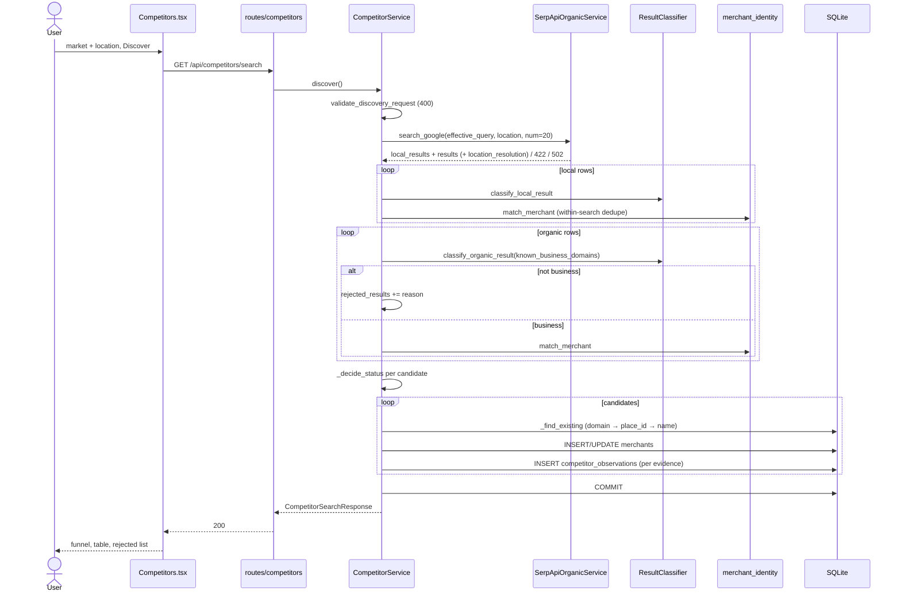
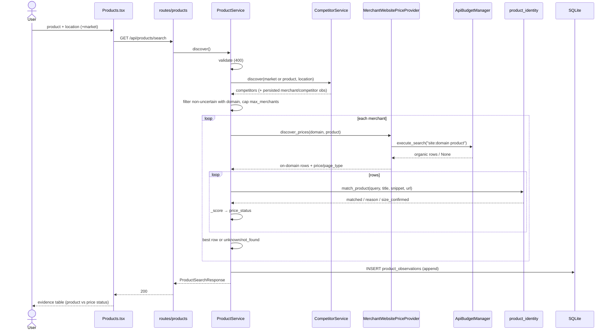
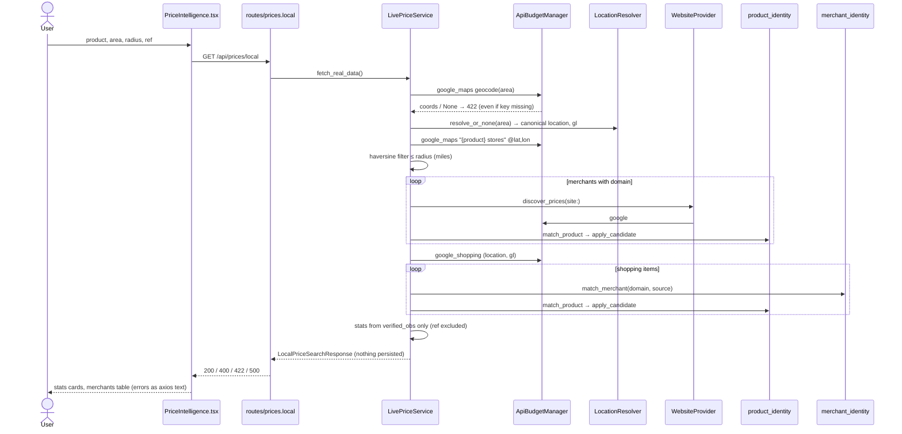
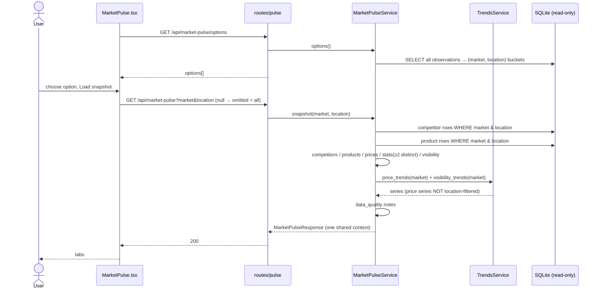
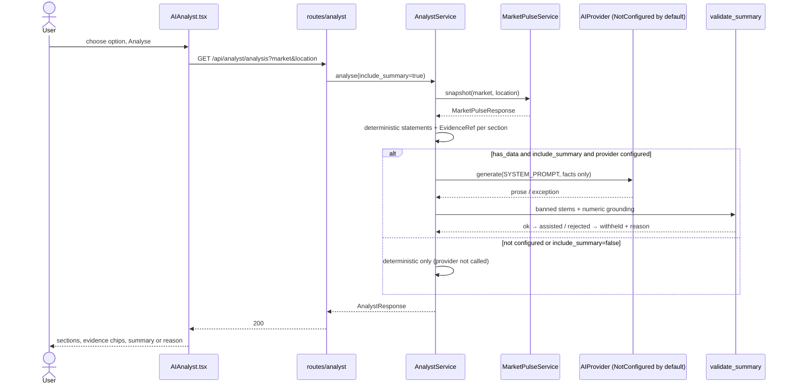

# MarketRadar — Module Working & Execution Flow

Companion to [MarketRadar-Pre-Submission-Audit.md](MarketRadar-Pre-Submission-Audit.md). This document describes the code **as it exists on 2026-10-02**. File references are relative to `backend/app/` or `frontend/src/`. Status labels: **Working** · **Needs Fix** · **Limitation** · **Not Implemented**.

Shared building blocks referenced below:

- **Location Resolver** (`services/location_service.py`). It turns a raw string into a SerpApi canonical location using the free `locations.json` catalogue. It tries up to 6 candidates (the full string, comma-separated component windows, then postal tokens), ranks results by `target_type`, and caches them in-process.
- **ApiBudgetManager** (`services/api_budget.py`). Every SerpApi call goes through `execute_search(cache_key, params, endpoint)`:
  1. Check the in-request memo.
  2. Check the `search_cache` row, which has a 7-day TTL.
  3. Insert an `api_usage` reservation.
  4. Call `GoogleSearch`.
  5. Settle the reservation: 1 credit on success, 0 on failure.
  6. Insert a `search_cache` row.

  A return of `None` means the provider failed, and `last_error` holds the reason.
- **Status conventions.**
  - Merchant: `verified | discovered | uncertain | rejected`.
  - Product: `found | not_found | unknown`.
  - Price: `verified | unavailable | unknown`.
  - Trend: `trend | insufficient_history | no_data`.
  - Analysis mode: `deterministic | assisted`.

---

## Module 1 — Market Research

1. **Purpose.** Run a Google organic search plus a local (Maps pack) search for a query and an optional place, and show what is visible.
2. **User action.** On the Market Research page, the user types a Query and an optional Location, then clicks Search. The Market/Industry field is shown, but its value is never sent.
3. **Frontend flow.** `handleSearch` (`pages/MarketResearch/MarketResearch.tsx:~45`):
   1. Guards against an empty query.
   2. Clears the previous results and sets loading.
   3. Calls `searchOrganic(q, location)` (`services/serpapiApi.ts`).
   4. On success, renders the tabs. On error, maps 422 and 502 to messages, preferring the backend `detail`.

   The recent searches list comes from `getRecentSearches()`.
4. **API request.** `GET /api/serpapi/search?q=&location=`. Also `GET /api/serpapi/recent`.
5. **Backend route.** `routes/serpapi.py::search_organic`. Its dependency `get_organic_service` returns 503 when no key is configured.
6. **Validation.**
   - A blank `q` returns 400.
   - An unresolvable location returns 422.
   - `num`, `hl`, `gl` and `google_domain` are passed through unvalidated.
7. **Service layer.** `SerpApiOrganicService.search_google`, then `_process_response`.
8. **External providers.** `locations.json` (free), then `engine=google` (1 credit on a cache miss).
9. **Database.**
   - Reads `search_cache`.
   - Writes `api_usage` (live calls only) and `search_cache` (on a miss).
   - On **every** call, writes 1 `serp_searches` row, N `serp_search_results` rows and M `serp_local_results` rows.
10. **Cache.**
    - Key: `v3|google|{q}|{canonical location}|{num}|{start}|{hl}|{gl}|{google_domain}`. TTL 7 days.
    - A hit sets `cache_hit=true` and `credits_used=0`.
    - **An expired row crashes the refresh (P0, see audit SB-1).**
11. **Processing.**
    - Resolve the location.
    - Build the parameters and run the search.
    - Flatten the organic rows into `{position,title,link,displayed_link,snippet,domain}`.
    - Flatten the local rows. The website is read from either `website` or `links.website`, and coordinates from `gps_coordinates`.
    - Set `provider_status` to `success` or `no_results`.
12. **Evidence.** The raw provider rows are stored in the `serp_*` tables. The resolved location is returned as `location_resolution` (requested, canonical, country, target type, ambiguous, alternatives).
13. **Response.** `SerpSearchResponseSchema`: `query, location, resolved_location, location_resolution, engine, searched_at, cache_hit, provider_status, results[], local_results[]`.
14. **Frontend rendering.** Organic and local tabs, an insights card, and recent-search cards. The engine, `hl` and `gl` labels are hardcoded.
15. **Error scenarios.**

| Scenario | Result |
|---|---|
| No key | 503 |
| Invalid location | 422 with a readable message |
| Provider error | 502 with the provider text |
| Empty result | 200 with `no_results` |
| Malformed payload | **500** |
| Any other exception | 500 with `str(e)` |

16. **Example.** `q=Wine stores`, `location=Holmdel, NJ` resolves to `Holmdel,New Jersey,United States`. The cache hits, so it costs 0 credits. The search returns 6 organic and 3 local results.
17. **Tests.** `test_serpapi_organic.py`, `test_location_resolution.py`, `test_provider_status.py`, `test_usage_endpoint.py`.
18. **Known limitations.**
    - The Market field is dead.
    - The "Open" button on a recent search re-runs a paid search and swallows its errors.
    - The `serp_searches.location` column stores the raw input.
19. **Submission status.** **Needs Fix** (P0 cache); otherwise Working.

```mermaid
sequenceDiagram
    actor U as User
    participant FE as MarketResearch.tsx
    participant API as serpapiApi.searchOrganic
    participant R as routes/serpapi.search_organic
    participant S as SerpApiOrganicService
    participant L as LocationResolver
    participant B as ApiBudgetManager
    participant P as SerpApi (google)
    participant DB as SQLite
    U->>FE: query + location, Search
    FE->>API: searchOrganic(q, location)
    API->>R: GET /api/serpapi/search
    R->>S: search_google(q, location, num, hl, gl)
    S->>L: resolve(location)
    L-->>S: canonical_name / LocationResolutionError(422)
    S->>B: execute_search(v3 key, params)
    B->>DB: SELECT search_cache
    alt fresh cache row
        DB-->>B: response JSON (0 credits)
    else miss or expired
        B->>DB: INSERT api_usage (reservation)
        B->>P: engine=google
        P-->>B: JSON / error
        B->>DB: UPDATE api_usage; INSERT search_cache (expired row → IntegrityError)
    end
    B-->>S: dict or None(→502)
    S->>DB: INSERT serp_searches + results + local_results
    S-->>R: response dict
    R-->>FE: 200 JSON
    FE-->>U: organic / local tabs
```

---

## Module 2 — Competitor Discovery

1. **Purpose.** Identify businesses that compete in a market and a place, and record evidence about each one.
2. **User action.** On the Competitors page, the user enters a Market and/or Query plus a Location, then clicks Discover. The button stays disabled until a market or query and a location are present.
3. **Frontend flow.** `Competitors.tsx`:
   1. On mount, `listCompetitors()` loads the saved list.
   2. Discover calls `searchCompetitors({market,q,location})`.
   3. The page renders the funnel counters, any problem stages, the competitor table and the rejected results.
   4. A row's details come from `getCompetitor(id)`.
   5. Errors map 400, 422, 502 and 503 and display `detail`.
4. **API request.** `GET /api/competitors/search?market=&q=&location=&hl=&gl=&num=`. Also `GET /api/competitors` and `GET /api/competitors/{id}`.
5. **Backend route.** `routes/competitors.py::competitors_search`. Its dependency returns 503 when no key is configured. Exceptions map as follows: `ValueError`→400, `LocationResolutionError`→422, `SerpApiLimitExceededError`→429, `SerpApiProviderError`→502.
6. **Validation.** `validate_discovery_request` (`competitor_service.py:63`):
   - The effective query (`q or market`) must be at least 2 characters and contain a letter.
   - A location is required.
   - The location must then resolve.
   - `num` is not bounded.
7. **Service layer.** `CompetitorService.discover`, which calls `_add_candidate` (built on `match_merchant`), `_decide_status`, `_persist` and `_find_existing`.
8. **External providers.** One `engine=google` search returns both local and organic results, through Module 1's service.
9. **Database.**
   - Reads `merchants`.
   - Inserts or updates `merchants`: fill gaps, upgrade status, refresh `last_seen_at`.
   - Inserts one `competitor_observations` row per evidence row, append-only.
   - Also writes Module 1's tables.
10. **Cache.** Same as Module 1, with `num=20` by default.
11. **Processing.**
    1. **Local rows.** A row with a place_id or an address is classified `business/high`. A website on a platform domain is kept as a URL, but its domain is removed from the business's identity.
    2. **Corroboration set.** The registrable domains of the local candidates are collected.
    3. **Organic rows.** Classification checks, in order:
       - corroborated by a local domain
       - gov/mil namespace
       - social, directory, marketplace or publisher platform
       - listicle or question title
       - dated or editorial path
       - listing path
       - shallow own-domain path, which is classed `business/medium`

       Rows that are not businesses go to `rejected_results` together with the reason.
    4. **Dedupe.** Within one search, `match_merchant` runs its tiers (exact_domain → domain_alias → exact_name → name_and_address → fuzzy_name). More than one hit makes the match ambiguous.
    5. **Status.**
       - An ambiguous match or a fuzzy-only match → uncertain.
       - A local row with a place_id or domain → verified.
       - A local row with neither → discovered.
       - An organic row corroborated by a local domain → verified.
       - An organic row with a domain → discovered.
       - Otherwise → uncertain.
    6. **Persist.** `_find_existing` matches by domain, then place_id, then exact normalized name. This matching is global and not scoped by location.
    7. **Sort.** By status, then best position, then name.
12. **Evidence.** Each observation stores market, query, location requested and resolved, source type, URL and domain, discovery method, entity type, match method and confidence, status and reason, position, rating, reviews, title, snippet and `observed_at`.
13. **Response.** `CompetitorSearchResponse`: the context, `location_resolution`, `provider_status`, `cache_hit`, `stages[]`, funnel counts, `competitors[]` (each with its evidence) and `rejected_results[]`.
14. **Frontend rendering.**
    - Status chips: verified, discovered, uncertain.
    - Source chips.
    - A "Location not verified" marker when `has_location_evidence` is false.
    - An evidence dialog.
15. **Error scenarios.**

| Scenario | Result |
|---|---|
| Missing location or market | 400 |
| Bad location | 422 |
| Provider failure | 502; nothing persisted except `api_usage` |
| Empty | 200 `no_results` |
| Malformed payload | 500 |
| Expired cache | 500 (P0) |
| Saved-list load failure | Not shown in the UI; the page shows an empty state |

16. **Example.** `market=Wine Retail`, `location=Holmdel, NJ`:
    - 3 local results become 3 verified competitors (Wine Outlet, Circle Wine, Bethany).
    - 6 organic results give 5 rejections (directories and articles) and 1 discovered competitor, "Grand Cayman Wine Stores" (jacquesscott.com). That last one is **geo-drift**.
17. **Tests.** `test_competitor_discovery.py`, `test_competitor_integrity.py`, `test_competitors_api.py`, `test_result_classifier.py`, `test_request_validation.py`.
18. **Known limitations.**
    - There is no geographic check on organic results.
    - Chains collapse into one merchant per domain.
    - Matching by name across the whole table can merge unrelated same-name businesses.
    - `gov.uk` and `mil.au` are not caught by the classifier.
19. **Submission status.** **Working with limitations** (and the P0 cache bug).



---

## Module 3 — Product Discovery

1. **Purpose.** Establish what the merchants in a market and place offer, product by product, and record any price evidence under strict rules.
2. **User action.** On the Products page, the user enters a Product (required), a Market (optional) and a Location (required), then clicks Search.
3. **Frontend flow.** `Products.tsx`:
   1. On mount, `listProductObservations()` loads the saved list.
   2. Search calls `searchProducts({q,market,location})`.
   3. The page renders the funnel, the evidence table (product status and price status in separate columns) and the rejected rows.
   4. Details come from `getProductObservation(id)`.
4. **API request.** `GET /api/products/search?q=&market=&location=&hl=&gl=&max_merchants=`. Also `GET /api/products` and `GET /api/products/{id}`.
5. **Backend route.** `routes/products.py::products_search`. It maps errors the same way as Competitors.
6. **Validation.**
   - `q` must be at least 2 characters and contain a letter, otherwise 400.
   - A location is required, otherwise 400.
   - The location must resolve, otherwise 422.
   - `max_merchants` (default 5) is not bounded.
7. **Service layer.** `ProductService.discover`, which delegates to `CompetitorService.discover` and then uses `MerchantWebsitePriceProvider.discover_prices`, `product_identity.match_product`, `_score` and `_persist`.
8. **External providers.** One google search for the merchants, then one `site:{domain} {product}` google search per selected merchant. Each costs 1 credit on a cache miss.
9. **Database.**
   - Everything Competitors writes.
   - Plus one `product_observations` row per merchant examined, append-only.
10. **Cache.**
    - Merchant search: same as Module 2.
    - Website search: key `v2|merchant_website_indexed|{domain}|{product}|{hl}|{gl}`, TTL 7 days.
11. **Processing.**
    1. Run merchant discovery with `market=market or product`.
    2. Keep only candidates that are not `uncertain`, do not have low confidence, and have a domain. Take the first `max_merchants`.
    3. For each merchant:
       - Run the `site:` search.
       - Drop rows not served by the merchant's own domain.
       - Extract a price. A "$A–$B" range is flagged as a range. "from/starting at $X" is flagged ambiguous. Otherwise take the best-scoring single `$NN.NN`.
       - Classify the page type as product, listing or unknown.
    4. For each row, run `match_product`. A row is rejected if:
       - an identity token is missing;
       - it carries an extra qualifier token (a different variant);
       - it carries an extra model number;
       - its size conflicts with the request, in the title or the snippet.
    5. Score each matched row (`_score`):
       - A listing page → `unavailable` (the price is not product-specific).
       - A price range → `unavailable`.
       - An ambiguous price → `unavailable`.
       - A requested size that was not confirmed → `unavailable` (`size_unverified`).
       - No price → `unavailable`.
       - Otherwise → verified, with the price in USD.
    6. Keep the best row per merchant. If there is none:
       - `not_found` when a row specifically contradicted the request (size, variant or model);
       - `unknown` otherwise;
       - `unknown/provider_request_failed` when the provider failed.
    7. Persist and sort: found before unknown before not_found, and verified prices before others.
12. **Evidence.** Each observation stores the product query (raw and normalized), market and location, product name and size, size confirmation, product status, price status, verification reason, price and currency, source URL and domain, page type, `evidence_scope=catalog`, `inventory_confirmed=false`, match reason, merchant match status and snippet.
13. **Response.** `ProductSearchResponse`: context, stages, funnel counters (merchants considered, searched and without a domain; provider errors; rows examined; off-domain; listing; candidate matches; found / not found / unknown; verified / unavailable), `evidence[]` and `rejected_results[]`.
14. **Frontend rendering.** "Unavailable" appears only in the price column. "unknown" is shown in grey and never as "not found". Prices without a USD currency are shown with no currency at all.
15. **Error scenarios.**
    - Same as Competitors.
    - A website lookup failure for one merchant makes that row unknown, marks the stage `degraded`, and still returns 200.
16. **Example.** `q=Kendall Jackson Vintner's Reserve Chardonnay 750ml`, `market=Wine Retail`, `location=Holmdel, NJ`:
    - 4 merchants are considered and 3 searched.
    - Circle Wine: `found`, verified at **19.99 USD** (catalog).
    - Wine Outlet and Grand Cayman: `unknown / insufficient_evidence`.
17. **Tests.** `test_product_discovery.py`, `test_products_api.py`, `test_evidence_integrity.py`, `test_price_pipeline.py`.
18. **Known limitations.**
    - Matching is token-subset: accessories and other-brand supersets can match.
    - There is no unit conversion (75cl vs 750ml), and other sizes mentioned in the snippet can cause a false `not_found`.
    - Only `$NN.NN` prices parse, and they are always labelled USD.
    - A blank Market files product rows under NULL while competitor rows go under the product text.
19. **Submission status.** **Working with limitations.**



---

## Module 4 — Price Intelligence (local)

1. **Purpose.** For one product around one area and radius, find nearby merchants, gather product and price evidence, and report verified local prices with optional comparison to a reference store.
2. **User action.** On the Price Intelligence page, the user enters a Product, an Area (prefilled "New York, NY"), a Radius (5, 10, 15 or 25) and an optional Reference store, then clicks Search.
3. **Frontend flow.** `PriceIntelligence.tsx:30-49`:
   1. Increments a request id and clears the previous data.
   2. Calls `searchLocalPrices(product, area, radius, ref)` (`services/priceApi.ts`).
   3. Renders only the newest response.
   4. On error, shows `err.message` — **not** the backend `detail`.
4. **API request.** `GET /api/prices/local?product=&area=&radius=&reference_store=&hl=&gl=`.
5. **Backend route.** `routes/prices.py::local_prices_search`.
   - An empty product or area returns 400.
   - A `LocationResolutionError` returns 422.
   - There is **no key check**.
   - Any other exception returns 500.
6. **Validation.**
   - Product and area must be non-empty.
   - `radius` is a required int, but **not range-checked**.
7. **Service layer.** `LivePriceService.fetch_real_data`:
   - `resolve_search_center` → `resolve_provider_location`
   - Maps discovery
   - `discover_prices` per merchant
   - Shopping
   - `apply_candidate` for each candidate
   - Assembly of the response
8. **External providers.**

| Call | Engine | Cost |
|---|---|---|
| Geocode | `google_maps` (type=search) | 1 credit |
| Merchant discovery | `google_maps` `"{product} stores"` at `@lat,lon,11z` | 1 credit |
| Merchant website evidence | `site:` google search per merchant with a domain | 1 credit each, **uncapped** |
| Shopping evidence | `google_shopping` | 1 credit |
| Provider location | `locations.json` | free |

9. **Database.** Writes only `api_usage` and `search_cache`. **No observations are persisted.**
10. **Cache.**

| Lookup | Key |
|---|---|
| Geocode | `v2|geocode|{area}` |
| Maps | `v2|maps|{q}|{lat},{lon}|{radius}mi|{hl}` |
| Website | `v2|merchant_website_indexed|…` |
| Shopping | `v2|shopping|{product}|{canonical location or nolocation}|{hl}|{gl}` |

    All entries have a 7-day TTL.
11. **Processing.**
    1. **Search centre.** Use `place_results.gps_coordinates`, falling back to the `@lat,lon` in the Maps URL; otherwise raise a 422.
    2. **Merchants.** Keep Maps local results that have coordinates and lie within `radius` miles (haversine). Each nearby merchant starts as `unknown/unknown`.
    3. **Website evidence.** For each merchant with a domain, run `site:` evidence through `apply_candidate`:
       - A non-match changes status only on a contradiction, and then only from `unknown` to `not_found`.
       - A match sets product `found`. The price is marked `unavailable` for any of: identity not matched, listing page, price range, ambiguous price, size unverified, or no price. Otherwise it is `verified` and added to `verified_obs`; the reference store is excluded from that list.
    4. **Shopping evidence.** Each Shopping item is matched to a nearby merchant by domain or name tiers. Unmatched items are skipped, and ambiguous matches count as `uncertain`. Matched items go through the same `apply_candidate`, with `evidence_scope=marketplace_listing`. A merchant that is already verified is never overwritten.
    5. **Statistics.** Lowest, average and highest come only from `verified_obs`. `mixed_size_statistics` is flagged when more than one size appears. With no verified prices, every statistic is `None`.
12. **Evidence.** Each verified observation carries the merchant, domain, product name, size, price, currency (`"USD"`), source type, URL and domain, discovery method, snippet, evidence scope, `inventory_confirmed=false`, page type, distance, and match method and confidence. Each nearby merchant carries its own product status, price status and verification reason.
13. **Response.** `LocalPriceSearchResponse`:
    - the search echo and `search_center`;
    - lowest, average and highest price; `verified_sizes`; `mixed_size_statistics`;
    - the funnel counters and stages;
    - `reference_store` and `reference_price`;
    - `nearby_merchants[]`, `verified_price_observations[]` and `api_usage`.
14. **Frontend rendering.**
    - A reference comparison card.
    - Lowest, average and highest cards, shown when there is **one or more** verified price.
    - A mixed-size alert.
    - A three-way empty-state split: no stores found, product found but no price, no evidence.
    - A table of verified observations.
    - A nearby-merchants table with status chips.
15. **Error scenarios.**

| Scenario | Result |
|---|---|
| No key | **422 "location provider did not respond"** |
| Provider outage on geocode | **422**, same message |
| Maps failure | stage `error`, returns 200 with no merchants |
| Website failure | stage `degraded` |
| Shopping failure | stage `error` |
| Other exception | 500 |

    The UI shows "Request failed with status code …" for all of these.
16. **Example.** Product "Cycling Frog 5mg Grapefruit 12oz 6pk", area 08807, radius 25:
    1. Geocode resolves to 40.597,-74.628.
    2. Maps finds the merchants within 25 miles.
    3. Total Wine `site:` evidence is checked.
    4. Shopping runs, localised to `08807,New Jersey,United States`.
17. **Tests.**
    - `test_price_pipeline.py` and `test_price_pipeline_integration.py` cover the service.
    - `test_evidence_integrity.py` covers extraction and identity.
    - **No route test covers `/api/prices/local`.**
18. **Known limitations.**
    - Nothing is persisted, so results never reach Trends, Pulse or the Analyst.
    - Distances are in miles only.
    - Prices are USD and `$` only.
    - Merchants are looked up by name, so same-named branches collide.
    - All provider calls run in sequence, which is slow.
    - The UI never echoes which inputs a result belongs to.
19. **Submission status.** **Needs Fix** (error mapping, SB-5); **Limitation** otherwise.



---

## Module 5 — Trends

1. **Purpose.** Report how competitor visibility, product availability and verified prices moved over time, and refuse to claim a direction from one measurement.
2. **User action.** The user opens the Trends page. It loads automatically and has no inputs.
3. **Frontend flow.** `Trends.tsx:186-201` calls `Promise.all` over five endpoints with an AbortController. It renders summary cards and tabs for Prices, Availability, Visibility and Presence. On any failure it shows a generic error **and** the "nothing recorded" empty states.
4. **API request.**
   - `GET /api/trends/summary`
   - `GET /api/trends/prices?q=&market=`
   - `GET /api/trends/availability?q=`
   - `GET /api/trends/visibility?market=&metric=position|rating|reviews`
   - `GET /api/trends/merchants?market=&location=`
5. **Backend route.** `routes/trends.py`. No key is needed. An invalid metric returns 400.
6. **Validation.** Only the `metric` enum is validated.
7. **Service layer.** `TrendsService`: `summary`, `price_trends`, `availability_trends`, `visibility_trends`, `merchant_presence`, `_series_from`, `build_series` and `collapse`.
8. **External providers.** None.
9. **Database.**
   - Reads `competitor_observations`, `product_observations` and `merchants`.
   - **Writes nothing** (verified at runtime).
10. **Cache.** None. Trends does account for the provider cache: identical consecutive readings collapse.
11. **Processing.**
    1. Group rows by key:

| Series | Key |
|---|---|
| Visibility | (merchant, market, location) |
| Price | (normalized_query, merchant) — **no location** |
| Availability | (normalized_query, merchant) — **no location** |

    2. Sort each group by `observed_at` and collapse consecutive identical (value, label) pairs into one point.
    3. Assign a status:
       - fewer than 2 distinct points → `insufficient_history`;
       - otherwise `trend`, with direction up, down or flat (first point vs last point), plus the absolute and percentage change.
    4. For presence, compare each merchant's last-seen time with the newest observation in its (market, location) context.
12. **Evidence.** Each series point carries its value, label, `observed_at` and `observation_count`. Each series carries raw and distinct counts, span hours and a detail sentence.
13. **Response.** `TrendSummaryResponse`, `TrendListResponse` (with `analyzable` and `insufficient_history` counts) and `MerchantPresenceResponse`.
14. **Frontend rendering.**
    - `insufficient_history` reads "Not yet measurable", with no arrow.
    - `present_in_latest=false` reads "not in latest", with a not-closure tooltip.
    - Availability uses the ordinal 1 / 0 / -1, so a change from found to unknown shows as "down".
15. **Error scenarios.**
    - With no data, every endpoint returns 200 with a `detail` sentence.
    - One endpoint failing blanks the whole page and shows misleading empty states.
16. **Example (live data).**
    - 3 contexts are "analyzable" (searched more than once).
    - Every series is still `insufficient_history`, because the repeat searches came from the cache with identical readings.
    - The summary explains the 7-day cache.
17. **Tests.** `test_trends.py` and `test_trends_api.py`.
18. **Known limitations.**
    - Price and availability series are not scoped by location.
    - A→B→A is reported as "flat".
    - `distinct_searches` is counted from timestamps truncated to the second.
    - Different queries filed under the same market label distort `present_in_latest`.
19. **Submission status.** **Working with limitations.**

```mermaid
sequenceDiagram
    actor U as User
    participant FE as Trends.tsx
    participant R as routes/trends
    participant T as TrendsService
    participant DB as SQLite (read-only)
    U->>FE: open page
    par 5 requests
        FE->>R: /summary
        FE->>R: /prices
        FE->>R: /availability
        FE->>R: /visibility?metric=position
        FE->>R: /merchants
    end
    R->>T: method()
    T->>DB: SELECT observations
    T->>T: group by key → collapse identical → build_series
    T-->>R: series (trend | insufficient_history | no_data)
    R-->>FE: 200 ×5
    FE-->>U: tabs; no arrow for insufficient history
```

---

## Module 6 — Market Pulse

1. **Purpose.** A single, read-only, factual snapshot of one market and location, assembled from stored observations.
2. **User action.** On the Market Pulse page, the user picks an option (a market and location pair from history), then clicks Load snapshot.
3. **Frontend flow.** `MarketPulse.tsx`:
   1. On mount, `getMarketPulseOptions()` loads the options.
   2. Loading a snapshot calls `getMarketPulse({market, location})`. Falsy values are dropped, so a NULL or empty option means **no filter**.
   3. The page renders the context header, data-quality chips, and the Competitors, Products, Prices, Visibility and Trends tabs.
4. **API request.** `GET /api/market-pulse/options` and `GET /api/market-pulse?market=&location=`.
5. **Backend route.** `routes/pulse.py`. No key is needed.
6. **Validation.** Market and location are trimmed; an empty value is treated as `None`, which means "all".
7. **Service layer.** `MarketPulseService`:
   - `options`
   - `snapshot`, which runs `_competitor_rows`, `_product_rows`, `_context`, `_competitors`, `_products`, `_prices`, `_price_statistics`, `_visibility`, `_trends` and `_data_quality`.
8. **External providers.** None. **Zero SerpApi calls**, verified.
9. **Database.** Reads observations and merchants. **No writes**, verified.
10. **Cache.** None.
11. **Processing.**
    1. Filter competitor and product rows by an exact `market` and `location_resolved` match.
    2. **Competitors.** Group by merchant. `present_in_latest` compares each merchant with the newest row in the context.
    3. **Products.** Newest first.
    4. **Prices.** Verified rows only, sorted by price.
    5. **Statistics.** Use distinct (merchant, query, price) triples, and require at least 2 before computing lowest, highest and average.
    6. **Visibility.** Best and latest position, plus the latest rating and reviews.
    7. **Trends.** Built from `TrendsService`, filtered by market only; **price series are kept from every location** (bug, SB-2).
    8. **Data quality.** Counts plus explanatory notes.
12. **Evidence.** Every entry carries an observation id and/or merchant id, `source_url`, `evidence_scope` and `observed_at`.
13. **Response.** `MarketPulseResponse`: `context`, `competitors[]`, `products[]`, `prices[]`, `price_statistics`, `visibility[]`, `trends[]`, `data_quality`, `has_data` and `detail`.
14. **Frontend rendering.**
    - Price statistics appear only when `sufficient`.
    - A "not in latest" chip carries the presence note.
    - Trend first and last values are shown raw.
    - The Competitors and Visibility tabs have no empty state.
15. **Error scenarios.**
    - No data returns `has_data=false` with a detail sentence.
    - A failed reload leaves the previous snapshot on screen under the error alert.
16. **Example.** "Wine Retail @ Holmdel" returns:
    - 6 competitors, 6 product rows, 2 verified price rows;
    - 1 distinct price, so statistics are insufficient;
    - 12 trend series, all `insufficient_history`.
17. **Tests.** `test_market_pulse.py`.
18. **Known limitations.**
    - Trend leakage across locations and markets (SB-2).
    - A NULL option loads every market.
    - Lookups are N+1 per row.
19. **Submission status.** **Needs Fix** (SB-2).



---

## Module 7 — AI Analyst

1. **Purpose.** Turn a Market Pulse snapshot into evidence-referenced factual statements, and optionally add a narrative summary that a model writes and a validator checks.
2. **User action.** On the AI Analyst page, the user picks an option, then clicks Analyse.
3. **Frontend flow.** `AIAnalyst.tsx`:
   1. On mount, `getMarketPulseOptions()` loads the options.
   2. Analyse calls `getAnalysis({market, location})`. `include_summary` is never sent, so it defaults to true.
   3. The page renders a mode chip, the provider chip, the summary or the withheld reason, and one card per section of statements with evidence chips.
4. **API request.** `GET /api/analyst/analysis?market=&location=&include_summary=`.
5. **Backend route.** `routes/analyst.py::analyst_analysis`. No key is needed and there is no 503 path.
6. **Validation.** None beyond Pulse's trimming.
7. **Service layer.** `AnalystService.analyse`:
   - `MarketPulseService.snapshot`
   - `_market_overview`, `_competitors`, `_products`, `_prices`, `_visibility`, `_trends` and `_data_quality`
   - optionally `_summarise`, which calls `validate_summary`
8. **External providers.** The `AIProvider` from `get_ai_provider()`. `PROVIDER_REGISTRY` is **empty**, so it is always `NotConfiguredProvider`. No vendor SDK is installed.
9. **Database.** Read-only, via Pulse.
10. **Cache.** None.
11. **Processing.**
    1. Python code builds each section's statements from the snapshot fields.
    2. Every statement gets an `EvidenceRef` (section, detail, record_ids, merchant_ids, count).
    3. If there is no data, the response returns early with the facts and a detail sentence.
    4. If `include_summary` is set and a provider is configured, the statements are sent as a bullet list with a 6-rule system prompt.
    5. The returned text goes through `validate_summary`:
       - banned stems such as "market leader", "growing", "will increase" and "you should";
       - numeric grounding — **defective, see SB-3**.
    6. A rejected summary is withheld and the reason is reported. A provider exception is caught, and the factual analysis is unaffected.
12. **Evidence.**
    - Competitor, product, price and visibility statements cite merchant ids and/or record ids.
    - Context and trend statements cite only counts and details.
13. **Response.** `AnalystResponse`:
    - `analysis_mode`, `provider_configured`, `provider_name` and `provider_error`;
    - `context` and `has_data`;
    - `summary`, `summary_rejected` and `summary_rejection_reason`;
    - the seven section lists, plus `observations[]`, `evidence[]` and `detail`.
14. **Frontend rendering.** Statements are grouped by section and coloured by kind (observation, limitation, insufficient evidence). Evidence record ids are not displayed. The chip can read "AI provider: null".
15. **Error scenarios.**

| Scenario | Result (all verified at runtime) |
|---|---|
| Provider not configured | deterministic mode, with a detail sentence |
| Provider error or crash | `provider_error` set, deterministic mode |
| Empty response | `provider_error` set |
| Banned phrase | summary withheld |
| Invented numbers starting 0, 1 or 2, or a prefix of a known number | **accepted** |
| Paraphrased conclusions | **accepted** |

16. **Example.** "Wine Retail @ Holmdel" produces 19 deterministic statements, for example:
    - "5 verified businesses were observed … Bethany Wines & Liquors, …" with evidence `competitors` and merchant ids [13, 12, 11, 10].
    - "There is only 1 distinct verified price measurement, which is insufficient to summarise."
17. **Tests.** `test_ai_analyst.py` (provider states, banned claims, one unknown-figure case, read-only behaviour).
18. **Known limitations.**
    - No real provider adapter exists, so assisted mode never occurs in production.
    - Validation is lexical.
    - Web-sourced text goes into the prompt.
    - Trend facts can include leaked series (SB-2).
19. **Submission status.**
    - Deterministic analyst: **Working**.
    - Summary validation: **Needs Fix** (SB-3).
    - Narrative AI: **Not Implemented** (no adapter).



---

## Supporting modules (brief)

| Module | Purpose | Entry | Data | Status |
|---|---|---|---|---|
| Location Resolver | raw → canonical location | used by Modules 1–4 | in-process cache; `locations.json` | **Needs Fix** (silent substitution, SB-4) |
| Search Cache / ApiBudgetManager | cache, credits, provider-error semantics | used by every provider call | `search_cache`, `api_usage` | **Needs Fix** (SB-1) |
| Result Classifier | web-entity type | Competitors | — | Working with limitation |
| Merchant Identity | tiered matching | Competitors, Price Intelligence | `merchants` | Working with limitation |
| Product Identity | strict product matching | Products, Price Intelligence | — | Working with limitation |
| SerpApi usage | real quota | `GET /api/serpapi/usage` (not used by UI) | `api_usage`, `account.json` | Working |
| Legacy Shopping prices | old observations | `/api/prices/search\|history\|changes` (not used by UI) | `market_observations` | Dead; `/changes` compares across merchants |
| Market stub | placeholder | `/api/market/search` | — | Not Implemented |
| Dashboard | landing | `/` | static | Working, static copy |
| Health | liveness + 30-s UI poll | `/api/health` | — | Working |
