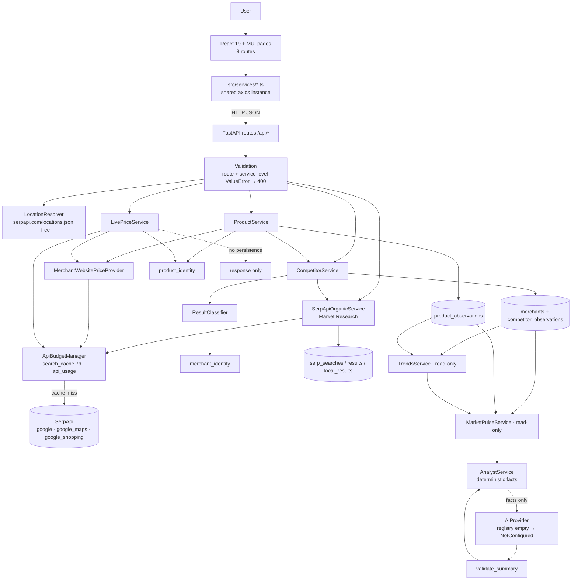
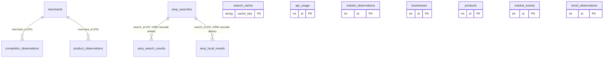

# MarketRadar — Final Pre-Submission Audit

**Audit date:** 2026-10-02 · **Scope:** `C:\MarketRadar` (backend, frontend, tests, docs, config, local DB)
**Mode:** read-only. No application code, configuration or data was changed. All runtime tests that could write ran against a *copy* of the database in a scratch directory, with the SerpApi search client stubbed so that **no credit could be spent**. The real `backend/data/market_radar.db` row counts were verified identical before and after the audit.

Companion document: [MarketRadar-Module-Working-and-Execution-Flow.md](MarketRadar-Module-Working-and-Execution-Flow.md) (Phase 20–21: per-module execution flow + sequence diagrams).

Classification used throughout: **Confirmed bug** (reproduced) · **Potential bug** (code path proven, not reproduced end-to-end) · **Architectural concern** · **Limitation** · **Improvement** · **Future feature**. Severity: P0 blocker · P1 high · P2 medium · P3 low · P4 future.

---

## Executive summary (Phase 25)

| # | Item | Result |
|---|---|---|
| 1 | Overall state | Core pipeline (Competitors → Products → Trends → Market Pulse → AI Analyst) is implemented and works end-to-end. The evidence model is careful and mostly honest. **One time-bomb defect will break repeat searches starting tomorrow (2026-10-03).** |
| 2 | Modules reviewed | 22 (21 required + Market Research usage/recent and legacy price modules) |
| 3 | API endpoints reviewed | 26 operations, 24 distinct paths (`/api/competitors` and `/api/products` are each registered with and without a trailing slash) |
| 4 | DB tables reviewed | 13 (6 actively written, 2 legacy, 4 unused, 1 cache) |
| 5 | Frontend pages reviewed | 8 (+ layout, 5 components, 9 services, 7 type files) |
| 6 | Tests | 481 collected test cases (369 `def test` functions + parametrisation) across 22 files |
| 7 | Backend tests | **481 passed**, 0 failed (24.95 s) |
| 8 | Frontend build | `tsc -b` **pass**; `vite build` **pass** (single 759 kB chunk warning) |
| 9 | Runtime smoke | Server starts clean on :8001; all free endpoints return 200; validation paths return the documented 400/404/422; provider-failure path returns 502; cache hit spends 0 credits; Trends/Pulse/Analyst made **0 provider calls and 0 DB writes** |
| 10 | Submission blockers | **1 × P0**: expired-cache refresh crashes after spending a credit (all 31 cache rows expire 2026-10-03) |
| 11 | High priority | 5 × P1: location resolver silently substitutes places; Market Pulse trend section leaks across locations/markets; summary validator accepts invented numbers; Price Intelligence UI hides backend error detail; README tells reviewers 5 working modules are "placeholders" |
| 12 | Known limitations | Token-subset product matching (accessories/other brands can match), USD/`$`-only price parsing, organic-result geo-drift, no AI vendor adapter (assisted mode unreachable in production), no migrations, project not under version control |
| 13 | Recommended final actions | Fix P0 (≈5 lines), then P1s in order listed in *Submission Blocking Issues*; refresh README; do not demo with a location typed as "City, Country-it-isn't-in" |

---

## Phase 0 — Project inventory

### Repository layout (excluding `venv/`, `node_modules/`)

| Area | Contents |
|---|---|
| `backend/app/` | `main.py`, `config.py`, `database/` (3), `models/` (10), `routes/` (10), `schemas/` (10), `services/` (21, 3 empty), `providers/` (1) — ≈6,000 lines |
| `backend/tests/` | 22 test modules + `conftest.py` (DB isolation guard) + `stubs.py` — ≈6,100 lines |
| `backend/` root strays | `test_usage.py` + `test_usage.db` (old ad-hoc test with its own DB; not collected because `pytest.ini` restricts to `tests/`), `search_strings.py` (8-line dev script) |
| `backend/data/` | `market_radar.db` (live, git-ignored), `.gitkeep` |
| `frontend/src/` | 8 pages, 1 layout, 5 components, 9 services (1 empty), 7 type files, theme — ≈4,000 lines |
| `docs/` | `MarketRadar-Technical-Documentation.md` (2,165 lines, current), `Commerce-Market-Intelligence.md`, LinkedIn content, 3 PDFs, and four **stale** stubs: `architecture.md`, `api.md`, `database.md`, `serpapi.md` |
| `_quarantine/` | 83 superseded scripts/tests/data staged for deletion (git-ignored, manifest in `_quarantine/README.md`) |
| Config | `.claude/launch.json` (backend only, port 8001), `backend/.env` + `.env.example`, `frontend/.env` + `.env.example`, `pytest.ini`, `vite.config.ts`, `tsconfig*.json`, `.oxlintrc.json` |
| VCS | **None** — the directory is not a git repository |

### Module inventory

| Module | B/F | Main files | Purpose | Depends on | Status |
|---|---|---|---|---|---|
| App bootstrap | B | `main.py`, `config.py`, `database/*` | FastAPI app, CORS, `create_all` + additive column sync | SQLAlchemy, pydantic-settings | Working |
| Health | B | `routes/health.py` | Liveness | — | Working |
| Market stub | B | `routes/market.py` | Placeholder `{"message": "Endpoint prepared for implementation"}` | — | **Dead/stub** (never called) |
| Market Research | B+F | `routes/serpapi.py`, `services/serpapi_organic_service.py`, `MarketResearch.tsx`, `serpapiApi.ts` | Google organic + local search with resolved location | Location, Search cache | Working with limitation |
| Location Resolver | B | `services/location_service.py` | Raw string → SerpApi canonical location (free catalogue) | `serpapi.com/locations.json` | **Working with significant limitation** (P1) |
| SerpApi integration / Search cache / credits | B | `services/api_budget.py`, `models/serpapi_models.py` | Cache-or-call, credit accounting, provider-error semantics | `google-search-results` | **Broken after TTL expiry** (P0) |
| SerpApi account usage | B | `services/serpapi_account.py`, `GET /api/serpapi/usage` | Real account quota (free endpoint) | `serpapi.com/account.json` | Working; frontend never calls it |
| Result Classifier | B | `services/result_classifier.py` | business/directory/social/article/marketplace/unknown | Merchant identity normalisers | Working with limitation |
| Merchant Identity | B | `services/merchant_identity.py` | Tiered matcher (domain → alias → name → name+address → fuzzy) | — | Working with limitation |
| Competitor Discovery + Observations | B+F | `services/competitor_service.py`, `routes/competitors.py`, `models/competitor.py`, `Competitors.tsx` | Discover, classify, dedupe, persist merchants + append-only observations | Organic service, Classifier, Identity | Working with limitation |
| Product Identity | B | `services/product_identity.py` | Canonicalise + strict token/size/variant/model matching | — | Working with limitation (P2) |
| Merchant website provider | B | `providers/merchant_website_provider.py` | `site:domain product` search, page-type + price extraction | Search cache | Working with limitation (USD only) |
| Product Discovery + Observations | B+F | `services/product_service.py`, `routes/products.py`, `models/product_observation.py`, `Products.tsx` | Merchants → site search → identity → evidence → append | Competitors, Website provider, Product identity | Working with limitation |
| Price Intelligence (local) | B+F | `services/live_price_service.py`, `routes/prices.py` (`/local`), `PriceIntelligence.tsx`, `priceApi.ts` | Geocode → Maps merchants in radius → website + Shopping evidence → verified price stats | Website provider, Identity, Location | Working with limitation; error handling weak (P1/P2); **persists nothing** |
| Legacy price (Shopping) | B | `routes/prices.py` (`/search`, `/history`, `/changes`), `serpapi_service.py`, `normalization_service.py`, `intelligence_service.py`, `models/market_observation.py` | Old Google Shopping observations | — | **Dead/unused** by UI; `/changes` logic flawed |
| Trends | B+F | `services/trends_service.py`, `routes/trends.py`, `Trends.tsx`, `trendApi.ts` | Read-only series with collapse-identical-readings rule | Observation tables | Working with limitation (price/availability not location-scoped) |
| Market Pulse | B+F | `services/pulse_service.py`, `routes/pulse.py`, `MarketPulse.tsx`, `marketPulseApi.ts` | One-snapshot read model per market+location | Trends | **Partially correct** — trend section leaks context (P1) |
| AI Provider | B | `services/ai_provider.py` | Provider protocol + registry; default `NotConfiguredProvider` | settings | Working; **registry empty** → no real provider exists |
| AI Analyst | B+F | `services/analyst_service.py`, `routes/analyst.py`, `AIAnalyst.tsx`, `analystApi.ts` | Deterministic facts + optional validated narrative | Market Pulse, AI provider | Facts: working. Validator: **numeric check defective** (P1) |
| Unused models | B | `business.py`, `product.py`, `market_event.py`, `trend_observation.py` | Planned tables | — | Dead/unused (tables exist, 0 rows) |
| Empty/stub services | B | `maps_service.py`, `search_service.py`, `shopping_service.py` (0 bytes), `ai_service.py` (stub), `SerpApiService.search_google/maps/trends` (`pass`) | — | — | Dead |
| Frontend shell | F | `App.tsx`, `AppLayout.tsx`, `main.tsx`, `services/api.ts` | 8 routes, nav, 30-s health poll, axios instance | — | Working (no 404 route, no timeout) |
| Dashboard | F | `Dashboard.tsx` | Static landing cards | — | Working but static/stale copy |
| Testing infrastructure | B | `tests/conftest.py`, `tests/stubs.py`, `pytest.ini` | Isolated throwaway DB, live-call stubs | — | Working; no frontend tests |

---

## Phase 1 — Actual architecture

**Layer notes**

- **Frontend** — every call goes through `src/services/*`; no component calls axios directly. StrictMode is on, but no mount effect hits a paid `/search` endpoint, so dev double-mounting never spends credits.
- **Routes** — thin; map typed exceptions to status codes (400 invalid, 422 location unresolvable, 429, 502 provider failed, 503 not configured). Exception: `routes/prices.py` and `routes/serpapi.py` contain error-mapping gaps (see Phase 12).
- **Validation** — mostly in services (`validate_discovery_request`, product checks). Numeric params (`num`, `max_merchants`, `radius`, `limit`) are **not bounded**.
- **Provider layer** — a single `ApiBudgetManager` owns cache lookup, credit reservation (`api_usage` insert-then-settle), the live call, and cache write. `None` = provider failure; never conflated with empty results. This separation is good.
- **Evidence layer** — `merchants` (identity) vs append-only `competitor_observations` / `product_observations` (evidence). Price Intelligence (`/prices/local`) is **outside** this layer: it writes nothing except cache/usage, so its results never reach Trends, Pulse or the Analyst.
- **Read models** — Trends, Market Pulse, Analyst are pure reads (verified: 0 provider calls, 0 DB changes).
- **AI** — deterministic facts are the source of truth; the model only narrates. With no adapter registered, production always runs in `deterministic` mode.

---

## Phase 2 — Module-by-module audit

> Detailed execution flows for each module are in the companion document. This section records purpose, interactions, status and findings.

### 1. Market Research
- **Entry:** `MarketResearch.tsx` → `serpapiApi.searchOrganic` → `GET /api/serpapi/search` (`routes/serpapi.py:19`) → `SerpApiOrganicService.search_google` (`serpapi_organic_service.py:38`).
- **DB:** writes `serp_searches`, `serp_search_results`, `serp_local_results` on **every** request including cache hits; reads `search_cache`; inserts/updates `api_usage` on live calls.
- **External:** `locations.json` (free) then `engine=google` (1 credit on miss).
- **Cache:** key `v3|google|{q}|{resolved_location}|{num}|{start}|{hl}|{gl}|{google_domain}`, TTL 7 days, in-request memo `_exec_cache`.
- **Validation:** blank `q` → 400; unresolvable location → 422. Location optional (unscoped global search allowed here, unlike Competitors).
- **Errors:** provider failure → 502 with provider message; any other exception → 500 with `str(e)` in body (`routes/serpapi.py:47-48`).
- **Status:** Working with limitation.
- **Findings:**
  - Confirmed bug (P3): the "Market/Industry" input is uncontrolled and never sent (`MarketResearch.tsx:122`).
  - Confirmed bug (P3): the recent-search label is a hardcoded heuristic, `includes('wine') ? 'Wine Retail' : 'Market Research'` (`MarketResearch.tsx:183`).
  - Potential bug (P2): the recent-search "Open" button re-runs a **paid** search and swallows every error with `catch(e) {}` (`MarketResearch.tsx:210`).
  - Potential bug (P3): a malformed provider payload (`organic_results: null`) produces an unhandled 500. Reproduced via Competitors, which uses the same code at `serpapi_organic_service.py:89-90`.
  - Improvement (P3): `serp_searches.location` stores the raw input, not the resolved canonical name.

### 2. Location Resolver
- **Entry:** `default_resolver.resolve()` from organic service (Market Research, Competitors, Products) and `resolve_or_none()` from Shopping/Price Intelligence.
- **External:** `GET https://serpapi.com/locations.json?q=…&limit=5` — free, keyless. Up to 6 candidate lookups per string.
- **Cache:** in-process dict, unbounded, never expires. **Negative results are cached for the process lifetime**, so a catalogue HTTP 5xx (`resp.ok` false → `[]`) is cached as "location does not exist" until restart (`location_service.py:157-158, 182-183`). Network exceptions are correctly not cached.
- **No hardcoded cities, countries, coordinates or industries.** Confirmed.
- **Live results (free catalogue, 2026-10-02):**

| Input | Resolved to | Verdict |
|---|---|---|
| `Holmdel, NJ` | Holmdel,New Jersey,United States | ✅ |
| `  HOLMDEL , new jersey ` | Holmdel,New Jersey,United States | ✅ whitespace/casing |
| `08807` | 08807,New Jersey,United States | ✅ postal |
| `Austin, Texas` / `Lyon, France` / `São Paulo` | correct city | ✅ |
| `asdfqwerzx`, `<script>` | 422 | ✅ |
| `Hyderabad` | Hyderabad,Telangana,India (ambiguous: Pakistan alt) | ⚠️ ambiguous flagged |
| **`Xyzzyville, New Jersey`** | **Newark,New Jersey** | ❌ unknown city silently becomes Newark |
| **`Holmdel, Germany`** | **Holmdel,New Jersey** (ambiguous=false) | ❌ contradicting country dropped silently |
| **`Texas`** | **Dallas,Texas** | ❌ a state resolves to a city (City ranks above State, `location_service.py:38-42`) |
| `NJ` | NJ-4 Congressional District (weak fallback) | ❌ |
| `1234 Main St, Springfield` | Springfield, Illinois | ⚠️ street discarded; ambiguous |

- **Status:** Working with significant limitation.
- **Finding (P1, confirmed):** an unresolvable or wrong component degrades to a *different valid place*. The search is then persisted under that place, as `location_resolved`. This violates "unresolved locations cannot accidentally become valid searches". `ambiguous`/`alternatives` are returned, but the backend does not block on them, and nothing in the UI warns the user.

### 3. SerpApi integration / 4. Search Cache
- **Files:** `api_budget.py`, `serpapi_models.py:18-23`.
- **Flow:** `_exec_cache` hit → in-memory. Otherwise read the `search_cache` row; if it exists and is unexpired, it is a hit. Otherwise insert an `api_usage` reservation (`success=0, credits=1`), call `GoogleSearch`, settle the reservation (`1/1` on success, `0/0` on failure), then **`db.add(SearchCache(...))`** (`api_budget.py:130-136`).
- **Status:** Broken after TTL.
- **Finding (P0, confirmed by reproduction):** when an **expired** row exists for the same `cache_key` (the primary key), line 130 inserts a second row with that key. The result is `IntegrityError: UNIQUE constraint failed: search_cache.cache_key`, raised *after* the live call succeeded and the credit was recorded. Nothing in the routes catches it, so the user gets HTTP 500, the session is left in a failed state, and every retry spends another credit and fails the same way. **All 31 rows in the live cache were created 2026-09-26 and expire 2026-10-03 09:17–12:15 UTC**, so every repeat of the demo searches fails from tomorrow. No test covers expiry: no test references `expires_at`.
- **Other findings:**
  - P4: the logger adds a new `StreamHandler` at import (`api_budget.py:14-17`). It is harmless, but the handler would duplicate if the module were re-imported.
  - P4: `params["api_key"]` mutates the caller's dict.
  - P3: `credits_used` is recorded as 1 even for engines that may bill differently. This is acceptable.

### 5. Merchant Identity
- **Files:** `merchant_identity.py`; persistence matching in `competitor_service.py:423-443`.
- **Within one search:** the tiered matcher runs; a tier with more than one hit is treated as ambiguous and becomes `uncertain`.
- **Across searches (`_find_existing`):** domain, then place_id, then **exact `normalized_name` across the entire table, with no location constraint**.
- **Findings:**
  - Architectural concern (P2): two unrelated same-name businesses in different cities ("Joe's Pizza", Austin and Hyderabad) merge into one `merchants` row. This contradicts the docstring ("a wrong merge is unrecoverable"). The current DB has no duplicate names, so this has not occurred yet.
  - Architectural concern (P2): chain stores sharing a domain collapse into one merchant per domain, both within a search (exact_domain merge, `competitor_service.py:321-364`) and across searches. Per-store place_id, address and coordinates of later stores are lost (fill-gaps only).
  - Limitation: `_STOPWORDS` removes "store", "shop" and "market", so "The Market" normalises to `""` and the candidate is skipped (`competitor_service.py:317-319`).

### 6. Competitor Discovery / 7. Competitor Observations
- **Entry:** `Competitors.tsx` → `GET /api/competitors/search` (`routes/competitors.py:28`) → `CompetitorService.discover`.
- **Validation:** market or query ≥2 chars with a letter, plus location required (400). Location must resolve (422).
- **Processing:**
  1. One google search (1 credit on miss).
  2. Local results are classified as business when they have a place_id or address; platform-domain websites are stripped from identity.
  3. Organic results go through `classify_organic_result`, with local domains as corroboration.
  4. Within-search dedupe, then status: verified / discovered / uncertain.
  5. Upsert the merchant and append a `CompetitorObservation` per evidence row.
- **Runtime:**
  - Cache hit: 0 calls, 200; 3 verified, 1 discovered, 5 rejected.
  - Stub failure: 502, only an `api_usage` row written.
  - Empty payload: 200 `no_results`.
  - Malformed payload: **500**.
- **gov/mil test** (`result_classifier.py`):

| URL | Result |
|---|---|
| government-supplies.com, govinda.com, mil.com, milford-motors.com | business ✅ (not falsely rejected) |
| nasa.gov, army.mil | non_commercial ✅ |
| **www.gov.uk**, **defence.mil.au** | **business ❌** — `classify_organic_result` passes the *registrable* domain (`gov.uk`, `mil.au`) to `is_non_commercial_domain` (`result_classifier.py:249,259`), which needs the full host. Tests call `is_non_commercial_domain` directly with full hosts, so they pass. P3. |
| local result with a `.gov` website | business. The local path never checks the namespace; corroboration also precedes the namespace check (`:254`). P4. |

- **Geo-drift (confirmed in the live DB):** organic results are classified only by URL shape, with no geographic check.
  - `jacquesscott.com` "Grand Cayman Wine Stores" is persisted as a *discovered* competitor of Wine Retail in Holmdel, NJ.
  - `exchange.aaa.com` (a US AAA article) and `cncautohamptonbays.net` (Hampton Bays, NY) appear in **Automotive Repair, Hyderabad**.
  - The Analyst does flag "no address or coordinates… geographic relevance could not be verified", which is honest, but the merchants still show up in competitor lists. Limitation, demo-visible (P2).
- **Status:** Working with limitation.

### 8. Product Identity
- **Normalisation verified:**
  - "Proper No. Twelve 750ml" ≡ "Proper Twelve 750 ML" ✅
  - "12" ≡ "Twelve" ✅
  - Punctuation and whitespace ✅
  - Different size (1.75L) → `different_size` ✅
  - Pro Max vs base model → `different_variant` ✅
  - S24 vs S25 → missing token ✅
- **Failures (confirmed):**

| Query | Candidate | Result |
|---|---|---|
| `iPhone 15` | `iPhone 15 Silicone Case` | **matched, size_ok** |
| `Coca Cola` | `Coca Cola Bottle Opener Keychain` | **matched** |
| `Barefoot Merlot` | `Josh Merlot Barefoot Collection` (different brand) | **matched** |
| `Nike Air Max 90` | `Nike Air Max 90 Kids` | **matched** |
| `KJ Chardonnay 750ml` | `KJ Chardonnay 75cl` | `different_size` → can set product `not_found` (no unit conversion) |
| `X 750ml` + snippet "also in 1.5l" | — | `different_size` → **contradiction from snippet text** can mark a correct product `not_found` |
| `Tide Pods 42 ct` | `Tide Pods 81 count` | matched, size unconfirmed ("count" not aliased; price correctly blocked) |

- **Root cause:** identity is "every query token present in the candidate". Extra tokens in the candidate (accessory nouns, other brands) are allowed unless they are in the 40-word `QUALIFIER_TOKENS` list (`product_identity.py:523-534`).
- **Status:** Working with limitation.
- **Finding (P2):** wrong product or wrong brand **can** become `found` + `verified` price. The guard is the merchant `site:` scope plus a `$` price on a product page, which reduces but does not eliminate the risk.

### 9. Product Discovery / 10. Product Observations
- **Entry:** `Products.tsx` → `GET /api/products/search` → `ProductService.discover`. It requires q (≥2 chars, a letter) and a location (400), then delegates merchant discovery to `CompetitorService.discover(market=market or product, query=market or product)`.
- **Selection:** non-uncertain merchants with a domain, capped at `max_merchants` (default 5, **unbounded**, negative values not rejected). Each costs 1 credit on a miss.
- **Per merchant:** `site:{domain} {product}`, then off-domain rows are rejected, then `match_product`, then `_score` (listing / range / ambiguous / size_unverified / no price → `unavailable`). The best row is kept; otherwise the result is `unknown`, or `not_found` only on a specific contradiction.
- **Statuses verified at runtime:**
  - `product_status` and `price_status` are independent.
  - `unknown` is never shown as "not found".
  - A provider error becomes `unknown/provider_request_failed`.
  - `evidence_scope=catalog`, `inventory_confirmed=false` always.
  - **"price unavailable" never becomes "product unavailable"** ✅ (backend and UI).
- **Findings:**
  - Architectural concern (P2): when Market is blank, competitor observations are filed under `market=<product text>` while product observations are filed under `market=NULL` (`product_service.py:102, 320`). One search therefore splits into two Pulse contexts, and the NULL one is unselectable in a meaningful way (see Pulse).
  - Limitation (P2): currency is hardcoded `"USD"` (`product_service.py:300`). The price regex only matches `$NN.NN` (`merchant_website_provider.py:622-672`), so "$1,299.99", "$25", "£", "€" and "₹" never verify, and CAD/AUD "$" would be mislabelled USD.
  - Potential bug (P3): provider-failure rows are persisted as `unknown` observations. A later successful search then reads as an availability change (`found` vs `unknown`).
- **Status:** Working with limitation.

### 11. Price Intelligence (`/api/prices/local`)
- **Flow:**
  1. Geocode via `google_maps` (1 credit).
  2. Maps search `"{product} stores"` at `ll=@lat,lon,11z` (1 credit), then a haversine filter in **miles**.
  3. Per merchant with a domain, a `site:` search (1 credit each, **uncapped**).
  4. Google Shopping (1 credit).
  5. `apply_candidate` per row, then stats over `verified_obs`.
- **Source hierarchy:** merchant website (exact domain, catalog) is applied first. Shopping (`marketplace_listing`, merchant matched by domain/name tiers) can only fill merchants not already verified. Ambiguous (chain) matches → `merchant_identity_uncertain`. ✅
- **Stats:** lowest/avg/highest are computed only from `verified_obs`; the reference store is excluded; `mixed_size_statistics` is flagged. ✅ No fake stats when there are no verified prices (all `None`).
- **Findings:**
  - Confirmed bug (P1, frontend): `PriceIntelligence.tsx:45` shows `err.message` ("Request failed with status code 422") instead of the backend `detail`.
  - Confirmed bug (P2, backend): a missing API key **or** a provider outage on geocode returns **422 "Could not resolve 'Austin, Texas'. The location provider did not respond."** (`live_price_service.py:49-56`; the route has no key check, `prices.py:86-110`). The user is told their location is bad. Any other exception gives an unhandled 500.
  - Potential bug (P2, frontend): lowest/average/highest render with **a single** verified price (all three identical) and with mixed sizes. There is no sufficiency gate here, unlike Market Pulse (`PriceIntelligence.tsx:172-213`).
  - Validation gap (P3): `radius` accepts 0 or negative values (all merchants are then filtered out, so the result looks like "no stores"). It is a required param, and a missing value returns FastAPI's 422 array, which collides with the 422 = "location" convention.
  - Potential bug (P3): `nearby` is looked up by name (`live_price_service.py:168`), so two same-named branches always attribute evidence to the first.
  - Architectural concern (P2): results are **not persisted**, so Price Intelligence findings are invisible to Trends, Pulse and the Analyst. The UI also never displays `searched_product`/`searched_area`, so stale results look current after the inputs are edited.
- **Status:** Working with limitation.

### 12. Trends
- **Read-only:** confirmed (0 provider calls, 0 DB changes in runtime test). No service imports a provider.
- **Collapse rule:**
  - One measurement → `insufficient_history` ✅
  - Repeated identical cached reading → `insufficient_history` ✅ (observed live: every series is insufficient; summary detail explains the 7-day cache)
  - `flat` only for ≥2 distinct points whose first and last values are equal ✅
  - A→B→A is reported as `flat` (net change) — limitation.
- **Context separation:**
  - Visibility key = (merchant, market, location) ✅
  - **Price and availability key = (normalized_query, merchant_id) only** (`trends_service.py:241, 260`), with no market or location. Because merchants are merged by domain across locations, a chain's price in Holmdel and in Austin form **one series**. Availability has no market filter at all (`routes/trends.py:44-50`). P2.
- **present_in_latest:**
  - Computed per (market, location) context and never worded as closure (backend `ABSENT_NOTE`, UI tooltip) ✅
  - But different *queries* filed under the same market label (e.g. "List down wine stores" and "Wine Retail", both "Wine Retail @ Holmdel") make businesses from the other query read as "not in latest" (observed: Hazlet Super Buy Rite, Total Wine) — limitation.
- **distinct_searches** is approximated by second-truncated timestamps (`trends_service.py:205`). One search whose inserts straddle a second boundary counts as two, which can mark a context "analyzable". P3.
- **Availability ordinal** `found=1, unknown=0, not_found=-1`: a change from found to unknown renders as a "down" arrow. P2 (UI semantics).
- **Status:** Working with limitation.

### 13. Market Pulse
- **Read-only, zero SerpApi, no discovery logic duplicated:** confirmed.
- **Competitors, products, prices, statistics and visibility** are filtered by the same (market, location) ✅. Statistics use distinct (merchant, query, price) triples and need ≥2 ✅ (live: 2 rows, 1 distinct, so insufficient — correct).
- **Confirmed bug (P1):** `_trends` (`pulse_service.py:345-369`) calls `price_trends(market=market)` without a location and then **keeps every price series regardless of location** (`or s.metric == "price"`). The location filter for visibility series is a **substring** test against `"market / location"` text. Reproduced:
  - `market=Wine Retail&location=Austin,Texas,United States` (no such data): `has_data=false`, yet `trends` contains the Holmdel price series *"Kendall Jackson … / Circle wine liquor and beer"*.
  - Location-only requests include price series from any market.
  - The AI Analyst builds its sections *before* checking `has_data`, so the leaked series also reaches the analyst payload.
- **Potential bug (P2):** an option whose market or location is NULL/empty is sent as "no filter", so the backend returns **all** markets/locations while the UI labels it "Unspecified market" (`MarketPulse.tsx:91-92`, `marketPulseApi.ts:27-28`; same in AIAnalyst). Triggered by Products searches without a market (see Module 9).
- **Minor:** the "Load snapshot" button with nothing selected loads everything. Pulse makes N+1 merchant lookups per row.
- **Status:** Partially correct; needs the P1 fix.

### 14. AI Analyst
- **Facts:** all 19 statements in the live run were deterministic strings built from the snapshot (`analyst_service.py:257-609`). Each carries an `EvidenceRef`. Record/merchant ids are present for competitors, products, prices and visibility; context and trend refs carry counts only.
- **Provider abstraction (runtime-verified with injected providers):**

| Case | Result |
|---|---|
| Not configured | `deterministic`, `provider_configured=false`, detail explains ✅ |
| `include_summary=false` | provider called **0** times ✅ |
| Valid summary | `assisted` ✅ |
| Banned phrase "market leader" | withheld, `summary_rejected=true`, facts unaffected ✅ |
| Empty response | `provider_error` set, deterministic ✅ |
| `AIProviderError` / arbitrary exception | caught, deterministic, facts intact ✅ |
| Unknown `AI_PROVIDER` name | `NotConfiguredProvider` + warning ✅ |
| **"There are 250 wine stores averaging 1000 dollars."** | **accepted** ❌ |
| **"Total Wine leads the market and I recommend matching its prices."** | **accepted** ❌ |

- **Confirmed bug (P1, `analyst_service.py:663-672`):** `known` always contains `"0"`, `"1"` and `"2"`. Any number that *starts with* a known number is accepted (`number.startswith(candidate)`), so every number beginning with 0, 1 or 2 passes (250, 1000, 20, 2.5, 19.9). The inline comment states the opposite intent. The only test (`test_ai_analyst.py:427`) uses "47", which happens to avoid the bypass.
- **Lexical weakness (limitation):** bans are phrase-exact stems. "leads the market", "clear leader", "strongest player", "I recommend", "rising fast", "demand is strong", "expanding", "appears closed" and "confidence score" all pass. Merchant names and page titles from the web are fed into the prompt unescaped (prompt-injection surface; mitigated only by this validator).
- **Limitation (P1 expectation):** `PROVIDER_REGISTRY` is empty (`ai_provider.py:64`), so no vendor adapter exists and **assisted mode cannot occur in production**. The README calls the product "AI-powered" while the AI layer is "Planned". Say this explicitly at submission.
- **Minor:**
  - Dead loop (`analyst_service.py:345-347`).
  - "2 verified price measurements are available" appears next to "only 1 distinct", which reads as contradictory (P3).
  - The UI chip can show "AI provider: null".
- **Status:** Deterministic analyst: Working. Summary validation: Broken (numeric), weak (lexical).

### 15. Frontend routing
8 routes in `App.tsx:22-29`, all reachable from the nav. There is **no catch-all route** (unknown path = blank page; P3). `frontend/README.md` route table is stale.

### 16. Frontend API services
All pages use `src/services/*`. `marketApi.ts` is 0 bytes and unused; `getUsageStats`, `types/price.ts`, `MetricCard` and some component props are unused. No axios timeout (P4). Base URL falls back to `http://127.0.0.1:8001/api`, which is in the CORS list ✅.

### 17. Database — see Phase 11. 18. Validation / 19. Error handling — see Phase 12. 20. Configuration — see Phase 19.

### 21. Testing infrastructure
`conftest.py` redirects `DATABASE_URL` to `tests/_test_market_radar.db` before import and asserts `_test_` in the engine URL — **good guard**. Live calls are stubbed. There are no frontend tests and no API contract tests against `/openapi.json`.

---

## Phase 3 — Market Research deep flow (verified transitions)

| Step | Where | Verified |
|---|---|---|
| User enters query (+ optional location; Market field ignored) | `MarketResearch.tsx:45,122,152` | Market not sent ❌ |
| Frontend validation | non-empty query only | ✅ |
| API request | `searchOrganic` → `GET /api/serpapi/search?q&location` | ✅ |
| Route | `routes/serpapi.py:19`; key missing → 503 (dependency) | ✅ |
| Request validation | blank q → 400 | ✅ runtime |
| Location resolver | invalid → 422 ✅; wrong-but-valid → silently substituted ❌ | runtime |
| Cache lookup | `ApiBudgetManager.execute_search` | hit ✅; **expired → 500 ❌ (P0)** |
| SerpApi | `engine=google` | stubbed |
| Provider failure | 502 with provider text | ✅ runtime |
| Empty result | 200 `provider_status=no_results` | ✅ runtime |
| Malformed response | 500 | ❌ P3 |
| Result processing | persist `serp_searches` + results, even on a cache hit | ✅ |
| UI rendering | tabs organic/local; 422/502 messages mapped; `detail` preferred | ✅ |

---

## Phases 4–10 — deep audits

Summarised in Phase 2 modules 2, 6, 8–14 with live evidence tables. Key outcomes:

- **Location resolver:** no hardcoding ✅; silent substitution ❌ (P1).
- **Competitor discovery:** gov/mil namespace logic does not over-reject ✅; `.gov.uk`/`.mil.au` slip through (P3); organic geo-drift persisted (P2); global name-merge risk (P2).
- **Product discovery:** normalisation ✅; wrong size, variant or model is blocked ✅; **wrong product (accessory) or wrong brand can match** (P2); snippet sizes can falsely contradict (P3); `price unavailable ≠ product unavailable` ✅.
- **Price intelligence:** only verified prices enter stats ✅; insufficient evidence gives `None` stats ✅; UI shows stats from a single price (P2); error mapping wrong (P1/P2); not persisted (P2).
- **Trends:** read-only ✅; collapse rule ✅; price/availability not location-scoped (P2).
- **Market Pulse:** zero SerpApi ✅; no DB mutation ✅; **trend section mixes contexts** (P1); NULL-option handling (P2).
- **AI Analyst:** facts are deterministic ✅; provider handling ✅; **numeric grounding bypass** (P1); lexical gaps (limitation); no real adapter (limitation).

---

## Phase 11 — Database audit

### Entity relationship diagram

### Table inventory (live DB, read-only)

| Table | Rows | Written by | Read by | Kind |
|---|---|---|---|---|
| merchants | 14 | Competitors (upsert: fill gaps, status upgrade, last_seen_at) | Competitors, Products, Trends, Pulse | Identity (mutable) |
| competitor_observations | 21 | Competitors | Trends, Pulse, list | **Append-only** |
| product_observations | 3 | Products | Trends, Pulse, list | **Append-only** |
| serp_searches / serp_search_results / serp_local_results | 17 / 122 / 45 | Organic service (every request) | `/serpapi/recent`, usage | Append-only log |
| search_cache | 31 (all expire 2026-10-03) | ApiBudgetManager | ApiBudgetManager | Cache (insert-only — **the P0**) |
| api_usage | 54 | ApiBudgetManager | `/serpapi/usage` | Append + one settle update |
| market_observations | 0 | legacy `/prices/search` | legacy `/history`, `/changes` | Legacy |
| businesses, products, market_events, trend_observations | 0 | nothing | nothing | **Unused** |

### Integrity checks
- **Foreign keys:** declared on 4 relations, but `PRAGMA foreign_keys = 0`, so SQLite does **not enforce** them. Orphans checked: **0** in all four relations ✅. No merchants without observations ✅.
- **Cascades:** ORM-level `cascade="all, delete"` on `serp_searches` → results (only fires on ORM delete; nothing deletes) — not dangerous.
- **Uniqueness:**
  - `merchants.merchant_id` is unique but never populated (always NULL).
  - `normalized_domain` and `place_id` are **not unique**, yet the code treats them as identity.
  - `products.sku` is unique on an unused table.
- **Indexes:** observation tables are well indexed (market, location_resolved, status, observed_at). `merchants.place_id` has **no index** although it is queried in `_find_existing` (P4 at this scale).
- **Nullable/naming:**
  - `market_observations.product_id` is a String while `products.id` is an Integer.
  - Two different "merchant_id" concepts: `merchants.merchant_id` (String, unused) vs `*.merchant_id` FK (Integer). Confusing (P4).
  - `merchants.source` defaults to `"google_maps"` but holds `google_maps_local`/`google_organic`.
- **Duplicate concepts:** `market_observations` (legacy price) vs `product_observations`; `Merchant` vs unused `Business`.
- **Dev/test records:**
  - No test or example merchants.
  - The cache holds a key `v3|google|x|None|20…` from a single-letter, location-less search made before validation existed (harmless; expires tomorrow).
  - `cncautohamptonbays.net`, `exchange.aaa.com` (Hyderabad) and `jacquesscott.com` (Holmdel) are **real but geographically wrong** organic records. They will appear in a demo of those contexts.
  - `backend/test_usage.db` (81 kB) is a stray test DB.
- **Migrations:** none. `schema_sync.py` adds nullable columns only; any type or constraint change needs a manual migration (documented).

---

## Phase 12 — API audit

| Method | Endpoint | Module | DB read | DB write | External | Cache | Status |
|---|---|---|---|---|---|---|---|
| GET | /api/health | Health | – | – | – | – | ✅ |
| GET | /api/market/search | Market | – | – | – | – | **Stub, unused** |
| GET | /api/serpapi/search | Market Research | cache | serp_*, api_usage, cache | locations.json, google | 7d | ✅ (P0 on expiry; 500 leaks `str(e)`) |
| POST | /api/serpapi/search/batch | Market Research | same | same | same ×≤20 | 7d | Unused by UI; per-query errors swallowed into a count |
| GET | /api/serpapi/usage | Usage | api_usage, serp_searches | – | account.json (free) | – | ✅, unused by UI |
| GET | /api/serpapi/recent | Market Research | serp_* | – | – | – | ✅ (N+1 via relationships, ≤5 rows) |
| GET | /api/competitors/search | Competitors | merchants, cache | merchants, competitor_obs, serp_*, api_usage, cache | locations.json, google | 7d | ✅ (P0 on expiry) |
| GET | /api/competitors, /api/competitors/ | Competitors | merchants, obs | – | – | – | ✅ (`limit` unbounded; N+1) |
| GET | /api/competitors/{id} | Competitors | merchants, obs | – | – | – | ✅ 404 |
| GET | /api/products/search | Products | as Competitors + product_obs | + product_observations | + google `site:` ×N | 7d | ✅ (P0 on expiry) |
| GET | /api/products, /api/products/ | Products | product_obs, merchants | – | – | – | ✅ |
| GET | /api/products/{id} | Products | product_obs | – | – | – | ✅ 404 |
| GET | /api/prices/local | Price Intelligence | cache | api_usage, cache | google_maps ×2, google `site:` ×N, google_shopping | 7d | ⚠️ no key check; outage→422; 500 otherwise |
| GET | /api/prices/search | Legacy | cache | market_observations, api_usage, cache | google_shopping | 7d | Unused by UI |
| GET | /api/prices/history | Legacy | market_observations | – | – | – | Unused; no response_model |
| GET | /api/prices/changes | Legacy | market_observations | – | – | – | Unused; **compares the two newest rows regardless of merchant** (`intelligence_service.py:516-531`) |
| GET | /api/trends/summary | Trends | obs, merchants | – | – | – | ✅ |
| GET | /api/trends/prices | Trends | product_obs | – | – | – | ⚠️ no location scoping |
| GET | /api/trends/availability | Trends | product_obs | – | – | – | ⚠️ no market/location filter |
| GET | /api/trends/visibility | Trends | competitor_obs | – | – | – | ✅ 400 on bad metric |
| GET | /api/trends/merchants | Trends | competitor_obs | – | – | – | ✅ |
| GET | /api/market-pulse/options | Pulse | obs | – | – | – | ✅ |
| GET | /api/market-pulse | Pulse | obs, merchants | – | – | – | ⚠️ trend leakage (P1) |
| GET | /api/analyst/analysis | Analyst | via Pulse | – | AI provider (none registered) | – | ✅ facts / ❌ validator |

**OpenAPI vs source:** `/openapi.json` exposes 26 path entries / 26 operations (24 distinct paths ignoring the trailing-slash aliases), matching the registered routers exactly. Discrepancies are only with **documentation**:
- `docs/api.md` lists `/api/trends/search` and `POST /api/analyst/query`, which do not exist, and calls implemented endpoints "planned".
- `backend/README.md:95-99` calls `/competitors/search`, `/market-pulse` and `/products/search` "scaffolded".

**Status-code convention:** 400 invalid, 422 location, 429, 502, 503 is applied consistently in Competitors and Products. Inconsistent in:
- Price Intelligence: provider failure gives 422; missing `radius` gives FastAPI's 422 array.
- `/serpapi/search`: catch-all 500 with the raw exception text.
- Path-param type errors give 422 (FastAPI default).

---

## Phase 13 — Frontend audit (summary; per-page detail in companion doc)

| Page | API | Loading | Error | Empty | Stale-data | Key issues |
|---|---|---|---|---|---|---|
| Dashboard | none | – | – | – | – | Static; omits 3 modules; "Discover what's growing" contradicts the no-conclusions design |
| Market Research | serpapi search/recent | ✅ | ✅ maps 422/502 + `detail` | ✅ | ✅ cleared | Dead Market field; hardcoded "Wine Retail" label; paid re-run swallows errors |
| Competitors | search/list/detail | ✅ | ✅ 400/422/502/503 | ✅ | ✅ | Saved-list load failure is silent ("No competitors yet"); count ignores `total` |
| Products | search/list/detail | ✅ | ✅ | ✅ (copy says location optional — wrong) | ✅ | Same silent list failure; non-USD currency dropped |
| Price Intelligence | prices/local | ✅ | ❌ axios text only | ✅ good 3-way split | ⚠️ never shows searched inputs | Stats with 1 price; "Increase radius" doesn't re-search; hardcoded `$`; low-contrast reference box; area prefilled "New York, NY" |
| Trends | 5 trend endpoints | ✅ | ⚠️ generic text, then **"Nothing recorded… run searches"** under the error | ✅ | ✅ | `Promise.all` blanks all tabs on one failure; found→unknown shows as "down" |
| Market Pulse | options, pulse | ✅ | ✅ `detail` | ✅ (missing for 2 tabs) | ❌ previous snapshot stays after a failed reload | NULL option → all markets |
| AI Analyst | options, analysis | ✅ | ✅ | ✅ | ❌ same as Pulse | "AI provider: null" chip; record ids not shown |

Verified correct across pages:
- No `console.log`, TODO or `dangerouslySetInnerHTML`.
- No mocked production data.
- TS types match the Pydantic schemas field by field, including all status enums.
- "unknown" is never rendered as "not found".
- "price unavailable" is never rendered as "product unavailable".
- `present_in_latest=false` → "not in latest" with a not-closure tooltip.
- `insufficient_history` never shows a flat arrow.
- Pulse statistics are gated on `sufficient`.

---

## Phase 14 — End-to-end runtime results

All mutating calls ran in-process (FastAPI `TestClient`) against a DB **copy**, with `GoogleSearch` replaced by a stub that raises or returns a scripted payload. The real server was also started via the project launch config and hit with read-only GETs.

| Area | Case | Actual |
|---|---|---|
| Server | `uvicorn app.main:app` startup | ✅ clean; `/api/health` 200; `/docs` 200; 26 OpenAPI path entries |
| Market Research | blank q | 400 ✅ |
| | invalid location | 422 readable message ✅ |
| | malformed provider payload | **500** ❌ |
| Competitors | no location / "x" / no market+query | 400 ×3 ✅ |
| | invalid location | 422 ✅ |
| | cache hit (Wine Retail, Holmdel NJ) | 200, `cache_hit=true`, **0 provider calls**; appended 4 observations + 1 serp_search |
| | provider failure | 502, only an `api_usage` row written ✅ |
| | empty provider result | 200 `no_results` ✅ |
| | expired cache refresh | **IntegrityError → 500 after a credit is recorded** ❌ P0 |
| Products | missing q / missing location / invalid location | 400 / 400 / 422 ✅ |
| | cached run | 200: 1 found+verified (19.99), 2 unknown; `catalog`, `inventory_confirmed=false` ✅ |
| Price Intelligence | missing radius | 422 (FastAPI array) ⚠️ |
| | provider failure | **422 "location provider did not respond"** ❌ |
| | no API key | **422 same message** ❌ (`/prices/search` correctly returns 503) |
| | negative radius | accepted ⚠️ |
| Trends | summary | `insufficient_history=true`, detail explains the cache ✅ |
| | all series | `insufficient_history` (identical cached readings collapsed) ✅ |
| Market Pulse | 3 options, each snapshot | coherent competitors/products/prices ✅ |
| | price stats (2 rows, 1 distinct) | `sufficient=false` ✅ |
| | Wine Retail @ Austin (no data) | `has_data=false` but **trends contain a Holmdel price series** ❌ |
| | DB immutability, SerpApi calls | 0 DB changes, 0 calls ✅ |
| AI Analyst | deterministic, include_summary=false, mock ok, banned, empty, error, crash | all as designed ✅ |
| | invented numbers / unbanned conclusion | **accepted** ❌ |
| CORS | `Origin: http://localhost:5173` | allowed ✅ |
| | `Origin: http://evil.example` | 400, no ACAO ✅ |

No API key appears in any output or in this report. The configured key appears in no file other than `backend/.env`.

---

## Phase 15 — Test suite audit

- **Backend:** 481 passed, 2 deprecation warnings (httpx `cgi`; pydantic class-based `Config`).
- **Frontend:** `tsc -b` ✅; `vite build` ✅ (one 759 kB JS chunk). There are no frontend unit or e2e tests, and `strict` is off in `tsconfig.app.json`.

| Area | Tests exist | Important missing tests | Risk |
|---|---|---|---|
| Search cache | hit/miss, credit accounting | **expired row refresh** (the P0) | **High** |
| Location resolver | candidate generation, stubbed catalogue | contradicting component ("Holmdel, Germany"), unknown city + valid state, state→city ranking, negative-cache on HTTP 5xx | High |
| Market Pulse | read-only, context fields | **trend section scoped by location**; NULL-market option | High |
| AI validator | one unknown-figure case ("47") | numbers beginning 0/1/2, prefixes of known numbers, paraphrased conclusions | High |
| Product identity | sizes, variants, models, normalisation | accessories, other-brand supersets, unit conversion, snippet-only size contradiction | Medium |
| Price Intelligence route | **none for `/api/prices/local`** (`test_prices_api.py` only covers legacy `/search`) | no-key, provider failure, radius validation, single-price stats | Medium |
| Classifier | gov/mil on full hosts | gov.uk/mil.au **through `classify_organic_result`** | Low |
| Competitors | broad | malformed payload, same-name merchants in different cities | Medium |
| Trends | collapse, contexts | price series across two locations for a chain merchant | Medium |
| Frontend | none | error-detail mapping, stale-data states, NULL option | Medium |

**Brittle or implementation-specific tests:**
- Some tests pin exact explanatory sentences or counts of stages. Wording changes will fail them without a behavioural change.
- The figure test passes only because its number avoids the prefix bypass.

---

## Phase 16 — Security audit

| Check | Result |
|---|---|
| Secrets in repo | `backend/.env` holds the real key. It is git-ignored, but **there is no git repo**, so any zip/copy for submission will include `.env` unless excluded manually. **P1 operational risk.** No other file contains the key. `.env.example` files are placeholders ✅ |
| Key handling | Key sent only to serpapi.com. The account response is filtered to an allow-list, so `api_key`/email are never returned ✅. On failure, `last_error` is the provider's error text, surfaced in 502 bodies; SerpApi errors don't echo the key, but this is not sanitised (P4) |
| SQL injection | Raw SQL uses bound parameters (`api_budget.py`, usage query); `schema_sync` interpolates model-defined names only ✅ |
| SSRF / external requests | Outbound hosts are fixed (serpapi.com). User input goes only into query parameters. The `site:` domain comes from provider data, not the user ✅ |
| XSS | No `dangerouslySetInnerHTML`. React escapes provider text. URLs from providers are rendered as `href`s; a `javascript:` URL from a provider would be clickable (P4, not observed) |
| CORS | Explicit origin list, credentials true, methods/headers `*` → acceptable for local dev ✅ |
| Error details | `/serpapi/search` returns `str(e)` on a 500 (`routes/serpapi.py:48`) — P3 |
| Logging | Usage logger prints queries/domains, not keys ✅ |
| AuthN/AuthZ | **None.** Every endpoint, including credit-spending ones, is open to anyone who can reach the port. Default bind 127.0.0.1 ✅. Must not be exposed publicly as-is (limitation; document it) |
| Cost abuse | `num`, `max_merchants`, batch size ≤20, the uncapped Price Intelligence `site:` fan-out, and `limit` are unbounded or user-controlled → credit/DoS amplification if exposed (P3) |
| Prompt injection | Web-sourced names/titles enter the LLM prompt. Mitigated only by the weak validator (see Analyst) |

No submission-blocking code vulnerability for a local demo.

---

## Phase 17 — Code quality

- **Dead code:**
  - `routes/market.py`
  - `services/{maps,search,shopping}_service.py` (empty)
  - `ai_service.py`
  - `SerpApiService.search_google/maps/trends` (`pass`)
  - models `Business`/`Product`/`MarketEvent`/`TrendObservation`
  - `classify_organic_results` (unused helper)
  - `ApiBudgetManager.used_*` counters, which are only meaningful for Price Intelligence
  - analyst dead loop `:345-347`
  - frontend `marketApi.ts` (0 B), `types/price.ts`, `MetricCard`, `getUsageStats`
  - `backend/test_usage.py`, `test_usage.db`, `search_strings.py`
- **Duplicated logic:**
  - Two `extract_sizes` implementations with different unit sets (`product_identity.py:471` vs `merchant_website_provider.py:633`).
  - Two `SerpApiNotConfiguredError` classes (`serpapi_service.py:6`, `serpapi_organic_service.py:16`).
  - Two `StageStatus` schemas (competitor, product, local_price).
  - `_ordered_unique` is defined twice.
  - `apply_candidate` in `live_price_service.py` re-implements `ProductService._score`'s rules (same order, separately maintained — a drift risk).
- **Business logic in routes:** minimal. The batch route loops queries itself. Fine.
- **Business logic in components:** `Trends.tsx:63-65` mirrors the availability ordinal. `PriceIntelligence.tsx` computes the reference difference client-side.
- **Large units:** `competitor_service.py` (642 lines), `analyst_service.py` (581), `live_price_service.fetch_real_data` (~300-line function with nested closure), page components of 450–590 lines.
- **Magic numbers:** 7-day TTL hardcoded in two places (`api_budget.py:133` and the user-facing text in trends/pulse/analyst), `11z` zoom, 3958.8 miles, `MAX_CANDIDATES=6`, `_MIN_FUZZY_LEN=8`, `address[:12]` match.
- **Inconsistent naming:** "Analyse" vs US spelling; `merchant_id` dual meaning; `canonicalise` vs `normalize_*`.
- **No circular imports detected** (the app imports cleanly; Products → Competitors → Organic is one-directional).

---

## Phase 18 — Performance

- **N+1 queries:**
  - `CompetitorService._to_schema` (1 query per merchant in the list).
  - Pulse `_competitors`/`_products`/`_prices`/`_visibility` (1 merchant lookup per row).
  - Trends `_merchant_name` per series.
  - `get_recent_searches` lazy-loads results.
  - Fine at the current scale (≤30 rows); degrades linearly.
- **Full-table scans:** `TrendsService.summary()` loads all observations and then calls four more trend computations (each re-reading tables). Pulse options load every observation row. Fine now.
- **Serial provider calls:**
  - Products runs up to `max_merchants` sequential live searches.
  - Price Intelligence runs geocode, maps, *N* site searches, then shopping, all sequential and synchronous in a sync endpoint.
  - With no axios timeout, a cold Price Intelligence run can take tens of seconds. This is the most likely visible delay in a live demo.
- **Location resolution:** up to 6 sequential catalogue lookups (10 s timeout each) on first sight of a string; cached afterwards in-process.
- **Frontend:**
  - Single 759 kB bundle (no code splitting).
  - Health poll every 30 s flips the indicator to "checking".
  - StrictMode causes duplicate *free* GETs in dev only.
- **No evidence of duplicate paid calls** from the UI.

---

## Phase 19 — Production / submission readiness

| Dimension | Assessment |
|---|---|
| Functionality | All 8 pages backed by working endpoints. Legacy `/prices/search` family and `/market/search` unused |
| Reliability | **P0 cache-expiry crash from 2026-10-03.** Price Intelligence is the slowest and most failure-prone flow |
| Data integrity | Append-only evidence ✅. Risks: wrong-place location substitution, organic geo-drift, global name merge, accessory/brand false matches |
| Error handling | Honest in Competitors/Products/Pulse/Analyst. Weak in Price Intelligence (backend and UI) and Trends (error then "no data") |
| UX | Evidence semantics are clear and careful. Dashboard is static and slightly overclaims |
| Performance | Acceptable; cold Price Intelligence is slow |
| Security | Fine for localhost. No auth. `.env` handling risk because there is no VCS |
| Documentation | `MarketRadar-Technical-Documentation.md` is current. **README.md, backend/README.md, frontend/README.md, docs/api.md, docs/architecture.md and docs/database.md are stale** and tell a reviewer core modules are placeholders |
| Configuration | `.env.example` lacks `AI_PROVIDER`, `AI_API_KEY`, `AI_MODEL` and `CORS_ORIGINS`. `launch.json` has backend only. Frontend `.env` falls back sensibly |
| Reproducibility | `requirements.txt` pinned ✅. `package-lock.json` present ✅. Python version: README says 3.9+, venv is 3.12. **No git repo.** DB auto-creates ✅ |
| Demo readiness | Risks, in order: (1) any repeated search → 500 after the cache expires; (2) a typed location silently mapped elsewhere; (3) Grand Cayman/AAA rows in competitor lists; (4) Price Intelligence error shows "Request failed with status code 422"; (5) "Load snapshot" with no selection mixes all markets |

---

# Submission Blocking Issues (Phase 22)

### SB-1 · P0 · Search cache · `backend/app/services/api_budget.py:92-93, 130-136`
- **Problem:** On a cache miss caused by an *expired* row, a new `SearchCache` with the same primary key is added. The commit raises `IntegrityError`.
- **Why it matters:** Every repeated search becomes HTTP 500 after its 7-day TTL. A credit is recorded and spent each time, and the key can never refresh. All 31 live cache rows expire **2026-10-03**, so the demo searches break tomorrow.
- **Reproduction:**
  1. Insert a `search_cache` row with `expires_at` in the past.
  2. Call `ApiBudgetManager.execute_search` with the same key (or wait until tomorrow and re-run "Wine Retail @ Holmdel, NJ").
- **Expected:** a fresh response replaces the expired row.
- **Actual:** `sqlite3.IntegrityError: UNIQUE constraint failed: search_cache.cache_key`, 500, credit recorded as used.
- **Recommended fix:** update the expired row in place (`cached.response_data = …; cached.expires_at = …`), or `db.merge(SearchCache(...))`. Add a regression test with an expired row.
- **Risk of fixing:** Very low. It is localised to the cache write, and existing tests cover hit/miss.

### SB-2 · P1 · Market Pulse · `backend/app/services/pulse_service.py:345-369`
- **Problem:** The trend section is not scoped by location. Price series are kept unconditionally, and location matching is a substring test.
- **Why it matters:** It breaks the module's core guarantee ("a snapshot can never mix…"), and the leaked series flows into AI Analyst facts.
- **Reproduction:** `GET /api/market-pulse?market=Wine Retail&location=Austin,Texas,United States` → `has_data=false` but `trends[0]` is the Holmdel price series.
- **Expected:** only series built from this market+location's rows.
- **Actual:** cross-location price series.
- **Recommended fix:** derive trend series from the already-filtered `competitor_rows`/`product_rows` (TrendsService helpers accept rows), or add `location` filters to `price_trends`/`visibility_trends` and compare `location_resolved` exactly. Return no trends when `has_data` is false.
- **Risk of fixing:** Low–medium. It touches the shared Trends API, so the Trends tests need extending.

### SB-3 · P1 · AI Analyst · `backend/app/services/analyst_service.py:660-674`
- **Problem:** Numeric grounding accepts any number with a prefix relationship to a known number, and `"0"`, `"1"` and `"2"` are always known.
- **Why it matters:** It defeats the "AI is not the source of truth" guarantee for figures. Severity is P1 rather than P0 only because no provider adapter is registered today.
- **Reproduction:** `validate_summary("There are 250 stores averaging 1000 dollars.", ["3 verified businesses…", "…19.99 USD."])` → `(True, None)`.
- **Expected:** rejected.
- **Actual:** accepted.
- **Recommended fix:** require exact membership. Optionally allow a small whitelist of spelled-out counts, and normalise "19.99" vs "19.990". Add tests for 250/1000/20/19.9.
- **Risk of fixing:** Low. It may reject some harmless summaries, which is the intended trade-off.

### SB-4 · P1 · Location Resolver · `backend/app/services/location_service.py:200-232, 38-42`
- **Problem:** Partial-component fallback silently substitutes a different place: unknown city + state → that state's top city; a city with a contradicting country → the city elsewhere; a state → its largest city.
- **Why it matters:** Wrong-location searches are persisted as real evidence (`location_resolved`). This is the exact case "unresolved locations must not become valid searches".
- **Reproduction:**
  - `resolve("Xyzzyville, New Jersey")` → Newark
  - `resolve("Holmdel, Germany")` → Holmdel, NJ
  - `resolve("Texas")` → Dallas
- **Expected:** an error, or a resolution the user must confirm.
- **Actual:** silent substitution. `ambiguous` is sometimes set, but no caller acts on it.
- **Recommended fix (minimal):** when `matched_candidate` is not the full input and a discarded component does not appear in the resolved `canonical_name`, raise `LocationResolutionError` naming the resolved alternative. Rank `State` above `City` when the input exactly equals a state name. Surface `location_resolved` prominently in the UI (Competitors/Products already return it).
- **Risk of fixing:** Medium. Stricter resolution may reject inputs that work today (for example "Holmdel, NJ", where "NJ" does not appear in "New Jersey"), so abbreviations need care. If time is short, ship only the UI change: show "Searched: <canonical name>" with a warning when `ambiguous` or when the matched candidate differs from the input.

### SB-5 · P1 · Price Intelligence error handling · `frontend/src/pages/PriceIntelligence/PriceIntelligence.tsx:45`; `backend/app/routes/prices.py:86-110`; `backend/app/services/live_price_service.py:49-56`
- **Problem:**
  - The UI shows axios text, not `detail`.
  - The backend maps a missing key and provider outages to 422 "location could not be resolved".
  - Other errors give a bare 500.
- **Why it matters:** This is the most demo-visible failure. The user is told their location is wrong when the provider failed.
- **Reproduction:** run with the SerpApi stub failing, or with no key → 422 "Could not resolve 'Austin, Texas'. The location provider did not respond."
- **Expected:** 503 when no key, 502 on provider failure, with the readable `detail` shown.
- **Actual:** as above.
- **Recommended fix:**
  - Add the same `if not settings.SERPAPI_API_KEY: 503` dependency as Competitors.
  - Raise `SerpApiProviderError` when `execute_search` returns `None` for the geocode, and map it to 502.
  - In the UI, read `err.response.data.detail` as the other pages do.
  - Validate `radius > 0`.
- **Risk of fixing:** Low.

### SB-6 · P1 · Documentation · `README.md:17-36`, `backend/README.md:95-99`, `frontend/README.md`, `docs/api.md`, `docs/architecture.md`, `docs/database.md`
- **Problem:** The top-level docs say Competitors, Products, Trends, Market Pulse and the AI Analyst are "Scaffolded… return a placeholder". They list non-existent endpoints and "planned" tables.
- **Why it matters:** A reviewer's first read contradicts the working system and undersells it.
- **Expected:** README reflects the implemented modules, links to `docs/MarketRadar-Technical-Documentation.md`, and states the limitations (no AI adapter, US/`$` price parsing, no auth).
- **Recommended fix:** rewrite the README module list and setup notes. Mark the stub docs superseded.
- **Risk of fixing:** None.

### Non-blocking but recommended before submission (P2)
| # | Module | File:line | Issue | Fix |
|---|---|---|---|---|
| R-1 | Pulse/Analyst UI | `MarketPulse.tsx:91-92`, `AIAnalyst.tsx:101-102`, `product_service.py:320` | NULL-market option loads all markets | Send an explicit sentinel, or default the product market to the competitor market (`market or product`) |
| R-2 | Price Intelligence UI | `PriceIntelligence.tsx:172-213` | Stats shown from one price | Gate on ≥2 distinct prices as Pulse does |
| R-3 | Trends UI | `Trends.tsx:197-276` | Error then "Nothing recorded" | Hide empty states when `error` is set; use `Promise.allSettled` |
| R-4 | Competitors/Products UI | `Competitors.tsx:87-93`, `Products.tsx:119-125` | Silent saved-list failure | Show an error alert |
| R-5 | Competitor discovery | `competitor_service.py:213-249` | Organic geo-drift persisted | Mark organic-only competitors without location evidence as `uncertain`, or exclude them from Products |
| R-6 | Product identity | `product_identity.py:523-534` | Accessory/other-brand superset match | Treat a large surplus of non-optional tokens as `insufficient_evidence` for price verification |
| R-7 | Trends | `trends_service.py:241,260` | Price/availability series cross locations | Add `location_resolved` (and market) to the key |
| R-8 | Merchant identity | `competitor_service.py:440-442` | Global exact-name merge | Restrict name matching to the same `location_resolved` |
| R-9 | Packaging | `backend/.env` | Real key in the working tree; no VCS | Exclude `.env`, `venv`, `node_modules`, `data/*.db` and `_quarantine/` from any submission archive; consider `git init` |

---

# Final Project Health Assessment (Phase 23)

### Working correctly
Health · App bootstrap and DB isolation guard · Competitor validation and status semantics · Competitor observations (append-only, evidence preserved) · Product observations (status independence, catalog scope, inventory never claimed) · Market Pulse non-trend sections and price statistics gating · Trends collapse/insufficient-history logic · AI Analyst deterministic facts, provider abstraction and failure isolation, `include_summary=false` · Frontend services layer and type contracts · CORS.

### Working with known limitations
- **Market Research:** dead Market field, malformed payload → 500.
- **Location Resolver:** substitution (SB-4).
- **Result Classifier:** gov.uk/mil.au, no geo check.
- **Merchant Identity:** chain collapse, global name merge.
- **Product Identity:** token-subset matching, no unit conversion.
- **Merchant website provider:** `$NN.NN` and USD only.
- **Price Intelligence:** not persisted, sequential and slow, miles only.
- **Trends:** price/availability scoping, second-granularity search counting.
- **AI Provider:** no vendor adapter.
- **Dashboard:** static.

### Needs fix before submission
SB-1 (P0 cache), SB-2 (Pulse trend leakage), SB-3 (validator numbers), SB-4 (location substitution — at minimum surface it in the UI), SB-5 (Price Intelligence errors), SB-6 (README).

### Recommended before submission
R-1 … R-9 above; add a catch-all 404 route; add `AI_*`/`CORS_ORIGINS` to `.env.example`; remove `backend/test_usage.py`, `test_usage.db` and `search_strings.py` from the submission.

### Safe to leave for future
Alembic migrations · PostgreSQL · real AI vendor adapter · semantic (non-lexical) summary validation · multi-currency and unit conversion · per-store chain identity · persisting Price Intelligence observations · async/parallel provider calls · auth and rate limiting · code-splitting the frontend bundle · N+1 query batching · removing legacy `market_observations` and the unused tables · frontend test suite.

---

# Final Submission Checklist (Phase 24)

### Backend
- [x] Server starts (verified, :8001)
- [x] Environment loads (`.env` present; `.env.example` incomplete — add `AI_*`, `CORS_ORIGINS`)
- [x] Database initializes (`create_all` + additive sync)
- [x] APIs respond (26 OpenAPI path entries)
- [ ] Errors handled — **SB-1, SB-5**, malformed-payload 500
- [x] Tests pass (481/481)

### Frontend
- [x] Build passes (`tsc -b`, `vite build`)
- [x] Pages load (8 routes; no 404 route)
- [x] API integration works (services layer, contracts match)
- [x] Loading states work
- [ ] Error states work — **Price Intelligence, Trends, saved lists**
- [~] Responsive behaviour checked (code review only; tables scroll; no live viewport test)

### Data
- [x] No corrupted development data (0 orphans; no test merchants)
- [x] Foreign keys valid (not enforced by SQLite, but 0 violations)
- [x] Evidence preserved (append-only observations)
- [~] Unknown states handled honestly (yes, except found→unknown shown as "down" in Trends)
- [ ] Geo-drift rows reviewed (jacquesscott.com, exchange.aaa.com, cncautohamptonbays.net)

### Search
- [ ] Location validation — **SB-4**
- [x] Query validation
- [ ] Cache — **SB-1**
- [x] Provider errors (502), except Price Intelligence (SB-5)
- [x] No-result handling (`no_results`)

### Competitors
- [x] Discovery · [x] Identity (within one search) · [x] Evidence · [ ] Geographic handling (organic drift)

### Products
- [~] Product identity (accessory/brand risk) · [x] Size matching · [x] Price evidence · [x] Unknown handling

### Trends
- [x] History logic · [x] Distinct measurements · [x] Insufficient history · [ ] Context separation (price/availability)

### Market Pulse
- [x] Context selection (with NULL-option caveat) · [ ] Snapshot consistency — **SB-2** · [x] Read-only · [x] Zero SerpApi

### AI Analyst
- [x] Deterministic facts · [x] Provider abstraction · [ ] Summary validation — **SB-3** · [x] Evidence references · [x] Provider failure handling

### Security
- [x] No secrets committed (no VCS — **exclude `backend/.env` from any archive**)
- [x] Environment variables
- [~] Safe errors (`/serpapi/search` 500 leaks exception text)
- [x] CORS reviewed

### Documentation
- [x] Architecture (Technical Documentation .md; stale `docs/architecture.md`)
- [ ] APIs — `docs/api.md` stale
- [ ] Database — `docs/database.md` stale
- [x] Module flows (companion document)
- [ ] Setup — README stale (SB-6)
- [ ] Limitations — not stated in README

---

*Audit performed without modifying application code, configuration, or data. Awaiting instructions before any fix.*

---

# Fix log (2026-10-02, after the audit)

All submission-blocking issues and the recommended P2/P3 bugs were fixed. Regression tests are in `backend/tests/test_audit_regressions.py` (42 tests). The suite now has **523 passing**. `tsc -b`, `vite build` and `oxlint` are clean.

| ID | Fix | Where |
|---|---|---|
| SB-1 | An expired cache row is refreshed in place instead of re-inserted. The TTL is a named constant. | `services/api_budget.py` |
| SB-2 | Trend series are keyed and filtered by market **and** location, using exact matches. Pulse passes both. A failed provider lookup is no longer an availability reading. | `services/trends_service.py`, `services/pulse_service.py`, `routes/trends.py` |
| SB-3 | Numeric grounding requires an exact (normalised) match. The banned list covers paraphrases such as "leads the market", "leader", "recommend", "strongest" and "demand". The price statement reports observations next to distinct measurements. | `services/analyst_service.py` |
| SB-4 | A place named exactly as typed wins ("Texas" → the state). A discarded component that contradicts the result raises `LocationConflictError` ("Holmdel, Germany", "Xyzzyville, New Jersey"). A catalogue HTTP error is an outage and is not cached as "no such place". | `services/location_service.py` |
| SB-5 | `/api/prices/local` maps no key → 503, provider outage → 502, and radius outside 1–100 → 400. The UI shows the backend `detail`, echoes the searched inputs, shows statistics only from ≥2 distinct prices, and its "search wider" button actually re-searches. | `routes/prices.py`, `services/live_price_service.py`, `PriceIntelligence.tsx` |
| SB-6 | The README, backend README and frontend README describe the implemented modules and limitations. Stale `docs/*.md` stubs are marked superseded. `.env.example` lists `CORS_ORIGINS` and `AI_*`. | docs |
| R-1 | A blank Market is filed under the searched text for both competitor and product observations. Pulse/Analyst disable options with a missing market or location, and require a selection. | `competitor_service.py`, `product_service.py`, `MarketPulse.tsx`, `AIAnalyst.tsx` |
| R-3/R-4 | Trends loads each signal independently and never shows "nothing recorded" for a failed load. Competitors/Products report saved-list failures and show counts against `total`. | `Trends.tsx`, `Competitors.tsx`, `Products.tsx` |
| R-6 | Accessory and related items ("case", "opener", …) are not the product (`accessory_or_related_item`, never `not_found`). Units are compared by quantity (75cl = 750ml). A size in a snippet can confirm a product but cannot contradict it. "count" = "ct". | `services/product_identity.py` |
| R-7 | (see SB-2) | |
| R-8 | Name-only merchant matching is restricted to the same resolved location. | `competitor_service.py` |
| — | A malformed provider payload is read as empty instead of returning 500. `/serpapi/search` no longer returns raw exception text. | `serpapi_organic_service.py`, `routes/serpapi.py` |
| — | gov/mil detection uses the full host (`www.gov.uk`, `defence.mil.au`). A government website on a Maps result is not a business. | `result_classifier.py` |
| — | Legacy `/prices/changes` compares two readings at the same merchant. | `intelligence_service.py` |
| — | Market Research: removed the dead Market field and the hardcoded "Wine Retail" label. "Open" reports errors. The insights card shows only what was searched. | `MarketResearch.tsx` |
| — | Market Pulse/Analyst clear stale results on failure or a selection change, and the empty tabs have empty states. Fixed the "AI provider: null" chip and the StrictMode loading flicker. | pages |
| — | Dashboard lists all 7 modules with accurate copy and keyboard access. Added a 404 route, an axios timeout, and stopped the health indicator flickering. | `Dashboard.tsx`, `App.tsx`, `services/api.ts`, `AppLayout.tsx` |
| — | Moved stray `backend/test_usage.py`, `test_usage.db` and `search_strings.py` to `_quarantine/backend/stray-root/`. | |
| — | Added a `frontend` entry to `.claude/launch.json`. | |

**Not changed (documented limitations, not bugs):**
- No AI vendor adapter.
- USD/`$NN.NN`-only price parsing.
- No geographic check on organic results.
- A different brand whose title contains every query word can still match.
- Chains collapse to one merchant per domain.
- Price Intelligence is not persisted.
- No auth.
- No VCS.
- Dead stub modules are left in place.
